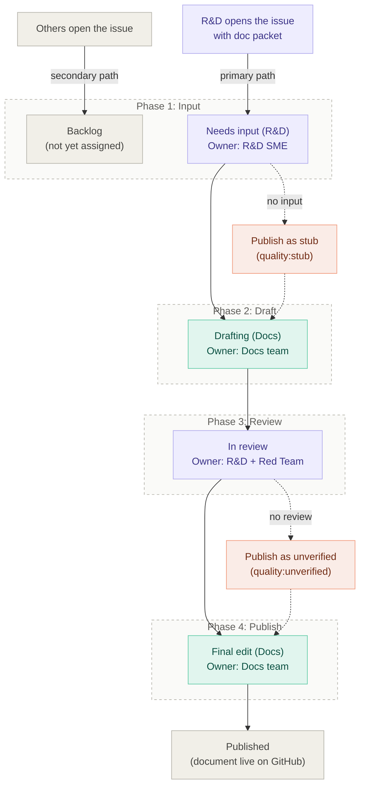

# Contributing to Logos documentation

This guide explains how to contribute to the Logos documentation project hosted at [`logos-docs`](https://github.com/logos-co/logos-docs/). It covers the contribution process for anyone - whether you are part of the Logos organization or an external contributor.

## Overview

Logos documentation lives in the [`docs/`](./docs/) folder of this repository. Every document follows one of five [canonical templates](./resources/templates/README.md) loosely based on [DITA standards](https://docs.oasis-open.org/dita/dita/v1.3/os/part2-tech-content/archSpec/technicalContent/dita-technicalContent-InformationTypes.html), uses a shared set of [writing rules](./resources/writing-rules/README.md), and goes through a review process before publication.

The Docs team (Technical Writers) owns the documentation workflow. R&D teams provide technical input and review. The Red Team validates that published documentation works end-to-end in a testing environment.

## Document types

Every document in this project uses one of these types. Choosing the right type is mandatory before writing.

<!-- TODO: Add final templates links once all resources are committed. -->

| Type | Purpose | Use when... |
|:---|:---|:---|
| Quickstart | Get a user from zero to a working result fast. | The reader needs to try something for the first time with minimal setup. |
| Procedure | Walk through a goal-oriented workflow step by step. | The reader needs to complete a specific task they already understand. |
| Concept | Explain what something is and how it works. | The reader needs to understand a system, component, or idea before acting. |
| Reference | Provide structured lookup information. | The reader needs to check a flag, parameter, API field, or config option. |
| Troubleshooting | Diagnose and fix problems. | The reader hit an error and needs symptom-to-fix guidance. |

If you are unsure which type fits, open an issue describing what you want to document and the Docs team will help you choose.

## Resources

| Resource | Location | Purpose |
|:---|:---|:---|
| Canonical templates | [`resources/templates/`](./resources/templates/README.md) | Markdown and JSON templates for each document type. Non-negotiable structure. |
| Writing rules | [`resources/writing-rules/`](./resources/writing-rules/README.md) | Style guide covering voice, formatting, code blocks, callouts, and terminology. |
| Doc packet template | [`resources/templates/doc-packet.md`](./resources/templates/doc-packet.md) | Template R&D teams use to provide technical input for a new document. |
| Project board | [Logos Docs project board](https://github.com/orgs/logos-co/projects/9) | Tracks every document from intake to publication. Read access is public. |
| Labels reference | [Repository labels](https://github.com/logos-co/logos-docs/labels) | Label taxonomy used on issues and PRs. |

## How to contribute

### Report a problem or request a new document

If you found an error in an existing document, want to request a new document, or have a suggestion, [open an issue](https://github.com/logos-co/logos-docs/issues/new/choose).

Describe what you need clearly. Include:

- The document path or URL (if reporting a problem with an existing doc).
- What is wrong or missing.
- For new document requests: the user journey or task you want documented, and why it matters.

The Docs team triages issues and decides priority.

### Fix or improve an existing document

If you want to fix a typo, clarify a step, update a command, or make any other improvement to an existing document:

1. Fork the repository.
1. Create a branch with a descriptive name (for example, `fix/quickstart-node-typo`).
1. Make your changes. Follow the [writing rules](./resources/writing-rules/README.md) and preserve the existing template structure. Do not reorganize sections or change the document type.
1. Open a pull request against `main`. In the PR description, explain what you changed and why.
1. The Docs team reviews your PR. For technical changes (commands, config values, expected outputs), an R&D SME may also review.

Keep PRs small and focused. One fix per PR is easier to review than a large batch of unrelated changes.

### Write a new document (core contributors)

This section applies to Logos core contributors: R&D engineers, Docs team members, and Red Team members who are part of the full documentation workflow.

Writing a new document follows a phased process tracked on the [project board](https://github.com/orgs/logos-co/projects/9). Each phase has a clear owner and a definition of done.

---

## Workflow for core contributors

The documentation process starts with R&D. The SME responsible for a feature or workflow is the one who opens the issue and provides the [doc packet](./resources/templates/doc-packet.md). The Docs team then takes that input and turns it into structured, publishable documentation.

### Board columns

The project board uses six columns. Each column represents a workflow stage and makes ownership explicit: anyone looking at the board can immediately see whose turn it is to act.

| Column | Owner | What happens here | How items enter | How items exit |
|:---|:---|:---|:---|:---|
| Backlog | - | Journey is identified but not yet prioritized. | Issue is created. | Docs or Red Team prioritizes and assigns an R&D SME. |
| Needs input (R&D) | R&D SME | R&D provides the doc packet or a draft in the issue. | Issue is assigned to an SME. | SME posts the doc packet, or 5 business days pass (see time-box rules). |
| Drafting (Docs) | Docs | Docs writes the document in a PR linked to the issue. | Doc packet received, or input deadline passed. | Draft is ready for review. Review requested on the PR. |
| In review (R&D + Red Team) | R&D SME + Red Team | SME reviews for technical correctness. Red Team tests end-to-end. Docs incorporates feedback. | PR is marked ready for review. | SME approves and Red Team report passes, or 5 business days pass (see time-box rules). |
| Final edit (Docs) | Docs | Docs does the editorial pass (structure, grammar, linters) and merges. | Reviews complete or review deadline passed. | PR merged. |
| Published | - | Document is live on GitHub. | PR is merged. | - |

### Labels

Labels are organized into four groups. Every issue gets exactly one label from each applicable group.

**Area (required, one per issue).** Maps to the R&D team responsible for the subject matter.

- `area:apps`
- `area:blockchain-l1`
- `area:connect`
- `area:core`
- `area:lssa-l2`
- `area:messaging`
- `area:storage`

**Quality (required, one per issue).** Tracks the current quality level of the document. Updated as the document progresses.

| Label | Meaning |
|:---|:---|
| `quality:stub` | Placeholder page. Title, status, and known gaps only. Not runnable. |
| `quality:unverified` | Structured draft with steps. Not confirmed by an SME. |
| `quality:sme-verified` | SME confirmed technical correctness for a specific repo version. |
| `quality:verified` | SME confirmed and Red Team tested end-to-end. |

**Type (required, one per issue).**

| Label | Meaning |
|:---|:---|
| `type:journey` | A user journey document (the primary deliverable). |
| `type:chore` | Repo maintenance, template updates, tooling work. |
| `type:bug` | Factual error or broken instructions in a published doc. |

**Blocked (optional).** Apply the `blocked` label when an item cannot progress. Write the reason as a comment on the issue. Remove the label when the blocker is resolved.

**Release (one per milestone).** For example, `release:testnet-v0.1`, `release:testnet-v0.2`. Used to filter the GitHub project board by release.

### Milestones

Each release has a corresponding GitHub milestone (e.g., "Testnet v0.2"). The milestone groups related issues and provides a progress bar. The milestone due date is the target date for R&D to provide all doc packets for that release.

Issues are added to the milestone when they are prioritized and moved out of Backlog.

### Phases in detail

| Phase | Owner | Action | Board column | Quality on exit |
|:---|:---|:---|:---|:---|
| 1. Input | R&D SME | Open an issue with the doc packet. | Needs input (R&D) or Drafting (Docs) | - |
| 2. Draft | Docs | Create PR, write the document from the doc packet. | Drafting (Docs) | Stub or Unverified |
| 3. Review | R&D SME + Red Team | SME verifies technical accuracy; Red Team tests end-to-end. | In review (R&D + Red Team) | SME-verified |
| 4. Publish | Docs | Final editorial pass, merge, and publish. | Final edit (Docs) → Published | Verified |

#### Phase 1: Input

**Owner:** R&D SME.

**Primary path (pull model).** The R&D SME opens an issue in this repository when a feature, workflow, or journey needs documentation. The issue must include a completed [doc packet](./resources/templates/doc-packet.md) pasted into the issue body. The doc packet is mandatory. It provides the minimum technical input the Docs team needs to start a draft: the journey's purpose, the components involved, prerequisites, a runnable happy path, and a verification step.

If the SME also has a draft, a recorded demo, a `README.md`, or any other supplementary material, they link it in the issue in addition to the doc packet.

When the doc packet is complete, Docs assigns a writer and moves the issue directly to "Drafting (Docs)." When the doc packet is present but incomplete, the issue stays in "Needs input (R&D)" phase.

> [!IMPORTANT]
>
> If the doc packet is not available, Docs publishes a stub: the template skeleton with the journey title, status, known gaps, and a note that technical details are pending. The stub is a published page that makes the gap visible. It is not a draft hidden in a branch.

**Secondary path (Red Team, Docs, or external).** If someone other than R&D identifies a documentation need (Red Team finds a gap during testing, an external contributor requests a new doc, or Docs identifies an undocumented journey), they open an issue describing the need. The issue goes to Backlog. Docs or Red Team assigns an R&D SME, who then provides the doc packet.

**Definition of done:** A complete doc packet is posted in the issue.

#### Phase 2: Draft

**Owner:** Docs team (the writer assigned to the PR).

Docs creates a PR linked to the issue and writes the document using the appropriate [canonical template](./resources/templates/README.md). The draft must follow the template structure exactly. Information that is missing or unconfirmed is marked explicitly in the document (e.g., "Technical details pending" for reader-facing text, or tracked in the PR description for internal notes).

**Definition of done:** The draft is complete enough for review. Review is requested on the PR. The issue moves to "In review."

#### Phase 3: Review

**Owner:** R&D SME + Red Team, in parallel.

- **SME review:** The SME checks that commands, config values, expected outputs, and technical explanations are correct for the repo version specified in the doc packet. The SME reviews on the PR using GitHub's review tools (approve, request changes, or comment).
- **Red Team review:** The Red Team runs the journey end-to-end in their testing environment and reports whether the instructions work as documented. Gaps or failures are reported as PR comments.
- **Docs:** Incorporates feedback from both reviews.

**Definition of done:** The SME approves and the Red Team report passes.

#### Phase 4: Final edit

**Owner:** Docs team.

Docs performs a final editorial pass: checks structure against the template, applies the writing rules, runs any linters, and updates the `quality:*` label to reflect the final state.

**Definition of done:** PR merged. Issue closed.

### Quality levels

Quality labels track the document's reliability, not its position in the workflow. A document can be published at any quality level. The quality level is visible to readers and sets expectations.

| Quality level | What the reader can expect |
|:---|:---|
| Stub | The page exists to reserve the journey and show its status. Content is minimal or absent. Not runnable. |
| Unverified | The document has structured content with steps, but no SME has confirmed correctness. Commands and outputs may be inaccurate. |
| SME-verified | An R&D SME has confirmed that the technical content is correct for a specific repo version. |
| Verified | An SME has confirmed correctness and the Red Team has tested the journey end-to-end. This is the highest quality bar. |

---

## Document structure rules

All documents must follow these rules regardless of who writes them.

1. **Use a canonical template.** Every document must use the Markdown template for its type. Templates are in [`resources/templates/`](./resources/templates/README.md). Do not invent your own structure.
1. **Follow the writing rules.** The style guide in [`resources/writing-rules/`](./resources/writing-rules/README.md) defines voice, formatting, terminology, and code block conventions. Read it before writing.
1. **One document, one type.** Do not mix types. If a quickstart needs a long conceptual explanation, write a separate concept document and link to it.
1. **Mark unknowns explicitly.** If you do not have the information for a required section, do not skip it. Write a clear note for the reader (for example., "Technical details pending - contact the [team] for status"). Track the gap in the PR or issue.
1. **Do not break existing structure.** When editing an existing document, preserve its template structure, section IDs, and numbering. Change only what you need to change.
