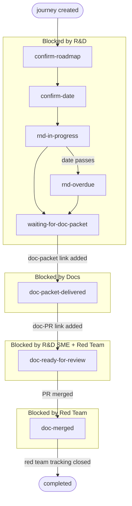

# Contributing to Logos documentation

This guide explains how to contribute to the Logos documentation project hosted at [`logos-docs`](https://github.com/logos-co/logos-docs/). It covers the contribution process for anyone - whether you are part of the Logos organization or an external contributor.

## Overview

Logos documentation lives in the [`docs/`](./docs/) folder of this repository. Every document follows one of five canonical types loosely based on [DITA standards](https://docs.oasis-open.org/dita/dita/v1.3/os/part2-tech-content/archSpec/technicalContent/dita-technicalContent-InformationTypes.html) and goes through a review process before publication. Canonical templates and writing rules are not yet committed. Until they ship, mirror the structure of [`docs/apps/wallet/journeys/quickstart-for-the-logos-execution-zone-wallet.md`](./docs/apps/wallet/journeys/quickstart-for-the-logos-execution-zone-wallet.md) as the reference example.

The Docs team (Technical Writers) owns the documentation workflow. R&D teams provide technical input and review. The Red Team validates that published documentation works end-to-end in a testing environment.

## Document types

Every document in this project uses one of these types. Choosing the right type is mandatory before writing.

| Type | Purpose | Use when... |
|:---|:---|:---|
| Quickstart | Get a user from zero to a working result fast. | The reader needs to try something for the first time with minimal setup. |
| Procedure | Walk through a goal-oriented workflow step by step. | The reader needs to complete a specific task they already understand. |
| Concept | Explain what something is and how it works. | The reader needs to understand a system, component, or idea before acting. |
| Reference | Provide structured lookup information. | The reader needs to check a flag, parameter, API field, or config option. |
| Troubleshooting | Diagnose and fix problems. | The reader hit an error and needs symptom-to-fix guidance. |

If you are unsure which type fits, open an issue describing what you want to document and the Docs team will help you choose.

## Resources

| Resource | Location | Purpose |
|:---|:---|:---|
| Reference example | [`docs/apps/wallet/journeys/quickstart-for-the-logos-execution-zone-wallet.md`](./docs/apps/wallet/journeys/quickstart-for-the-logos-execution-zone-wallet.md) | Interim model for structure, voice, and formatting until canonical templates and writing rules ship. |
| Doc packet template | [`resources/templates/doc-packet.md`](./resources/templates/doc-packet.md) | Template R&D teams use to provide technical input for a new document. |
| Project board | [Logos Docs project board](https://github.com/orgs/logos-co/projects/9) | Tracks every document from intake to publication. Read access is public. |
| Labels reference | [Repository labels](https://github.com/logos-co/logos-docs/labels) | Label taxonomy used on issues and PRs. |

## How to contribute

### Report a problem or request a new document

If you found an error in an existing document, want to request a new document, or have a suggestion, [open an issue](https://github.com/logos-co/logos-docs/issues/new/choose).

Describe what you need clearly. Include:

- The document path or URL (if reporting a problem with an existing doc).
- What is wrong or missing.
- For new document requests: the user journey or task you want documented, and why it matters.

The Docs team triages issues and decides priority.

### Fix or improve an existing document

If you want to fix a typo, clarify a step, update a command, or make any other improvement to an existing document:

1. Fork the repository.
1. Create a branch with a descriptive name (for example, `fix/quickstart-node-typo`).
1. Make your changes. Preserve the existing template structure. Do not reorganize sections or change the document type.
1. Open a pull request against `main`. In the PR description, explain what you changed and why.
1. The Docs team reviews your PR. For technical changes (commands, config values, expected outputs), an R&D SME may also review.

Keep PRs small and focused. One fix per PR is easier to review than a large batch of unrelated changes.

### Write a new document (core contributors)

This section applies to Logos core contributors: R&D engineers, Docs team members, and Red Team members who are part of the full documentation workflow.

Writing a new document follows a phased process tracked on the [project board](https://github.com/orgs/logos-co/projects/9). Each phase has a clear owner and a definition of done.

---

## Workflow for core contributors

The documentation process starts with R&D. The SME responsible for a feature or workflow is the one who opens the issue and provides the [doc packet](./resources/templates/doc-packet.md). The Docs team then takes that input and turns it into structured, publishable documentation.

### Board sections

The project board uses six sections. Each section represents a workflow stage of a document and makes ownership explicit: anyone looking at the board can immediately see whose turn it is to act.

| Section | Owner | What happens here | How items enter | How items exit |
|:---|:---|:---|:---|:---|
| Backlog | - | Journey is identified but not yet prioritized. | Issue is created. | Docs or Red Team prioritizes and assigns an R&D SME. |
| Needs input (R&D) | R&D SME | R&D provides the doc packet or a draft in the issue. | Issue is assigned to an SME. | SME posts the doc packet, or 5 business days pass (see time-box rules). |
| Drafting (Docs) | Docs | Docs writes the document in a PR linked to the issue. | Doc packet received, or input deadline passed. | Draft is ready for review. Review requested on the PR. |
| In review (R&D + Red Team) | R&D SME + Red Team | SME reviews for technical correctness. Red Team tests end-to-end. Docs incorporates feedback. | PR is marked ready for review. | SME approves and Red Team report passes, or 5 business days pass (see time-box rules). |
| Final edit (Docs) | Docs | Docs does the editorial pass (structure, grammar, linters) and merges. | Reviews complete or review deadline passed. | PR merged. |
| Published | - | Document is live on GitHub. | PR is merged. | - |

### Labels

Labels are organized into four groups. Every issue gets exactly one label from each applicable group.

**Area (required, one per issue).** Maps to the R&D team responsible for the subject matter.

- `area:anoncomms`
- `area:apps`
- `area:blockchain`
- `area:core`
- `area:lez`
- `area:messaging`
- `area:storage`

**Quality (required, one per issue).** Tracks the current quality level of the document. Updated as the document progresses.

| Label | Meaning |
|:---|:---|
| `quality:stub` | Placeholder page. Title, status, and known gaps only. Not runnable. |
| `quality:unverified` | Structured draft with steps. Not confirmed by an SME. |
| `quality:sme-verified` | SME confirmed technical correctness for a specific repo version. |
| `quality:verified` | SME confirmed and Red Team tested end-to-end. |

**Type (required, one per issue).**

| Label | Meaning |
|:---|:---|
| `type:journey` | A user journey document (the primary deliverable). |
| `type:chore` | Repo maintenance, template updates, tooling work. |
| `type:bug` | Factual error or broken instructions in a published doc. |

**Status (required, one per issue).** Tracks the current phase in the workflow. See details in [Phases in detail](#phases-in-detail).

**Blocked-by (optional).** Select a `blocked-by` label when an item cannot progress to indicate the blocker. Write the reason as a comment on the issue. Remove the label when the blocker is resolved.

**Release (one per milestone).** For example, `release:testnet-v0.1`, `release:testnet-v0.2`. Used to filter the GitHub project board by release.

### Milestones

Each release has a corresponding GitHub milestone (e.g., "Testnet v0.2"). The milestone groups related issues and provides a progress bar. The milestone due date is the target date for R&D to provide all doc packets for that release.

Issues are added to the milestone when they are prioritized and moved out of Backlog.

### Phases in detail

Each journey has a single `status:<phase>` label and one or more `blocked-by:<team>` labels — both auto-managed by the [Logos Journeys web app](https://journeys.logos.co/) based on what's in the issue body. The whole lifecycle is one linear sequence:

| `status:*`                      | Next step (who does it)                                                                     | Blocked by                  |
|---------------------------------|---------------------------------------------------------------------------------------------|-----------------------------|
| `status:confirm-roadmap`        | **R&D lead**: set `- team:` and a `- milestone:` URL in the issue body                      | `blocked-by:rnd` (or team)  |
| `status:confirm-date`           | **R&D lead**: add the estimated delivery `- date:` (DDMmmYY)                                | `blocked-by:rnd-<team>`     |
| `status:rnd-in-progress`        | **R&D**: deliver the roadmap milestones (auto-advances when all are ticked in [roadmap.logos.co](https://roadmap.logos.co)) | `blocked-by:rnd-<team>`     |
| `status:rnd-overdue`            | **R&D**: deliver the milestones — target date has passed, update the date or close them    | `blocked-by:rnd-<team>`     |
| `status:waiting-for-doc-packet` | **R&D**: open a [doc packet issue](https://github.com/logos-co/logos-docs/issues/new?template=doc-packet.yml), fill it in, paste its URL into `## Doc Packet - link:` | `blocked-by:rnd-<team>` |
| `status:doc-packet-delivered`   | **Docs**: open a tracking issue (paste into `## Documentation - tracking:`), write the doc, and once the doc PR is ready for review paste its URL into `## Documentation - pr:` | `blocked-by:docs`           |
| `status:doc-ready-for-review`   | **R&D and Red Team**: review the doc PR. **Docs**: merge the PR once both have approved     | `blocked-by:red-team` + `blocked-by:rnd-<team>` |
| `status:doc-merged`             | **Red Team**: finish dogfooding, close `## Red Team - tracking:` when done                  | `blocked-by:red-team`       |
| `status:completed`              | Nothing — journey is done                                                                   | —                           |

The doc PR URL (`## Documentation - pr:`) is added **manually by the docs team** as an explicit "ready for review" signal — there is no auto-discovery.

R&D team granularity: `<team>` is one of `anon-comms`, `messaging`, `core`, `storage`, `blockchain`, `zones`, `smart-contract`, `devkit`.

### The hand-offs

1. **R&D** fills in their team, a roadmap milestone link, and an estimated date. When all milestones are closed (checked against the `logos-co/roadmap` repo), the phase auto-advances to `waiting-for-doc-packet`. R&D then [opens an issue using the doc packet template](https://github.com/logos-co/logos-docs/issues/new?template=doc-packet.yml), fills it in (including appointing a Subject-Matter Expert from their team), and pastes the issue URL into the `- link:` field of the `## Doc Packet` section. That flip (`status:doc-packet-delivered`) hands off to Docs.
2. **Docs** opens a tracking issue in `logos-co/logos-docs` (pasted into `## Documentation - tracking:`) and begins writing. When the doc PR is ready for review, Docs **manually** pastes the PR URL into `## Documentation - pr:` — this is an explicit "ready for review" signal (no auto-discovery), which advances the journey to `doc-ready-for-review`. Red Team and the R&D SME review on that PR; once approved, Docs merges it → `doc-merged`.
3. **Red Team** dogfoods the journey and reviews the doc PR simultaneously. Their tracking issue lives in `## Red Team - tracking:`. Closing that issue completes the journey → `status:completed`. If no red team tracking is provided, the journey is considered complete once the doc PR is merged.

External blockers (`blocked-by:legal`, `blocked-by:security`, etc.) can be added manually in the detail panel; they coexist with the lifecycle `blocked-by:*` labels and don't affect the auto-managed flow.

The app keeps these labels in sync automatically. A ⚠ "Fix Labels" button in the header appears when any issue's labels drift from the computed state; clicking it reconciles everything in one pass (also migrates legacy `action:*` and `blocked:<team>` labels).

---

### Quality levels

Quality labels track the document's reliability, not its position in the workflow. A document can be published at any quality level. The quality level is visible to readers and sets expectations.

| Quality level | What the reader can expect |
|:---|:---|
| Stub | The page exists to reserve the journey and show its status. Content is minimal or absent. Not runnable. |
| Unverified | The document has structured content with steps, but no SME has confirmed correctness. Commands and outputs may be inaccurate. |
| SME-verified | An R&D SME has confirmed that the technical content is correct for a specific repo version. |
| Verified | An SME has confirmed correctness and the Red Team has tested the journey end-to-end. This is the highest quality bar. |

## Document structure rules

All documents must follow these rules regardless of who writes them.

1. **Mirror the reference example.** Until canonical templates and writing rules are committed, mirror the structure, voice, and formatting of [`docs/apps/wallet/journeys/quickstart-for-the-logos-execution-zone-wallet.md`](./docs/apps/wallet/journeys/quickstart-for-the-logos-execution-zone-wallet.md). Do not invent your own structure.
1. **One document, one type.** Do not mix types. If a quickstart needs a long conceptual explanation, write a separate concept document and link to it.
1. **Mark unknowns explicitly.** If you do not have the information for a required section, do not skip it. Write a clear note for the reader (for example., "Technical details pending - contact the [team] for status"). Track the gap in the PR or issue.
1. **Do not break existing structure.** When editing an existing document, preserve its template structure, section IDs, and numbering. Change only what you need to change.
