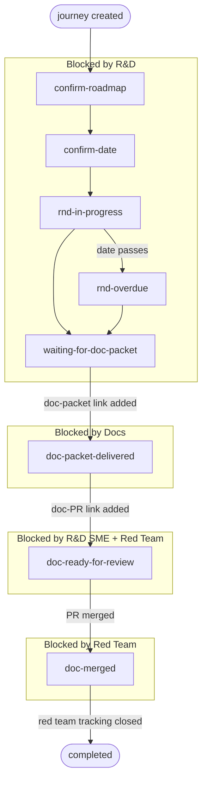

# Contributing to the Logos Documentation

This guide explains how to contribute to the Logos Documentation project, hosted at the [`logos-docs`](https://github.com/logos-co/logos-docs/) repository. By following the rules delineated in this guide, both Logos Core Contributors and others can make improvements to the Logos Documentation.

## Overview

The Logos Documentation lives in the [`docs/`](./docs) folder of this repository. Every document follows an applicable [template](./resources/templates) and goes through a review process before being published.

The Logos Docs team own the documentation workflow. R&D teams provide technical input and review in the form of [doc packets](./resources/templates/doc-packet.md). The Logos Red Team validates that published documentation works end-to-end in a testing environment.

## How to contribute

The procedure for contributing will differ depending on the kind of change you wish to make. Click on the link below that best describes your desired contribution to see the steps most applicable to your situation.

- [Report a problem or suggest a change](#report-a-problem-or-suggest-a-change)
- [Fix or improve an existing document](#fix-or-improve-an-existing-document)
- [Review an existing issue or PR](#review-an-existing-issue-or-pr)
- [Request a new document](#request-a-new-document)
- [Write a new document](#write-a-new-document)

### Report a problem or suggest a change

If you found an error in an existing document and are not sure how to fix it (or don't have the time do to so), or you want to suggest a new document or broad changes to the style or structure of the Documentation, [open an issue](https://github.com/logos-co/logos-docs/issues/new/choose).

Describe what you want to see clearly. Include:

- The document path or URL (if reporting a problem with an existing doc).
- What is wrong or missing.
- For broad changes requests: justification for why your change is important, and why the current state is inadequate.

> [!TIP]
> If you see a problem in the Documentation that you could fix, create a [PR](#fix-or-improve-an-existing-document) instead!

The Docs team triages issues and decides priority.

### Request a new document

To request the creation of a new document, open an issue and follow the steps [above](#report-a-problem-or-suggest-a-change). For a new tutorial ("procedure") type document that describes how to use some component of the stack or how to reach some desired result, open a [Doc packet issue](https://github.com/logos-co/logos-docs/issues/new?template=doc-packet.yml).

> [!IMPORTANT]
> Core contributors should follow the phased process tracked in the [Journeys repository](https://github.com/logos-co/journeys.logos.co/issues). For more information, see [Workflow for core contributors](#workflow-for-core-contributors).

### Fix or improve an existing document

If you want to fix a typo, clarify a step, update a command, or make any other improvement to an existing document, open a pull request:

1. Create a branch with a descriptive name (for example, `fix/blockchain-node-typo`).
1. Make your changes. Preserve the existing structure - do not reorganise sections or change the document type.
1. Open a pull request against `main` and tag `logos-co/docs` and `logos-co/eco-dev-eng` as reviewers. In the PR description, explain what you changed and why. Make sure that all checks pass before opening your PR for review.
1. The Docs team and others will review your PR. Further changes may be requested before the PR is merged.

Keep PRs small and focused. One fix per PR is easier to review than a large batch of unrelated changes.

### Review an existing issue or PR

Constructive input on suggested changes to the repo, both from humans and AI agents, is always welcome. If you see an existing issue or PR that could benefit from your opinion, follow these guidelines:

- Keep comments concise but understandable.
- If a suggestion is based on a subjective judgement, explain your reasoning.
- AI comments should be clearly labeled as such.
- If a human has reviewed an AI review and confirmed its conclusions, include a comment explicitly stating this fact.
- Where practical, use "suggested changes" rather than just comments.
- Do not commit changes to the PR branch without the permission of the author or the Docs team.

### Write a new document

Writing a new document is a task typically handled by the Docs team, but can be taken up by anyone. The easiest way to write a new document is to take pre-existing documentation, a [doc packet](./resources/templates/doc-packet.md), or an *ad hoc* text and use AI to make it conform with the template required for its [document type](#document-types). Once the document is written, [open a PR](#fix-or-improve-an-existing-document) to start the review process.

> [!IMPORTANT]
> Core contributors should follow the phased process tracked in the [Journeys repository](https://github.com/logos-co/journeys.logos.co/issues). For more information, see [Workflow for core contributors](#workflow-for-core-contributors).
>
> Other users are advised to first submit a [new document request](#request-a-new-document) and await approval before writing a new document.

#### Document types

To enforce a consistent style, every document in this project must follow the rules that apply to its specific type. Choosing the right type is mandatory before writing.

| Type | Purpose | Use when... | Template |
|:---|:---|:---|:---|
| Procedure | Walk through a goal-oriented workflow step by step. | The reader needs to complete a specific task they already understand. | [Procedure template](./resources/templates/procedure-template.md) |
| Concept | Explain what something is and how it works. | The reader needs to understand a system, component, or idea before acting. | Coming soon... |
| Reference | Provide structured lookup information. | The reader needs to check a flag, parameter, API field, or config option. | Coming soon... |
| Troubleshooting | Diagnose and fix problems. | The reader hit an error and needs symptom-to-fix guidance. | Coming soon... |

If you are unsure which type fits, [open an issue](#request-a-new-document) describing what you want to document and the Docs team will help you choose.

#### Document structure rules

All documents must follow these rules regardless of who writes them.

1. **Use a canonical template.** Every document must use the Markdown template for its type. Templates are in [`resources/templates/`](./resources/templates/). Do not invent your own structure.
1. **Follow the writing rules.** The style is enforced by Vale in the PR checks. Make sure to use British English when writing.
1. **One document, one type.** Do not mix types. If a procedure needs a long conceptual explanation, write a separate concept document and link to it.
1. **Mark unknowns explicitly.** If you do not have the information for a required section, do not skip it. Write a clear note for the reader (for example., "Technical details pending - contact the team for status"). Track the gap in the PR or issue.
1. **Do not break existing structure.** When editing an existing document, preserve its template structure, section IDs, and numbering. Change only what you need to change.

---

## Workflow for core contributors

The documentation process starts with R&D. The SME responsible for a feature or workflow is the one who opens the issue and provides the [doc packet](./resources/templates/doc-packet.md). The Docs team then takes that input and turns it into structured, publishable documentation.

### Board sections

The project board uses six sections. Each section represents a workflow stage of a document and makes ownership explicit: anyone looking at the board can immediately see whose turn it is to act.

| Section | Owner | What happens here | How items enter | How items exit |
|:---|:---|:---|:---|:---|
| Backlog | - | Journey is identified but not yet prioritized. | Issue is created. | Docs or Red Team prioritizes and assigns an R&D SME. |
| Needs input (R&D) | R&D SME | R&D provides the doc packet or a draft in the issue. | Issue is assigned to an SME. | SME posts the doc packet, or 5 business days pass (see time-box rules). |
| Drafting (Docs) | Docs | Docs writes the document in a PR linked to the issue. | Doc packet received, or input deadline passed. | Draft is ready for review. Review requested on the PR. |
| In review (R&D + Red Team) | R&D SME + Red Team | SME reviews for technical correctness. Red Team tests end-to-end. Docs incorporates feedback. | PR is marked ready for review. | SME approves and Red Team report passes, or 5 business days pass (see time-box rules). |
| Final edit (Docs) | Docs | Docs does the editorial pass (structure, grammar, linters) and merges. | Reviews complete or review deadline passed. | PR merged. |
| Published | - | Document is live on GitHub. | PR is merged. | - |

### Labels

Labels are organized into four groups. Every issue gets exactly one label from each applicable group.

**Area (required, one per issue).** Maps to the R&D team responsible for the subject matter.

- `area:anoncomms`
- `area:apps`
- `area:blockchain`
- `area:core`
- `area:lez`
- `area:messaging`
- `area:storage`

**Quality (required, one per issue).** Tracks the current quality level of the document. Updated as the document progresses.

| Label | Meaning |
|:---|:---|
| `quality:stub` | Placeholder page. Title, status, and known gaps only. Not runnable. |
| `quality:unverified` | Structured draft with steps. Not confirmed by an SME. |
| `quality:sme-verified` | SME confirmed technical correctness for a specific repo version. |
| `quality:verified` | SME confirmed and Red Team tested end-to-end. |

**Type (required, one per issue).**

| Label | Meaning |
|:---|:---|
| `type:journey` | A user journey document (the primary deliverable). |
| `type:chore` | Repo maintenance, template updates, tooling work. |
| `type:bug` | Factual error or broken instructions in a published doc. |

**Status (required, one per issue).** Tracks the current phase in the workflow. See details in [Phases in detail](#phases-in-detail).

**Blocked-by (optional).** Select a `blocked-by` label when an item cannot progress to indicate the blocker. Write the reason as a comment on the issue. Remove the label when the blocker is resolved.

**Release (one per milestone).** For example, `release:testnet-v0.1`, `release:testnet-v0.2`. Used to filter the GitHub project board by release.

### Milestones

Each release has a corresponding GitHub milestone (e.g., "Testnet v0.2"). The milestone groups related issues and provides a progress bar. The milestone due date is the target date for R&D to provide all doc packets for that release.

Issues are added to the milestone when they are prioritized and moved out of Backlog.

### Phases in detail

Each journey has a single `status:<phase>` label and one or more `blocked-by:<team>` labels — both auto-managed by the [Logos Journeys web app](https://journeys.logos.co/) based on what's in the issue body. The whole lifecycle is one linear sequence:

```mermaid
flowchart TD
    start([journey created]) --> s1

    subgraph RND[Blocked by R&D]
        s1[confirm-roadmap] --> s2[confirm-date] --> s3[rnd-in-progress]
        s3 -->|date passes| s3o[rnd-overdue]
        s3  --> s4[waiting-for-doc-packet]
        s3o --> s4
    end

    s4 -->|doc-packet link added| s5

    subgraph DOCS[Blocked by Docs]
        s5[doc-packet-delivered]
    end

    s5 -->|doc-PR link added| s6

    subgraph REVIEW[Blocked by R&D SME + Red Team]
        s6[doc-ready-for-review]
    end

    s6 -->|PR merged| s7

    subgraph RT[Blocked by Red Team]
        s7[doc-merged]
    end

    s7 -->|red team tracking closed| fin([completed])
```

| `status:*`                      | Next step (who does it)                                                                     | Blocked by                  |
|---------------------------------|---------------------------------------------------------------------------------------------|-----------------------------|
| `status:confirm-roadmap`        | **R&D lead**: set `- team:` and a `- milestone:` URL in the issue body                      | `blocked-by:rnd` (or team)  |
| `status:confirm-date`           | **R&D lead**: add the estimated delivery `- date:` (DDMmmYY)                                | `blocked-by:rnd-<team>`     |
| `status:rnd-in-progress`        | **R&D**: deliver the roadmap milestones (auto-advances when all are ticked in [roadmap.logos.co](https://roadmap.logos.co)) | `blocked-by:rnd-<team>`     |
| `status:rnd-overdue`            | **R&D**: deliver the milestones — target date has passed, update the date or close them    | `blocked-by:rnd-<team>`     |
| `status:waiting-for-doc-packet` | **R&D**: open a [doc packet issue](https://github.com/logos-co/logos-docs/issues/new?template=doc-packet.yml), fill it in, paste its URL into `## Doc Packet - link:` | `blocked-by:rnd-<team>` |
| `status:doc-packet-delivered`   | **Docs**: open a tracking issue (paste into `## Documentation - tracking:`), write the doc, and once the doc PR is ready for review paste its URL into `## Documentation - pr:` | `blocked-by:docs`           |
| `status:doc-ready-for-review`   | **R&D and Red Team**: review the doc PR. **Docs**: merge the PR once both have approved     | `blocked-by:red-team` + `blocked-by:rnd-<team>` |
| `status:doc-merged`             | **Red Team**: finish dogfooding, close `## Red Team - tracking:` when done                  | `blocked-by:red-team`       |
| `status:completed`              | Nothing — journey is done                                                                   | —                           |

The doc PR URL (`## Documentation - pr:`) is added **manually by the docs team** as an explicit "ready for review" signal — there is no auto-discovery.

R&D team granularity: `<team>` is one of `anon-comms`, `messaging`, `core`, `storage`, `blockchain`, `zones`, `smart-contract`, `devkit`.

### The hand-offs

1. **R&D** fills in their team, a roadmap milestone link, and an estimated date. When all milestones are closed (checked against the `logos-co/roadmap` repo), the phase auto-advances to `waiting-for-doc-packet`. R&D then [opens an issue using the doc packet template](https://github.com/logos-co/logos-docs/issues/new?template=doc-packet.yml), fills it in (including appointing a Subject-Matter Expert from their team), and pastes the issue URL into the `- link:` field of the `## Doc Packet` section. That flip (`status:doc-packet-delivered`) hands off to Docs.
2. **Docs** opens a tracking issue in `logos-co/logos-docs` (pasted into `## Documentation - tracking:`) and begins writing. When the doc PR is ready for review, Docs **manually** pastes the PR URL into `## Documentation - pr:` — this is an explicit "ready for review" signal (no auto-discovery), which advances the journey to `doc-ready-for-review`. Red Team and the R&D SME review on that PR; once approved, Docs merges it → `doc-merged`.
3. **Red Team** dogfoods the journey and reviews the doc PR simultaneously. Their tracking issue lives in `## Red Team - tracking:`. Closing that issue completes the journey → `status:completed`. If no red team tracking is provided, the journey is considered complete once the doc PR is merged.

External blockers (`blocked-by:legal`, `blocked-by:security`, etc.) can be added manually in the detail panel; they coexist with the lifecycle `blocked-by:*` labels and don't affect the auto-managed flow.

The app keeps these labels in sync automatically. A ⚠ "Fix Labels" button in the header appears when any issue's labels drift from the computed state; clicking it reconciles everything in one pass (also migrates legacy `action:*` and `blocked:<team>` labels).

### Quality levels

Quality labels track the document's reliability, not its position in the workflow. A document can be published at any quality level. The quality level is visible to readers and sets expectations.

| Quality level | What the reader can expect |
|:---|:---|
| Stub | The page exists to reserve the journey and show its status. Content is minimal or absent. Not runnable. |
| Unverified | The document has structured content with steps, but no SME has confirmed correctness. Commands and outputs may be inaccurate. |
| SME-verified | An R&D SME has confirmed that the technical content is correct for a specific repo version. |
| Verified | An SME has confirmed correctness and the Red Team has tested the journey end-to-end. This is the highest quality bar. |