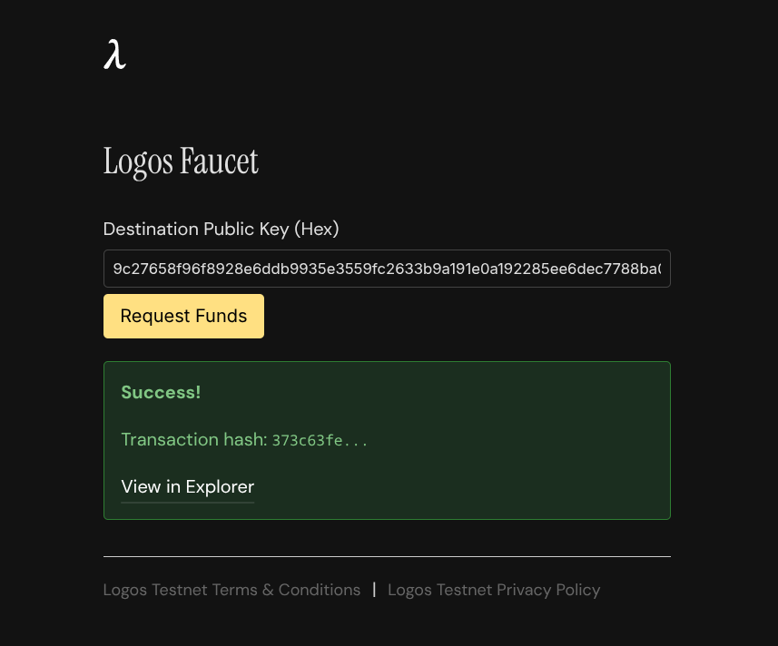

# Run a Logos Blockchain node on the public testnet from the CLI

#### Start a node and verify runtime and consensus signals.

With this tutorial, you will install the [Logos Blockchain](https://docs.logos.co/get-started/glossary#logos-blockchain) node, connect to the public testnet, and verify that your node is running. The Logos Blockchain is the blockchain component of the Logos technology stack, providing a privacy-preserving and censorship-resistant framework for decentralised applications. This procedure is for node operators setting up a node for the first time.

There is currently no dynamic wallet key management. To add new keys you must manually edit `user_config.yaml` and restart the node. If the node is restarted while bootstrapping, it does not save sync progress and restarts from the beginning.

Before you start, ensure you have:

* Linux x86\_64, macOS, or a Raspberry Pi 5 with [Raspberry Pi OS](https://www.raspberrypi.com/software/) installed
* glibc version 2.39 or later (Linux only)
* At least 64 GB of storage

## What to expect

* You can install the node binary, generate a configuration, and join the public testnet.
* You can verify that your node is syncing and connected to peers using the local API.
* You can receive test tokens from the faucet and automatically participate in the consensus lottery once your stake matures.

## Step 1: Install Logos core tools

1.  Use the `install-node-tools.sh` helper script to install [`logoscore`](https://github.com/logos-co/logos-logoscore-cli/releases/tag/0.2.0), [`lgpd`](https://github.com/logos-co/logos-package-downloader/releases/tag/0.2.0), and [`lgpm`](https://github.com/logos-co/logos-package-manager/releases/tag/0.2.0) into `./bin`:

    ```bash
    curl -fsSL https://raw.githubusercontent.com/logos-co/logos-docs/main/resources/scripts/install-node-tools.sh | sh
    export PATH="$PWD/bin:$PATH"
    ```

## Step 2: Load the Logos Blockchain module

Download the Logos Blockchain [module](https://docs.logos.co/get-started/glossary#module) with `lgpd`, then install it with `lgpm` before loading it with `logoscore`.

1.  Download the module:

    ```bash
    lgpd download blockchain_module --version 0.2.0 --output ./
    # writes ./blockchain_module-0.2.0.lgx
    ```
2.  Install the module:

    ```bash
    lgpm --modules-dir ./modules install --file blockchain_module-0.2.0.lgx
    ```
3.  Launch `logoscore` in daemon mode and load the Logos Blockchain module:

    ```bash
    logoscore -m ./modules -D &
    logoscore load-module blockchain_module
    ```

## Step 2: Configure and start the node

The `generate_user_config` subcommand generates a user configuration that includes per-node settings such as keys, ports, and peer addresses, along with fresh cryptographic keys and an auto-detected public IP.


Make sure to use the current bootstrap peer addresses in the [Logos Blockchain Node release notes](https://github.com/logos-blockchain/logos-blockchain/releases/latest) for your selected release.


1.  Generate your `user_config.yaml` by running `generate_user_config` with the bootstrap peer addresses. For example, for release 0.2.0:

    ```sh
    logoscore call blockchain_module generate_user_config '{
        "initial_peers": [
            "/ip4/65.109.51.37/udp/3000/quic-v1/p2p/12D3KooWFrouXfmrR4nsLMtE7wu15DoMJ6VtoUtHinREZCvbWHar",
            "/ip4/65.109.51.37/udp/3001/quic-v1/p2p/12D3KooWJRGau8M1rjT7R5e4YYsgdFhsMX35nRDtMwCDjxQkXAHz",
            "/ip4/65.109.51.37/udp/3002/quic-v1/p2p/12D3KooWQXJavMDTRscjauFSgVAB1VLB6Rzpy2uY5SU9Tk7927tb",
            "/ip4/65.109.51.37/udp/50001/quic-v1/p2p/12D3KooWSQc7CcGtvWDPF1yCbBthFnQjprfCVHmfmNDUrSmqQsU1"
        ]
    }'
    ```

    * To change the API port, set `api.backend.listen_address` in `user_config.yaml` before starting. The default is `8080`.
2.  Start the node:

    ```sh
    logoscore call blockchain_module start user_config.yaml ""
    ```

## Step 3: Verify that your node is running and connected to peers

Wait for your node to finish syncing and reach `Online` mode before requesting tokens. Pipe the `get_cryptarchia_info` command through `jq .` to format JSON output.

1.  Check the consensus state:

    ```sh
    logoscore call blockchain_module get_cryptarchia_info | jq -r .result.value | jq .

    # Alternatively, send a request directly to your node port
    curl -s http://localhost:8080/cryptarchia/info | jq .
    ```

    Example response:

    ```json
    {
      "lib": "3d0c...4e6d",
      "lib_slot": 0,
      "tip": "f44d...e2f5",
      "slot": 70899,
      "height": 120,
      "mode": "Bootstrapping"
    }
    ```

    * `mode` starts as `Bootstrapping` while syncing and transitions to `Online` once caught up.
    * Confirm `slot` and `height` are increasing. `height` counts confirmed blocks; `slot` counts elapsed time intervals, with a new block expected roughly every 10 seconds.
2.  Check peer connectivity:

    ```sh
    curl -s http://localhost:8080/network/info | jq .
    ```

    Example response:

    ```json
    {
      "listen_addresses": ["/ip4/127.0.0.1/udp/3001/quic-v1"],
      "peer_id": "12D3...fuS2",
      "n_peers": 16,
      "n_connections": 19,
      "n_pending_connections": 0
    }
    ```

    * Confirm `n_peers` is greater than `0`.
3. After 30–60 seconds, run the `get_cryptarchia_info` command again and confirm `slot` and `height` have increased.
4. Wait until `mode` transitions to `Online` before continuing. Bootstrapping should take approximately 1 hour.

## Step 4: Request tokens from the faucet

A faucet distributes free tokens on test networks so you can experiment without financial risk. Navigate to the [public faucet site](https://testnet.blockchain.logos.co/web/faucet/) after your node reaches `Online` mode.

1.  Find the keys associated with your node:

    ```sh
    grep -A3 known_keys user_config.yaml
    ```

    Example output:

    ```
    known_keys:
        57364103d3ff29c35d2073cba0526ef729b8e08490bddfc6b74128b6613fe923: ...
        de3233cec107e6589f83d4f3094caa65c633b5b33601211353779dc01972ca14: ...
    voucher_master_key_id: de3233cec107e6589f83d4f3094caa65c633b5b33601211353779dc01972ca14
    ```
2.  Choose any key from `known_keys`, enter it in **Destination Public Key (Hex)** on the faucet site, and press **Request Funds**.

    
3.  Wait 1 to 2 minutes, then check your balance. Replace `<your-chosen-key>` with the key you used:

    ```sh
    curl -s http://localhost:8080/wallet/<your-chosen-key>/balance | jq .
    ```

    Example response:

    ```json
    {
      "tip": "5d16d4bd3712dc5869fc624e59774552b4fb0c974a6efa516563b3778bac9258",
      "balance": 1000,
      "address": "57364103d3ff29c35d2073cba0526ef729b8e08490bddfc6b74128b6613fe923"
    }
    ```

    * Only one faucet transaction can be included per block. During high demand, your transaction may be dropped; retry the request and wait 1 to 2 minutes before checking again.


Your tokens become eligible for consensus after 3.5 hours. Confirm that your node is participating by checking that `mode` remains `Online` and `height` continues to increase.

Block proposal is probabilistic. Your node will not propose on every [slot](https://docs.logos.co/get-started/glossary#slot); participation depends on your stake relative to total active stake in the network.


## Troubleshooting the Logos Blockchain node

### The testnet explorer shows an error when I click on a transaction?

The [testnet explorer](https://testnet.blockchain.logos.co/web/) does not support clicking on individual transactions. Searching by address is also not supported. Transaction hashes returned by the faucet may appear truncated and may not be immediately findable.

### My wallet balance is not updating after requesting tokens?

Only one faucet transaction can be included per block. During high demand, your transaction may be dropped. Retry the request and wait 1 to 2 minutes before checking your balance again.
