# Run a Logos Blockchain node from Basecamp

#### Install the blockchain modules and run a syncing testnet node from the Basecamp desktop app.

The [Logos Blockchain](../../get-started/glossary.md#logos-blockchain) is the blockchain [module](../../get-started/glossary.md#module) of the Logos technology stack. You can run a node [from the CLI](./run-a-logos-blockchain-node-from-cli.md), from a [standalone application](../node-app/build-and-run-logos-blockchain-node-app-ui.md), or — as described here — from [**Basecamp**](../../get-started/glossary.md#basecamp), the modular Logos desktop app, by installing the blockchain module and its UI.

This procedure covers Linux, Windows (via WSL), and macOS on Apple Silicon. It requires no terminal beyond a single prerequisite-install command on Linux.

## Before you start

Make sure you have the following:

- [Logos Basecamp](../../basecamp/install-logos-basecamp.md) installed and running.
- A graphical desktop session on one of: **Linux** (tested on Ubuntu 24.04), **Windows 11 with WSL2** (plus WSLg for the GUI), or an **Apple Silicon Mac** (M1 or later). Basecamp is a desktop application and needs a real display.
- 2 Core CPU, 2Ghz. Modern multi-core processor.
- Minimal RAM (1 Gb).
- SSD with 100+ GB free with ability to expand storage on demand.
- Relatively reliable network connection. 1Mbps of free bandwidth.

Port forwarding is **not** required. A blockchain node participates outbound-only: it syncs, validates, and (once funded) proposes blocks. Forwarding only makes your node *reachable* so others can use it, which is out of scope here.

## What to expect

By the end of this procedure:

- Basecamp will be running the Logos Blockchain app.
- Your node will be connected to testnet peers and syncing the chain.
- You will confirm sync by observing an advancing block height.
- Optionally, you can fund your wallet from the faucet so your node proposes blocks.

## Step 1: Install and launch the blockchain app

1. In Basecamp, press **Install now** or the top left button on the bottom of the sidebar (highlighted in the image below) to open the **Applications** section. In the **Blockchain** category, select **Blockchain**.

   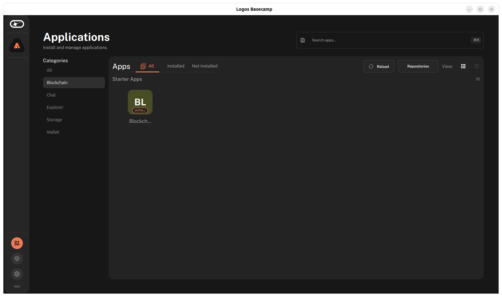


1. Make sure that `Blockchain` (the UI module) is set to `v0.2.1` and `Blockchain Module` (the core module) is set to `v0.2.2`, then click **Install**.

   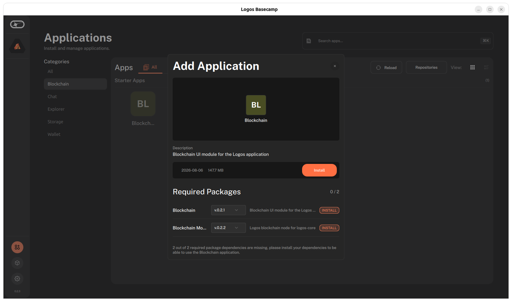

1. Once the modules are installed, press **Launch**.

   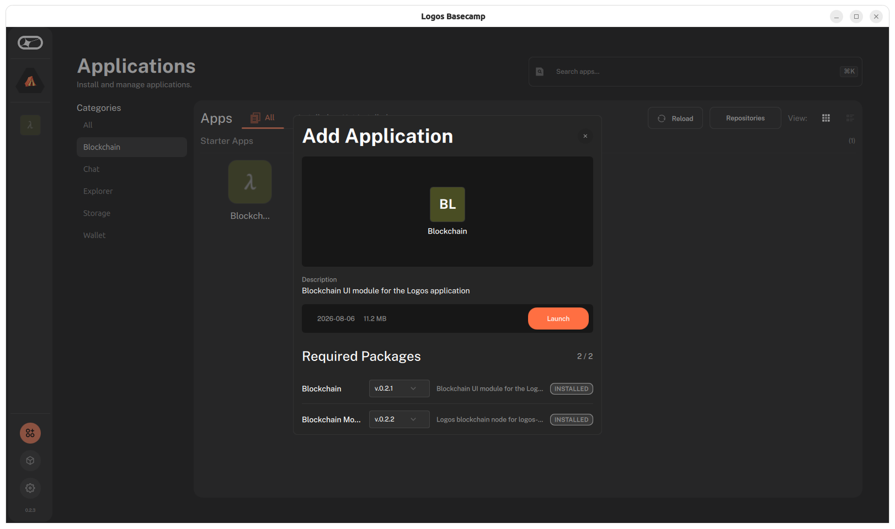

   - The Blockchain app will open.

## Step 2: Configure the node

In the Blockchain app, add a node configuration.

1. Click **Generate a config**.

   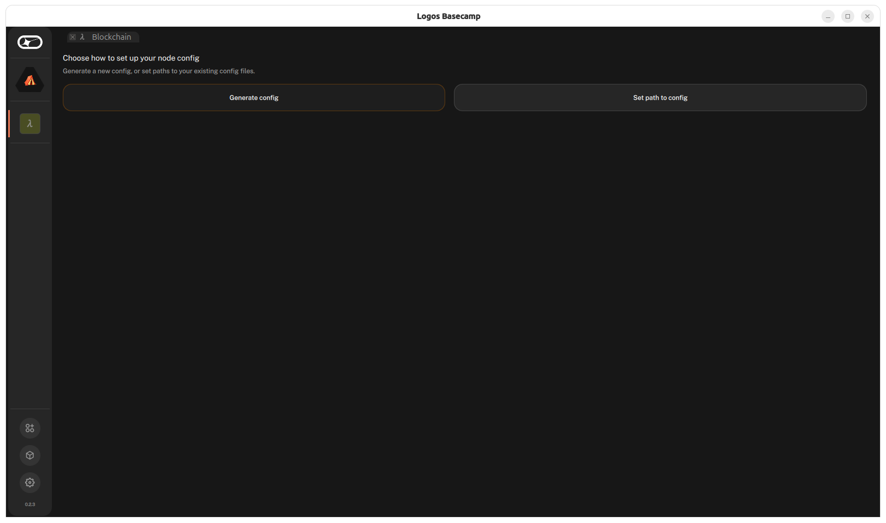

1. In the **Initial peers** field, add the testnet bootstrap peers (one per line). For example, for release 0.2.2:

   ```text
   /ip4/65.109.51.37/udp/3000/quic-v1/p2p/12D3KooWFrouXfmrR4nsLMtE7wu15DoMJ6VtoUtHinREZCvbWHar
   /ip4/65.109.51.37/udp/3001/quic-v1/p2p/12D3KooWJRGau8M1rjT7R5e4YYsgdFhsMX35nRDtMwCDjxQkXAHz
   /ip4/65.109.51.37/udp/3002/quic-v1/p2p/12D3KooWQXJavMDTRscjauFSgVAB1VLB6Rzpy2uY5SU9Tk7927tb
   /ip4/65.109.51.37/udp/50001/quic-v1/p2p/12D3KooWSQc7CcGtvWDPF1yCbBthFnQjprfCVHmfmNDUrSmqQsU1
   ```

   :::info
   Make sure to use the current bootstrap peer addresses in the [Logos Blockchain Node release notes](https://github.com/logos-blockchain/logos-blockchain/releases/latest) for your selected release.
   :::

1. Leave the other fields at their defaults and click **Generate config**, then **Continue**.

   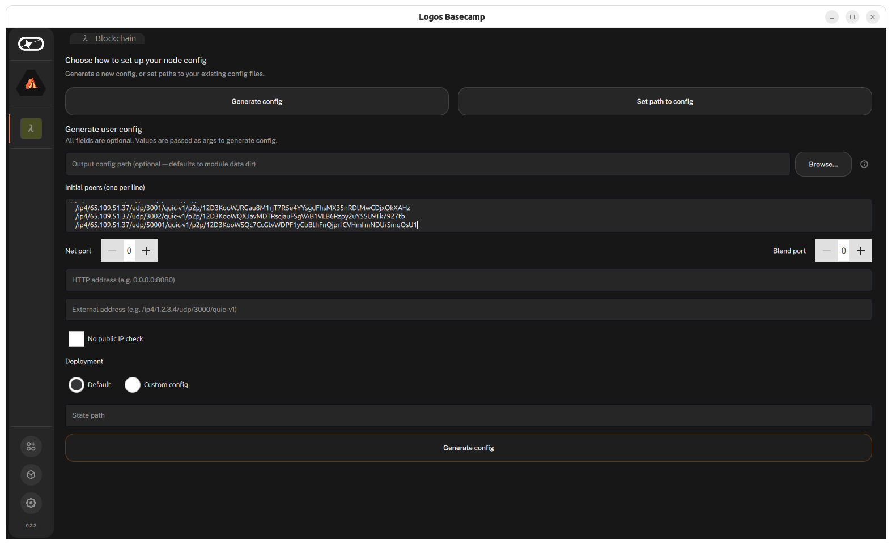

   :::caution
   A config generated with an empty **Initial peers** field produces a node that starts and reports success but never syncs. Make sure the peers above are present before generating.
   :::

## Step 3: Start the node

On the node view, select **Start Node**.

   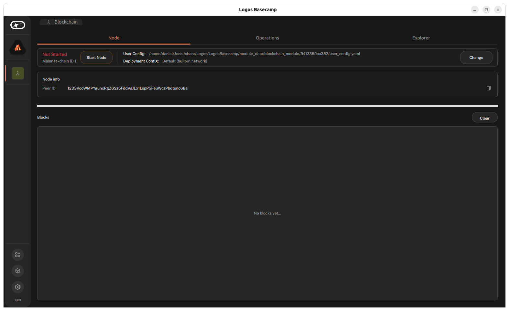

The status moves to *Starting*, then *[Bootstrapping](../../get-started/glossary.md#bootstrapping)*, and the node begins connecting to peers.

   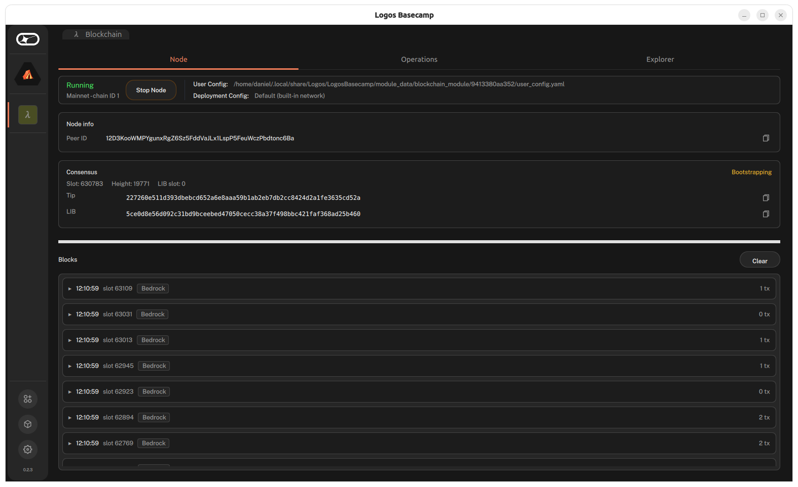

## Step 4: Verify that your node is syncing

In the consensus tab, you will see the consensus status of your node. A syncing node returns a `Tip` that is not genesis and a `Height` that increases over time. The block list in the UI also begins filling within a minute or two.

   :::note
   If you were offline for a while, expect the node to sit in *Bootstrapping* while it catches up before it reports *Online*. A height that is far below the current [slot](../../get-started/glossary.md#slot) during initial sync is normal.
   :::

## Step 5: Fund your node and propose blocks

A synced node validates the chain but does not **propose** blocks until its wallet has a balance. For conensus leadership, your wallet's notes participate automatically — there is no separate staking step.

1. In the node view, open **Operations → Accounts** and copy one of your wallet keys.

   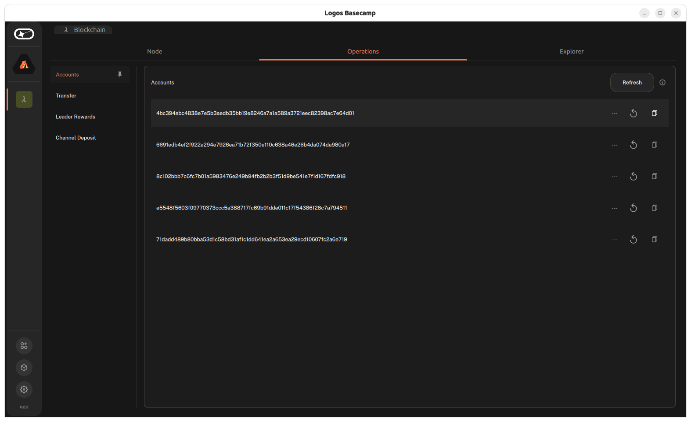

1. Go to the [testnet faucet](https://testnet.blockchain.logos.co/web/faucet/), paste the key in **Destination Public Key (Hex)** on the faucet site, and press **Request Funds**. Make sure your node is *Online* before doing this.

   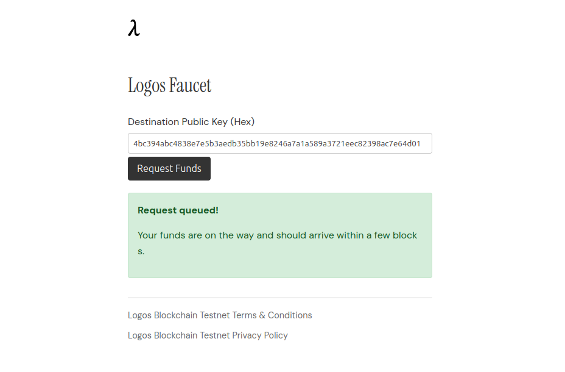

   - Only one faucet transaction can be included per block. During high demand, your transaction may be dropped; retry the request and wait 1 to 2 minutes before checking again.

1. Wait 1 to 2 minutes, then check your balance by clicking **Refresh** in the **Accounts** view.

   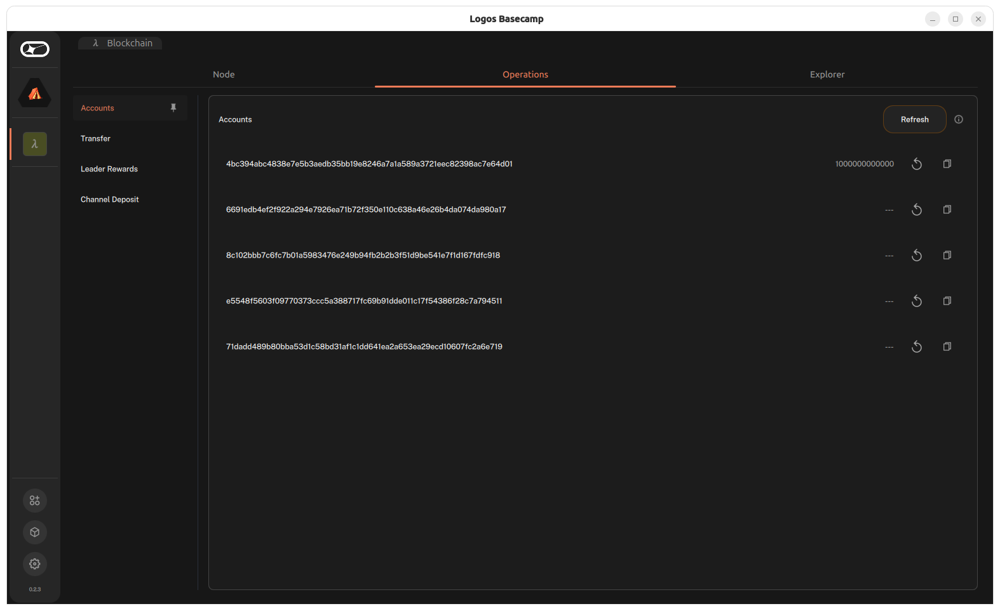

1. Your tokens become eligible for consensus after 3.5 hours. Confirm that your node is participating by checking that the consensus status remains `Online` and `Height` continues to increase.
   
   :::info
   Block proposal is probabilistic. Your node will not propose on every slot; participation depends on your stake relative to total active stake in the network.
   :::

1. Rewards appear under **Operations → Leader Rewards**, where **Claim** redeems them into your wallet.

   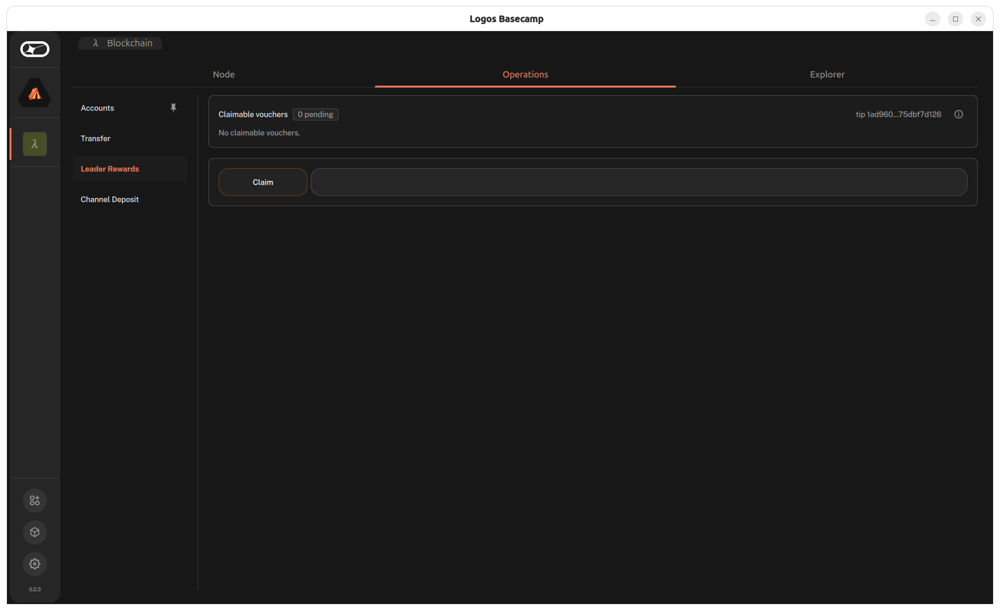

:::note
Participating in the [Blend network](../../get-started/glossary.md#blend-network) as a [*Core* node](../../get-started/glossary.md#core-node) requires a separate locked [note](../../get-started/glossary.md#note) (staked funds) and does not affect block proposing. See [Join the Blend network as a Core node](../blend/join-the-blend-network-as-a-core-node.md).
:::

## Step 6: Keeping your node running

The node runs only while Basecamp is open, and it does not resume automatically after a restart — reopen Basecamp, open the blockchain module, and select **Start Node** again. For an unattended, always-on node, use the [CLI setup](./run-a-logos-blockchain-node-from-cli.md) with a service manager instead.

## Troubleshooting

### The node is Online but Consensus shows "Call failed", or Accounts won't load

This is a UI-side issue, not a node fault — the core is healthy but the UI cannot render the call. Recover least-destructively first:

1. **Fully quit Basecamp and relaunch** (Quit, not just close the window), then reopen the node. This clears most cases with no data loss.
2. **Check that the module versions match** — `Blockchain Module` should be `0.2.2` and `Blockchain` should be `0.2.1`. A version mismatch is a common cause.
3. **If it persists**, reset the chain state while keeping your keys: quit Basecamp, delete `db/` and `state/` inside `module_data/blockchain_module/<id>/` (not the whole folder — that removes your wallet keystore), relaunch, and Start. The node re-syncs from genesis.

If the consensus info on the **Node** page shows an advancing height, the node is syncing and a restart is enough — do not wipe a working node.

### Height stays at 0

Your Initial peers are empty. Quit Basecamp, delete `user_config.yaml`, `db/`, and `state/` inside `module_data/blockchain_module/<id>/` (leave `keystore.yaml`), relaunch, and redo Step 5 with the peers present.

### I need my wallet address but the Accounts panel is blank

Your keys are safe in the keystore regardless of the UI. Retrieve an address directly:

```bash
cd ~/.local/share/Logos/LogosBasecamp/module_data/blockchain_module/<id>/
grep -A20 public_keys keystore.yaml
```
