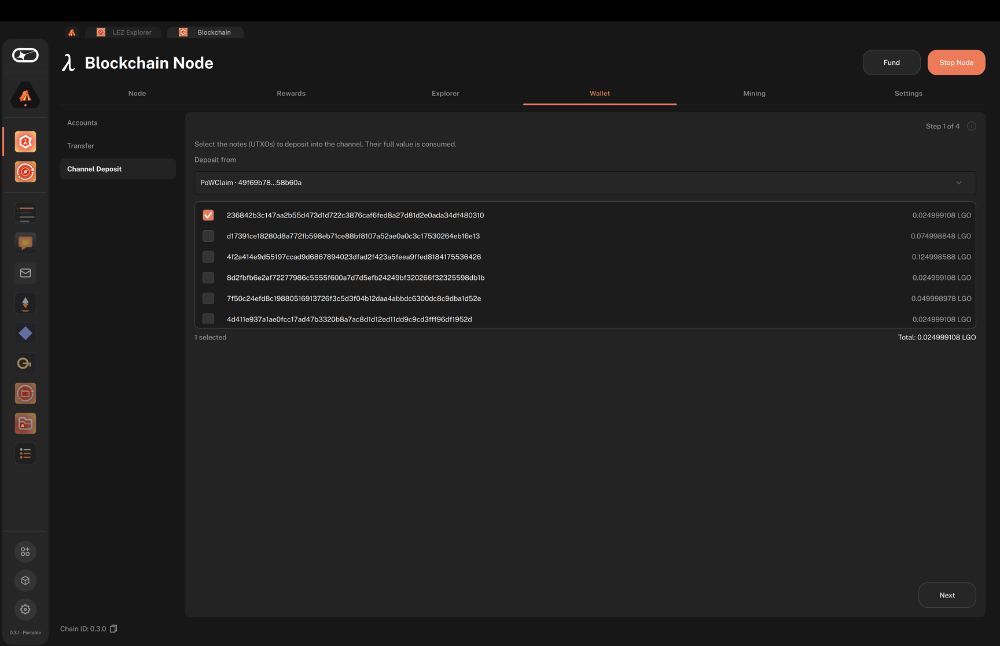
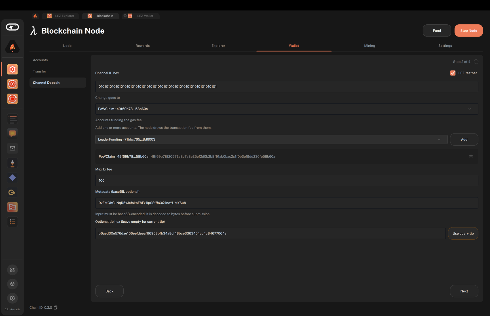
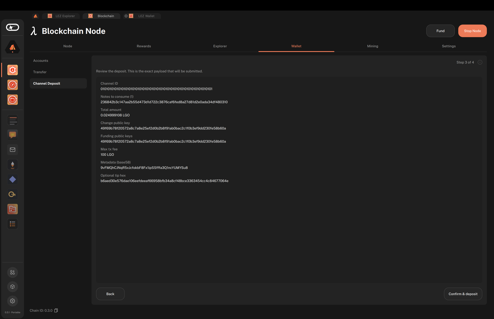
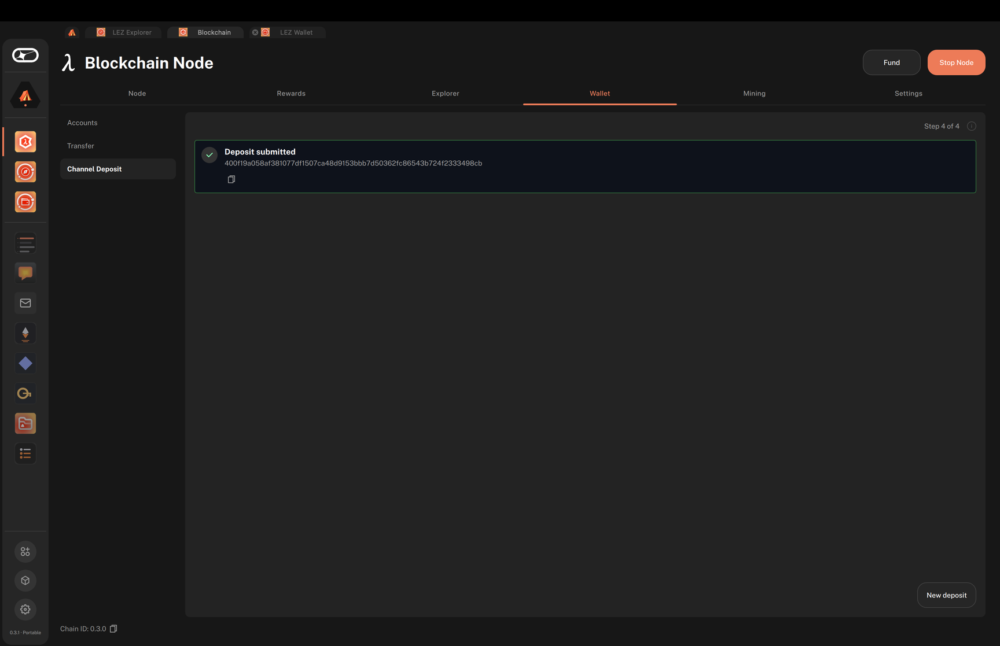

# Bridge assets from Logos Blockchain to a Zone using the Logos Blockchain app

#### Get started locking wallet notes into a Logos Zone, including the LEZ, using the Logos Blockchain UI app.

:::tip[Version]
This document is accurate for **Testnet v0.3**.
:::

This procedure covers how to lock one or more of your wallet [notes](../../get-started/glossary.md#note) (UTXOs) into a Logos [Zone](../../get-started/glossary.md#zone) (such as the [LEZ](../../get-started/glossary.md#lez)) using the [Logos Blockchain desktop app](./build-and-run-logos-blockchain-node-app-ui.md), and receive the resulting transaction hash. It is intended for wallet users on Testnet v0.3 who need to fund a [channel](../../get-started/glossary.md#channel) without hand-assembling note IDs, keys, and fees on a CLI.

:::info[Prerequisites]

- The [Blockchain UI app](./build-and-run-logos-blockchain-node-app-ui.md) running, with the node **Online**.
- At least one wallet account with a positive balance, for example one funded by [mining](./build-and-run-logos-blockchain-node-app-ui.md#step-4-fund-your-node).
- The channel ID of the target Zone. For the public LEZ testnet, the **LEZ testnet** checkbox in the deposit wizard fills it in for you.
- For a LEZ deposit, a public account in the [LEZ wallet UI](../../lez/get-started/run-lez-wallet-ui-and-initiate-native-token-transfers.md) to receive the funds.

:::

## What to expect

- You can select one or more wallet notes and lock their full value into a channel through a four-step wizard.
- You can review the exact deposit payload, including channel ID, notes, keys, fee, and metadata, before submitting.
- You can confirm the deposit succeeded by finding the returned transaction hash in the **Explorer** tab, where the transaction carries a **Channel Deposit** operation.

## Submit a deposit

The wizard collects the deposit payload across two input steps and a review step, then submits it on confirmation. A **Step N of 4** counter in the top-right corner shows where you are.

1. Click the **Wallet** tab, then click **Channel Deposit** in the left menu.

   - The deposit wizard opens at **Step 1 of 4**.
   - While the node cannot answer, a notice at the top of the wizard says why, for example `Start the node from the Node tab.`

1. On **Step 1 of 4**, choose the account to deposit from in **Deposit from**.

   - The account's notes load automatically. Choosing a different account reloads them.

1. Select one or more notes. The counter below the list shows how many notes are selected and their total. **Next** is enabled once at least one note is selected; the full value of each selected note is consumed. Click **Next**.

   

1. On **Step 2 of 4**, enter the deposit parameters:

   - **Channel ID hex**: the target channel. For the public LEZ testnet, select **LEZ testnet** and the app fills in the channel ID. For any other Zone, paste the 64-hex-character channel ID.
   - **Change goes to**: the account that receives any leftover value. It defaults to the account you deposit from.
   - **Accounts funding the gas fee**: the accounts the node draws the transaction fee from. The account you deposit from is added for you. To add another, choose it in the **Account…** dropdown and click **Add**.
   - **Max tx fee**: the maximum fee you allow, in LGO.
   - **Metadata (base58, optional)**: data for the Zone, usually specific to it. For the LEZ, paste the ID of the public account that receives the deposit: in the [LEZ wallet UI](../../lez/get-started/run-lez-wallet-ui-and-initiate-native-token-transfers.md#create-a-new-public-account), click the copy button next to one of your public accounts. For other Zones, leave it empty if the Zone does not need any.

     :::warning
     A LEZ deposit without a public account ID in **Metadata** is locked on the Logos Blockchain but never credited on the LEZ.
     :::
   - **Optional tip hex (leave empty for current tip)**: the chain tip the deposit is built against. Leave it empty to use the node's current tip, or click **Use query tip** to use the tip that the notes were loaded at.

   - **Next** is enabled once the channel ID, change account, at least one funding account, and max fee are present, and any metadata entered is valid base58. Click **Next**.

   

1. On **Step 3 of 4**, review the exact payload: channel ID, notes to consume and total amount, change and funding public keys, max transaction fee, metadata, and tip. Then click **Confirm & deposit**.

   

   :::warning
   Review the information carefully. Deposits are irreversible once included in a block.
   :::

## Read the deposit result

1. On **Step 4 of 4**, wait while the wizard shows **Submitting deposit…**, then read the result:

   - On success, the wizard shows **Deposit submitted** with the transaction hash. Click the copy button to copy it.
   - On failure, the wizard shows **Deposit failed** with the error message.

   

1. Click **New deposit** to reset the wizard for another deposit.

1. Confirm the transaction on chain. Open the **Explorer** tab, paste the transaction hash in **Search a block id or transaction hash**, and press **Enter**.

   - The result shows the transaction and the slot of the block it was included in. Its operation is labelled **Channel Deposit** (`op 18`).
   - If the result reads `Nothing found for “<hash>”.`, the transaction is not in a block yet. Wait for a few blocks and search again.

## Troubleshooting channel deposits

### Confirm & deposit is disabled

The node is not running. Start it with **Start Node** in the header and wait for the **Node** tab to read **Online** before submitting.

### The note list reads `This account holds no notes to deposit.`

Either the account has no spendable notes, or the node was not running when you chose the account, so its notes were never loaded.

- If the node was not running, start it and wait for **Online**. Then choose a different account in **Deposit from**, and choose yours again to reload its notes.
- If the node was running, the account has nothing to deposit. Fund it first, or choose another account.

### The LEZ testnet checkbox is missing

The app has no LEZ channel ID: either it could not read the one built into its `metadata.json`, or it was built from `master`, which has none. Get the channel ID from the LEZ testnet and paste it in **Channel ID hex**:

```bash
curl https://testnet.lez.logos.co/ \
 -H "Content-Type: application/json" \
 -d "{ \
     \"jsonrpc\": \"2.0\", \
     \"method\": \"getChannelId\", \
     \"params\": {}, \
     \"id\": 1 \
 }"
```

### Next stays disabled on Step 2 of 4

A required field is missing or invalid:

- The channel ID is not 64 hex characters. The field shows `A channel ID is 64 hex characters (32 bytes).`
- No change account or funding account is selected, or **Max tx fee** is empty.
- The metadata is not valid base58. The field shows `Invalid base58 input`.

### The wizard shows Deposit failed

The module rejected the transaction. Common causes are insufficient funds to cover the selected notes plus the maximum transaction fee, an invalid channel ID or key, or a rejected or expired tip. The exact error is shown in the result step.
