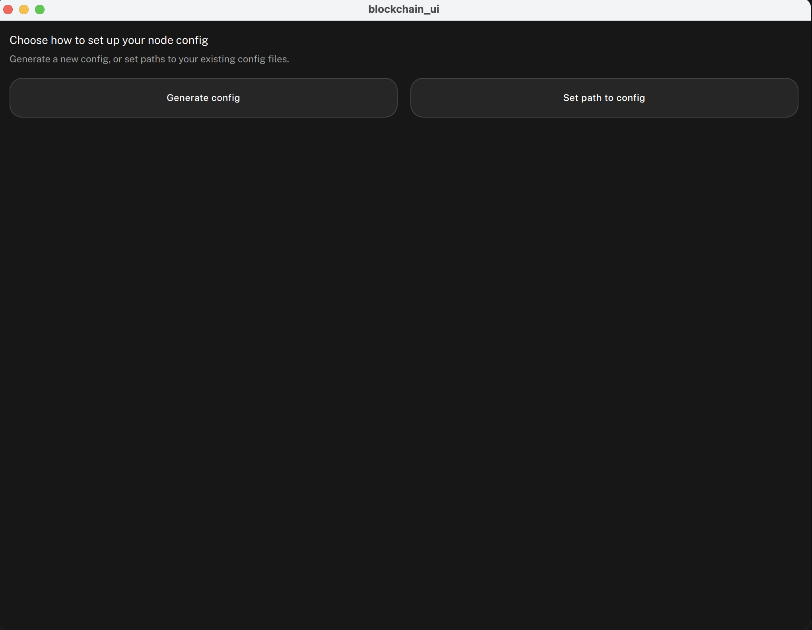
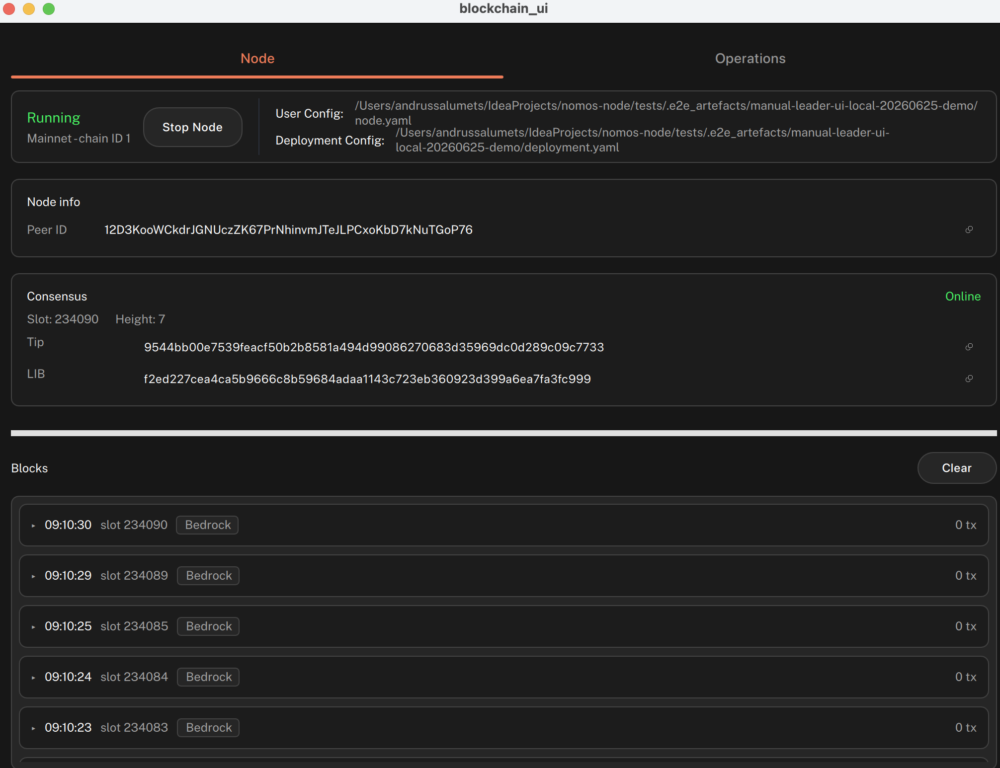

# Build and run the Logos Blockchain UI app

#### Run a node that participates in consensus via a standalone application.

:::tip[Version]
This document is accurate for **Testnet v0.2.1**.
:::

The [Logos Blockchain](../../get-started/glossary.md#logos-blockchain) is the blockchain [module](../../get-started/glossary.md#module) of the Logos technology stack, providing a privacy-preserving and censorship-resistant framework for decentralised network states. You can run a Logos Blockchain node [using the CLI](../get-started/run-a-logos-blockchain-node-from-cli.md) or a standalone application.

:::info[Prerequisites]

- A supported OS:
    - Linux x86_64
    - macOS
- **Nix** with flakes enabled.
    - Install from [nixos.org](https://nixos.org/download.html), then enable flakes:

    ```bash
    mkdir -p ~/.config/nix
    echo 'experimental-features = nix-command flakes' >> ~/.config/nix/nix.conf
    ```
:::

## What to expect

By the end of this tutorial:

- You will have a Logos Blockchain node running and connected to peers.
- Your wallet will hold testnet funds requested from the faucet.
- Your node will be eligible to participate in the consensus lottery after the UTXO ages for approximately two hours.

## Step 1: Run the Logos Blockchain app

1.  Clone the repository:

    ```sh
    git clone https://github.com/logos-blockchain/logos-blockchain-ui.git
    cd logos-blockchain-ui
    ```
2.  Build and run the standalone app:

    ```sh
    nix run
    ```

    :::info
    On a cold Nix cache, the first run compiles the blockchain UI from source (Qt/C++ and Rust dependencies). This can take 20–60 minutes. Subsequent runs are instant from cache.
    :::

## Step 2: Generate and load a node config

1. In the app, click **Generate Config**.

    
2. In the [Logos Blockchain release notes](https://github.com/logos-blockchain/logos-blockchain/releases/latest), find the `Initialize Your Node` section and copy the `/ip4/…/quic-v1/p2p/…` addresses listed under `initial_peers`. These are the testnet bootstrap peers.
3. In the app, paste the peer set information into **Initial peers (one per line)** and click the generate button at the bottom. The generated file becomes the active user config, shown as **User Config: … (Generated)**. (To use an existing config file instead, choose **Set path to config**.)
5.  Click **Start Node**. A green indicator shows the node is running, and the wallet appears with a balance of `0`.

    

## Step 3: Request testnet funds from the faucet

1. From the wallet section of the UI, copy one of your keys.
2.  Go to the [testnet faucet](https://testnet.blockchain.logos.co/web/faucet/), paste your key, and click **Request Funds**.

    :::info
    The transaction can take up to a minute to confirm and appear in your wallet.
    :::

## Step 4: Verify the node is healthy

1.  Check that the blockchain height is increasing:

    ```sh
    curl localhost:8080/cryptarchia/info
    ```

    Example response:

    ```json
    {"cryptarchia_info":{"lib":"3d0c...4e6d","lib_slot":0,"tip":"f44d...e2f5","slot":70899,"height":120,"state":"Bootstrapping"},"phase":"InitialBlockDownload"}
    ```

    The HTTP endpoint nests the fields under `cryptarchia_info` and names the status field `state`; the `logoscore call blockchain_module get_cryptarchia_info` form returns a flat object with a `mode` field instead.

    Expect `height` to increase at an average rate of one block every 10 seconds. The timing is probabilistic, so some variance is normal. While the node is catching up, this endpoint can also time out with a `408` under sync load even though `/network/info` still answers.
2.  Check that the node is connected to peers:

    ```sh
    curl localhost:8080/network/info
    ```

    Example response:

    ```json
    {"listen_addresses":["/ip4/127.0.0.1/udp/3001/quic-v1"],"peer_id":"12D3...fuS2","n_peers":16,"n_connections":19,"n_pending_connections":0}
    ```

    Confirm that `n_peers` is greater than `0`.

Once the node is funded and the UTXO has aged for approximately two hours, the node automatically participates in the consensus lottery and starts producing blocks.

## Troubleshooting starting a node

### The wallet balance does not update after a faucet request

Only one faucet transaction can be included per block, so transactions may be dropped during periods of high demand. Retry the request from the faucet.

### `nix build` is taking a long time to build

This is expected behaviour. The build could take over an hour in some cases.
