# Build and run the Logos Blockchain UI app

#### Run a node that participates in consensus from the Logos Blockchain desktop app.

:::tip[Version]
This document is accurate for **Testnet v0.3.0**.
:::

The [Logos Blockchain](../../get-started/glossary.md#logos-blockchain) is the blockchain [module](../../get-started/glossary.md#module) of the Logos technology stack, providing a privacy-preserving and censorship-resistant framework for decentralised network states. You can run a Logos Blockchain node [using the CLI](../get-started/run-a-logos-blockchain-node-from-cli.md) or with the Logos Blockchain UI app, which drives the `blockchain_module` module from a graphical interface.

This procedure covers running the app (through Logos [Basecamp](../../get-started/glossary.md#basecamp) or by building it with Nix), setting up a node through the onboarding wizard, confirming that it syncs, and funding its wallet so it can propose blocks.

:::info[Prerequisites]

- A graphical desktop session on one of:
    - **Linux** (tested on Ubuntu 24.04)
    - **Windows 11 with WSL2** (plus WSLg for the GUI)
    - **Apple Silicon Mac** (M1 or later).
- CPU: 2 Cores, 2Ghz. Modern multi-core processor. **Must have ADX instruction support (on x86_64)**, such as Intel Broadwell or later, or any AMD Zen. On virtual machines, configure the hypervisor to pass through host CPU features. Generic CPU models such as `kvm64` and `qemu64` hide ADX and cause the blockchain module to crash with `signal 4`.
- Memory (RAM): Minimal (1 Gb).
- Storage:
    - For joining the testnet or a short-lived node: SSD with 1-2 GB free.
    - Expected for a long-lived mainnet node: SSD with 100+ GB free with ability to expand storage on demand.
- Network: Relatively reliable network connection. 1Mbps of free bandwidth.
- To build from source: **Nix** with flakes enabled.
    - Install from [nixos.org](https://nixos.org/download.html), then enable flakes:

    ```bash
    mkdir -p ~/.config/nix
    echo 'experimental-features = nix-command flakes' >> ~/.config/nix/nix.conf
    ```
:::

## What to expect

- You can run the Logos Blockchain UI app from Logos Basecamp or build it from source with Nix.
- You can set up and start a node in one click with **Quick start**, or through the onboarding wizard.
- You can fund your wallet by mining, so your node takes part in the consensus lottery.

## Step 1: Run the application

Install the official release from the Basecamp catalogue, or build the same release from source. Either way, the app comes with the testnet bootstrap peers and LEZ channel ID built in.

### Install from Logos Basecamp

1. Download and [install](../../basecamp/install-logos-basecamp.md) the latest release of Logos Basecamp.
1. At the bottom of the sidebar, click **Applications**.
1. Select `Blockchain` in **Categories**, then click the **Blockchain** card.
1.  In the **Add Application** dialogue, click **Install**. Under **Required Packages**, the dialogue lists the **Blockchain** app and the **Blockchain Module** [core module](../../get-started/glossary.md#core-module) it needs, and **Install** installs both.

    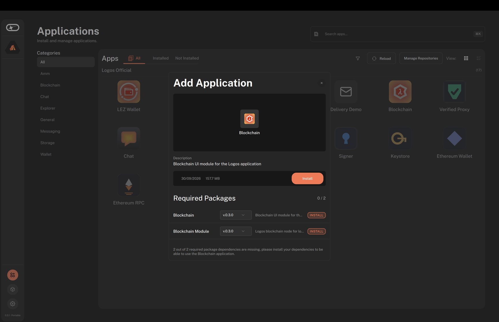

1. Wait until the button changes to **Launch**, then click it. A **Blockchain** icon appears in the sidebar, so you can reopen the app from there later.

To install packages one by one instead, see [Install and load a module in Logos Basecamp](../../basecamp/install-and-load-a-module-in-logos-basecamp.md).

### Build from source

Build the standalone app from the `release/0.3.1` branch of [`logos-blockchain-ui`](https://github.com/logos-blockchain/logos-blockchain-ui), the source of the `blockchain_ui` 0.3.1 catalogue release. Its `flake.lock` pins `blockchain_module` 0.3.0 and the node release it runs.

:::note
`master` runs ahead of the testnet, so a build from it can need node changes, bootstrap peers, and config updates that this page does not cover.
:::

1.  Clone the release branch and enter the project directory:

    ```bash
    git clone --branch release/0.3.1 https://github.com/logos-blockchain/logos-blockchain-ui.git
    cd logos-blockchain-ui
    ```

1.  Build and run the standalone app:

    ```bash
    nix run
    ```

    :::info
    On a cold Nix cache, the first run compiles the app and the node from source (Qt/C++ and Rust dependencies). This can take 20–60 minutes, or longer on slower machines. Later runs start from the cache.
    :::

## Step 2: Set up your node

On first run, the app opens on a welcome screen titled **Blockchain Node**. A node needs a config and a keystore before it can start.

The welcome screen offers **Quick start** and **Advanced**. **Quick start** generates a config for the public testnet with the bootstrap peers built into the release, creates your keys, and starts the node. To walk through the same choices one at a time, or to reuse a config you already have, click **Advanced** and follow [Step-by-step setup](#step-by-step-setup) instead.

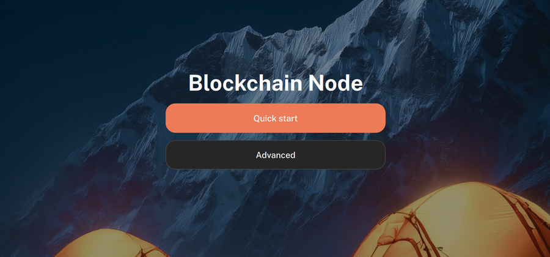

1.  Click **Quick start**.

    - The screen reads **Setting up your node…** while the app writes your config, creates your keys, and starts the node. The node view then opens.

1.  Open the **Settings** tab. Until you back up your keys, the **Node** tab shows a **Back up your keys** notice that points here.

    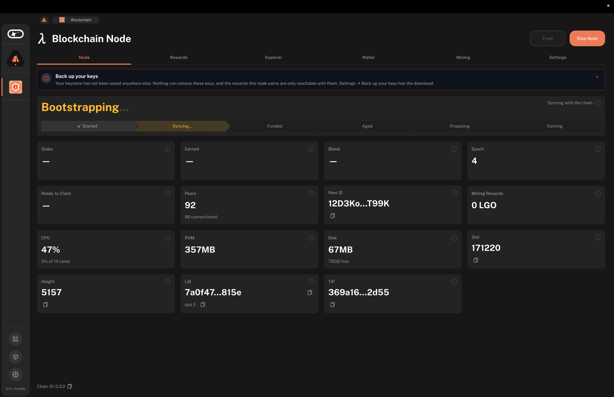

1.  In the **Back up your keys** card, click **Download keystore.yaml** and choose where to save the copy.

    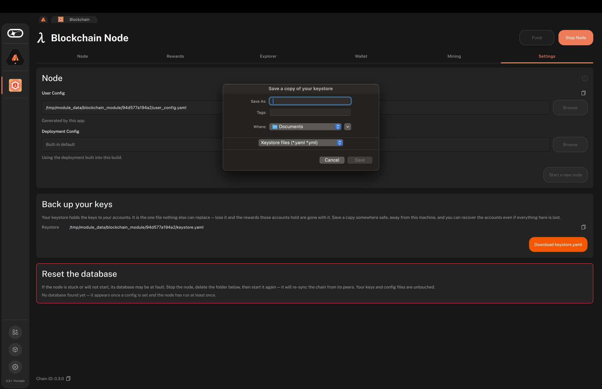

    - A **Keystore saved** message confirms the backup, and the card shows a **Done** badge.

    :::warning
    Your keystore holds the keys to your accounts, stake, and rewards. Nothing can reissue them. Keep the copy somewhere other than this machine.
    :::

### Step-by-step setup

1. Click **Advanced**. The **Set up your node** wizard opens on step **1. Setup**.
1.  Under **How do you want to start?**, select **Generate a new node** and click **Continue**.

    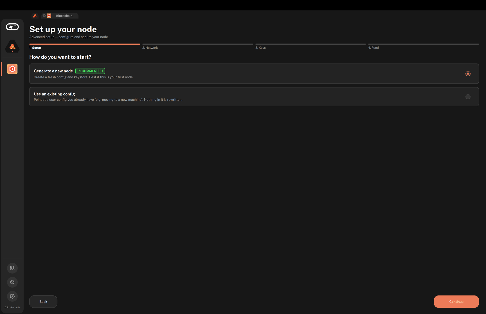

    - To reuse files you already have, select **Use an existing config** instead, fill in **User config** (and optionally **Deployment**) under **Point to your files**, and click **Start node**. The wizard ends there.

1.  On **2. Network**, leave **Default (public testnet)** selected. The **Bootstrap peers** field is already filled with the testnet peers built into the release.

    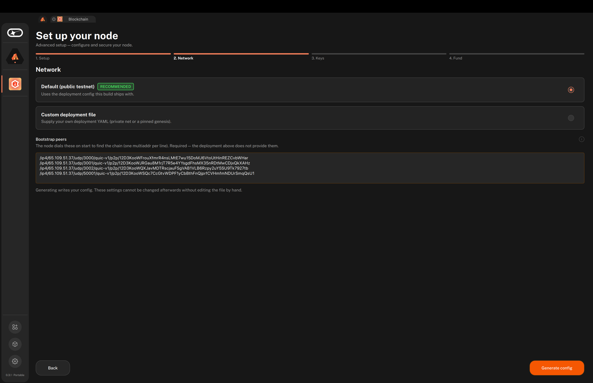

1. Click **Generate config**.

    - Generating writes your config. You cannot change these settings afterwards without editing the file by hand.

1.  On **3. Keys**, click **Download keystore.yaml** and save the copy somewhere safe. Select **I've backed up my keys somewhere safe**, then click **Continue**.

    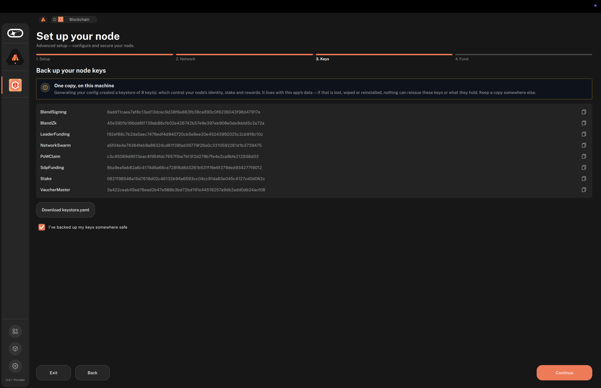

1.  On **4. Fund**, choose whether the node claims mined rewards automatically:

    - Leave **Claim mined rewards automatically** on. **Pays into** already lists the target from your generated config: your **PoWClaim** account, with **No cap**. To pay into another account as well, choose it, set a threshold or switch on **No cap**, and click **Add**.
    - Alternatively, switch it off. You can still mine with the **Fund** button and claim rewards yourself from the **Mining** tab.

    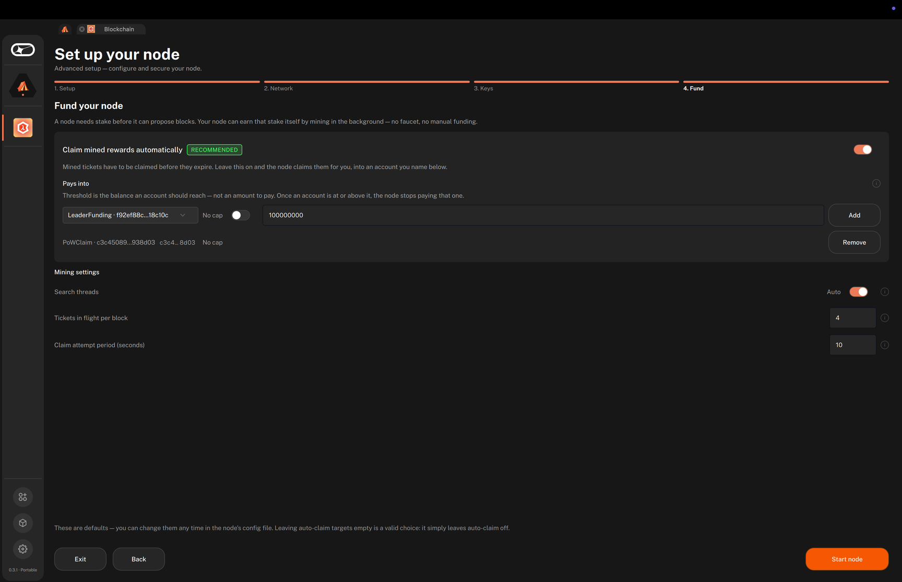

1. Click **Start node**. The app saves your mining settings, starts the node, and opens the node view.

## Step 3: Verify that the node is syncing

The **Node** tab shows the node's state as a headline, with a lifecycle lane underneath it (**Started**, **Online**, **Funded**, **Aged**, **Proposing**, **Earning**) that lights up one stage at a time.

1.  Watch the headline. It moves from **Starting** to **[Bootstrapping](../../get-started/glossary.md#bootstrapping)** (**Syncing with the chain**) while the node catches up, then to **Online** (**Following the chain**).

    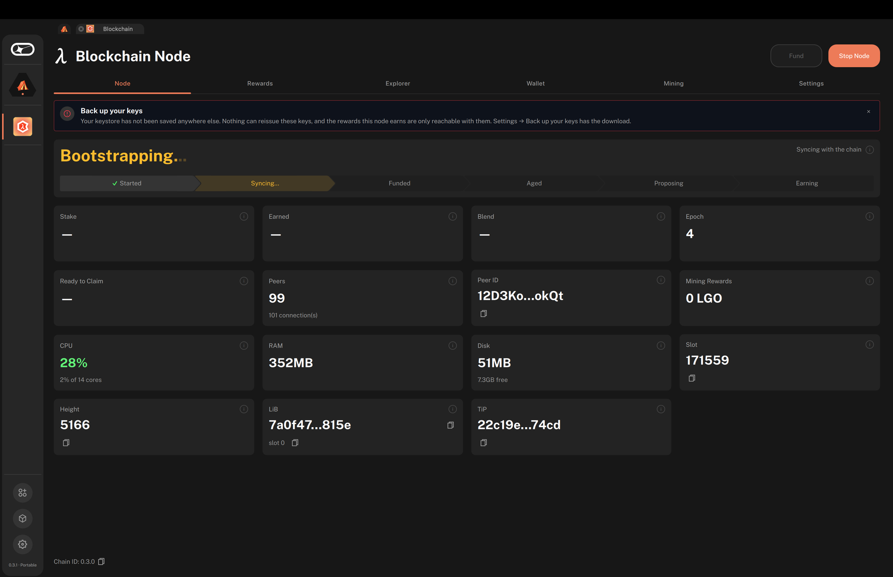

    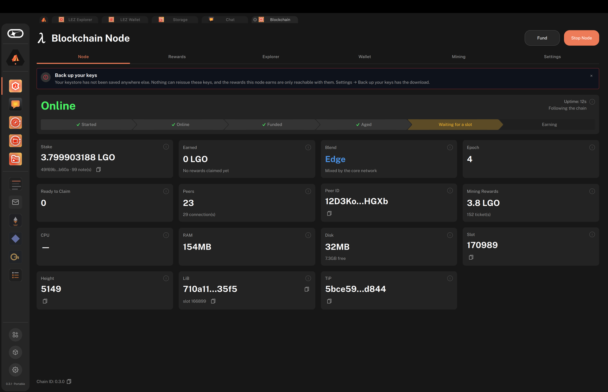

1.  Check the **Peers** tile. It shows the number of connected peers, and should be greater than `0`.
1.  Check the **Height** tile. Expect it to increase by about one block every 10 seconds once the node is **Online**. The timing is probabilistic, so some variance is normal.

    - You can compare the height with the [testnet block explorer](https://testnet.blockchain.logos.co/web/explorer/).
    - The **Explorer** tab lists each new block that this node sees from now on.

## Step 4: Fund your node

A synced node validates the chain but does not propose blocks until its wallet holds stake. You fund it by mining.

1. Wait until the headline reads **Online**. The **Fund** button in the header stays disabled until then.
1.  Click **Fund**. The node starts mining in the background and the button changes to **Stop Mining**.

    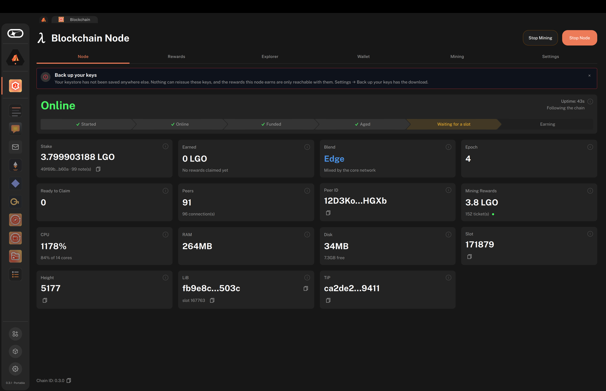

    :::warning
    Mining uses CPU for as long as it runs. It does not stop by itself: click **Stop Mining** when you have enough funds.
    :::

1. Open the **Mining** tab to follow mined tickets. A ticket pays nothing until it is claimed, and expires if it never is.

    - By default the node claims tickets for you and pays them into your **PoWClaim** account, whether you used **Quick start** or step-by-step setup: the generated config lists that account as an auto-claim target.
    - If you switched auto-claim off during [step-by-step setup](#step-by-step-setup), claim tickets yourself under **Manual claim**, as described in [Claim mining rewards](./claim-leader-rewards-in-logos-blockchain-ui-app.md#claim-mining-rewards).
    - The **Mining Rewards** tile on the **Node** tab shows what mining has paid so far.

1.  Open the **Wallet** tab, then click **Accounts**. Click **Refresh** and confirm the balance of your **PoWClaim** account, in LGO.

    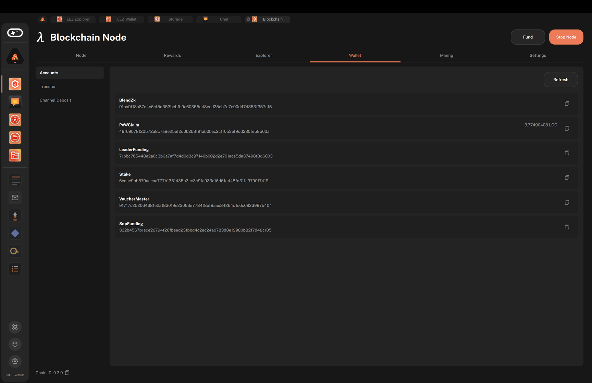

Once the wallet is funded, the **Stake** tile on the **Node** tab shows the value of the notes that have aged into the leadership lottery. Tokens can take up to two [epochs](../../get-started/glossary.md#epoch) to age in. After that, the node takes part in the consensus lottery automatically and starts proposing blocks. To claim the rewards it earns, see [Claim leader rewards in the Logos Blockchain UI app](./claim-leader-rewards-in-logos-blockchain-ui-app.md).

## Troubleshooting starting a node

### The welcome screen only offers Set up your node

The app hides **Quick start** when it has no bootstrap peers: either it could not read the peers built into its `metadata.json`, or it was built from `master`, which has none. Click **Set up your node** and follow [Step-by-step setup](#step-by-step-setup). On **2. Network**, the **Bootstrap peers** field is empty: copy the testnet peers from the `Initialize Your Node` section of the [Logos Blockchain release notes](https://github.com/logos-blockchain/logos-blockchain/releases/latest) and paste them one per line. The release notes show them inside a CLI command: keep only the multiaddrs themselves, such as `/ip4/<ip>/udp/<port>/quic-v1/p2p/<peer-id>`, with no quotes, brackets, or commas.

### A dialogue says `Your config is out of date`

The config was written for an older release, so the node won't start with it. Testnet v0.3 starts a new chain, so configs from Testnet v0.2 need updating. Click **Update config**: the app rebuilds the config for this release and keeps your settings and keys. If the dialogue reads `This config can't be updated` instead, there is no keystore next to the config, and **Start fresh** creates a new config with a new set of keys.

### The headline stays in Bootstrapping mode

The node is still catching up, and the line beside the headline says why:

- `Catching up — replaying stored blocks.` or `Syncing with the chain`: wait. A first sync can take a while.
- `No block progress for 10 minutes — the node may have lost its peers. Try stopping and starting it.`: click **Stop Node**, then **Start Node**.
- `Genesis is … — the node can't finish syncing until then. Its config likely points at the wrong network.`: the config was generated for another network. In **Settings**, click **Start a new node** to generate a config for the public testnet.

If the node is stuck or will not start at all, the **Reset the database** card in **Settings** shows the database folder. Stop the node, delete that folder, then start the node again. It re-syncs the chain from its peers, and your keys and config files are untouched.

### The headline reads Node stopped or Disconnected

- **Node stopped** means the node process stopped unexpectedly. Click **Start Node**. If the same thing happens again, restart the app.
- **Disconnected** means the app lost contact with the node service. Restart the app.

### `nix run` takes a long time to build

This is expected behaviour on a cold cache. The build could take over an hour in some cases.
