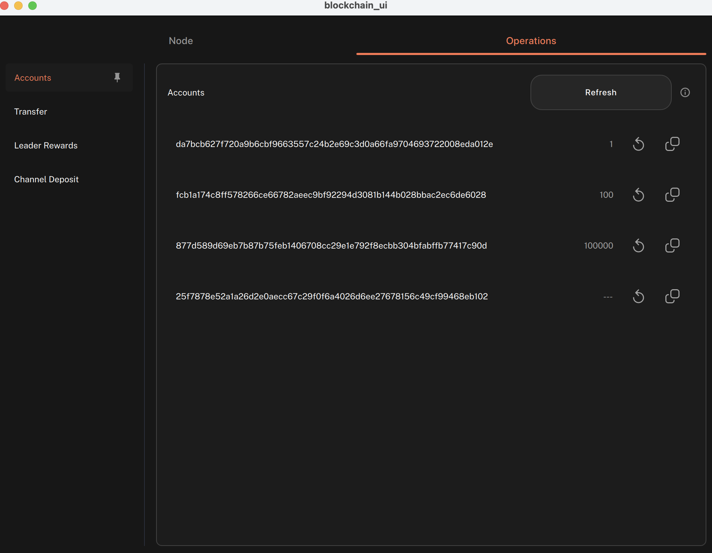
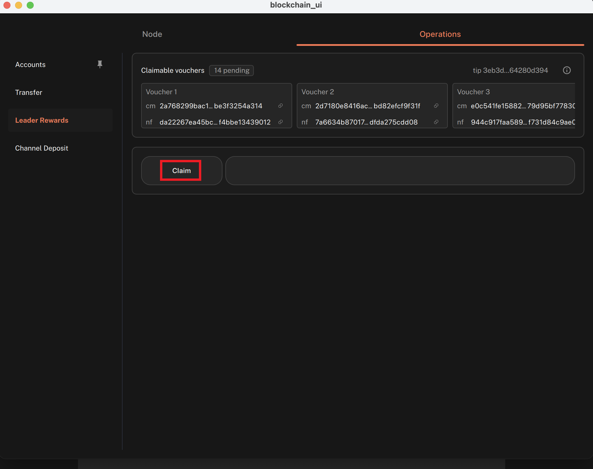
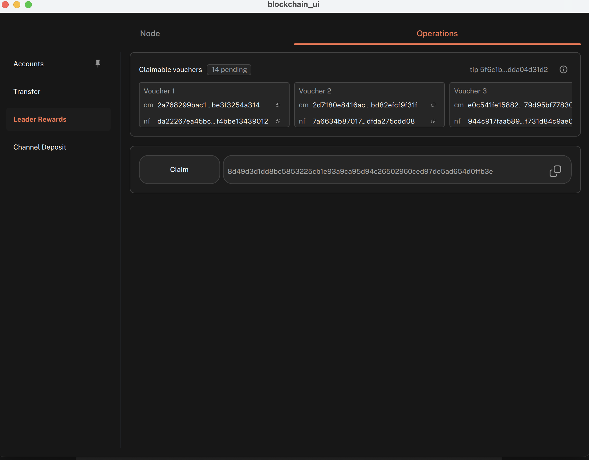
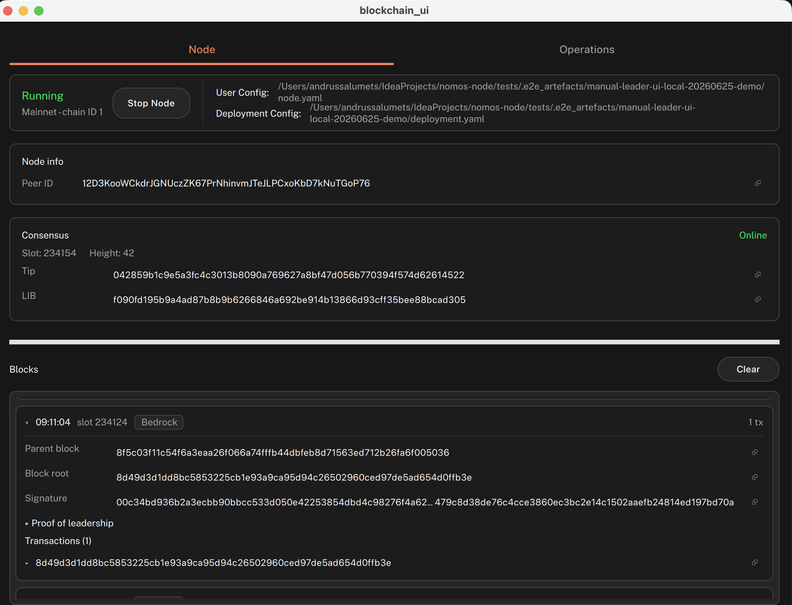
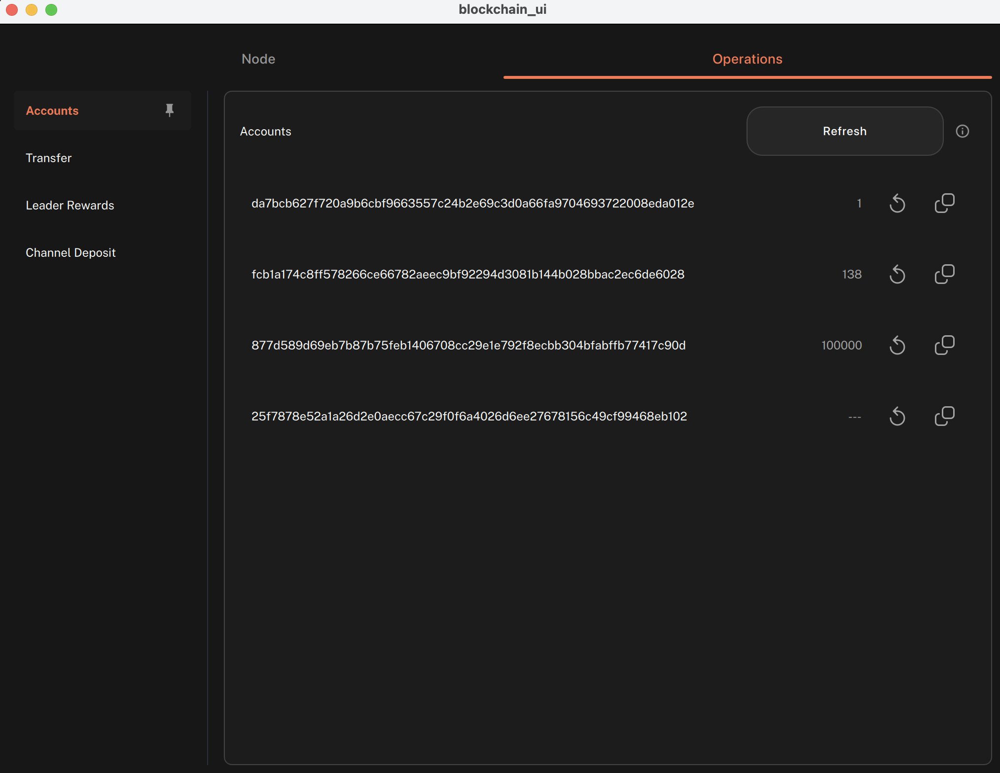

# Claim leader rewards in the Logos Blockchain UI app

#### Learn how to get rewarded for having your Logos Blockchain node propose blocks

This procedure covers how to claim rewards for participating in the consensus protocol of the Logos Blockchain. It is intended for node operators running their node via the Blockchain UI app.

Before you start, make sure you have the following:

* A [Logos Blockchain node running via the UI app](build-and-run-logos-blockchain-node-app-ui.md)
* A wallet key that can receive leader reward claims

## What to expect

* You can view available reward vouchers in **Leader Rewards** and claim one with a single button press.
* You can verify the claim by matching the transaction hash in the block list and confirming the reward account balance has increased.

## Claim a reward voucher

Check the account balance before claiming, submit a claim, then confirm the transaction and balance update.

1.  In **Operations**, open **Accounts** and click **Refresh** to load the current wallet state.

    

    * Note the balance of the account that will receive the reward before claiming.
2.  In **Operations**, open **Leader Rewards**.

    

    * The panel shows the number of available claimable vouchers, the tip used for the query, and voucher details including `cm` and `nf` values.

    

If the voucher count shows <code>0</code>, wait for more blocks and refresh the <strong>Leader Rewards</strong> panel before proceeding.

3.  Click **Claim**.

    

    * The UI displays a transaction hash. Note this hash to confirm inclusion in the next step.
4.  Return to the **Node** tab and inspect the block list. Find a block that includes the claim transaction, expand it, and confirm the transaction hash matches the one shown after clicking **Claim**.

    

    * On shared networks the block may contain other transactions too.
5.  Return to **Operations**, then **Accounts**, and click **Refresh**.

    

    * Confirm the reward account balance has increased. The balance updates after the claim transaction is processed.

## Troubleshooting leader rewards

### Why does the voucher count show 0?

The node has not yet produced enough blocks for vouchers to be available. Keep the node running and refresh **Leader Rewards** after more blocks appear.

### Why does clicking **Claim** fail?

Either the node is not running or the voucher count is `0`. Confirm the node status shows **Running** and that at least one voucher is listed before retrying.

### Why is the transaction hash not showing in the block list yet?

Transaction inclusion is not always immediate. Wait for more blocks to appear in the block list and check again.

### Why hasn't the account balance updated after claiming?

Refresh **Accounts** only after the claim transaction appears in a block. The balance reflects on-chain state and does not update until the transaction is included.
