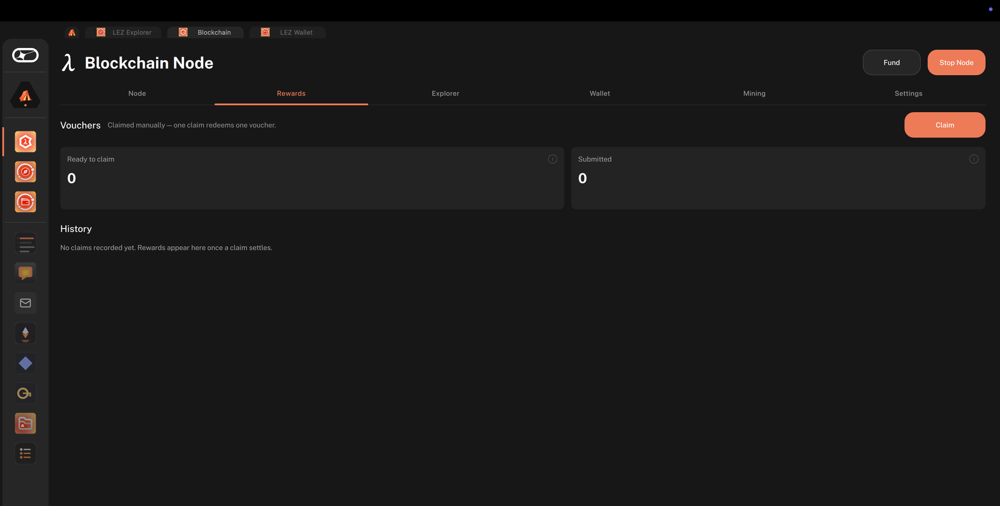
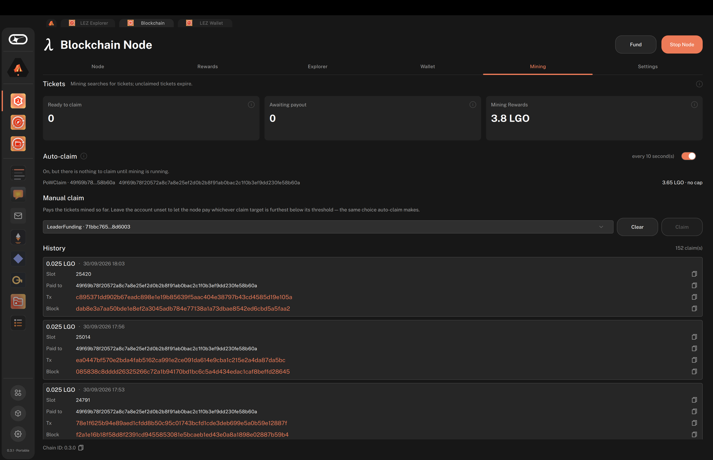

# Claim leader rewards in the Logos Blockchain UI app

#### Learn how to get rewarded for having your Logos Blockchain node propose blocks.

:::tip[Version]
This document is accurate for **Testnet v0.3.0**.
:::

This procedure covers how to claim rewards for participating in the consensus protocol of the [Logos Blockchain](../../get-started/glossary.md#logos-blockchain). Every block your node leads through [Proof of Leadership](../../get-started/glossary.md#proof-of-leadership) mints a reward voucher, and claiming a voucher redeems it into spendable balance. It is intended for node operators running their node via the Blockchain UI app. The procedure also covers claiming the proof-of-work tickets that [mining](../../get-started/glossary.md#mining) produces.

:::info[Prerequisites]

- The [Blockchain UI app](./build-and-run-logos-blockchain-node-app-ui.md) running, with the node **Online**.
- A funded node that has proposed at least one block. The lifecycle lane on the **Node** tab reaches **Earning** once a reward voucher is ready to claim.
:::

## What to expect

- You can see how many leader reward vouchers are ready to claim in the **Rewards** tab and claim one with a single button press.
- You can follow each claim in the **History** list until it reaches finality, and open its transaction in the **Explorer** tab.
- You can claim mined proof-of-work tickets from the **Mining** tab, by hand or automatically.

## Claim a reward voucher

Check what is ready to claim, submit a claim, then follow it until it settles.

1. Click the **Rewards** tab.

   - The **Ready to claim** card shows how many vouchers your wallet can claim now, with their approximate value before fees beneath.
   - Click the **Ready to claim** card to list the vouchers, with the `cm` and `nf` values of each and the chain tip they were read at.

   :::info
   If **Ready to claim** shows `0`, your node has not led a block yet, or every voucher has already been claimed. If it shows `—`, the node has not reported yet. Wait for more blocks; the card updates by itself.
   :::

   

1. Click **Claim** next to **Vouchers**, or in the voucher list.

   - One claim redeems one voucher, and the protocol picks which one.
   - A **Claim submitted** notice shows the transaction hash. Click the copy button to copy it.
   - The **Submitted** card counts the claim as **waiting to land** until its transaction is seen in a block.

1. Under **History**, find the new claim.

   - Each entry shows the amount, the **Slot**, the account it was **Paid to**, and links to its **Tx** and **Block**.
   - A `Finalizes in …` badge shows how long until the claim is final. The badge disappears once it is.
   - Select **Show only pending** to list only the claims that have not reached finality yet.

1. Click the **Tx** link of the claim to open its transaction in the **Explorer** tab. Its operation is labelled **Leader Claim**.

1. Once the claim is final, open the **Node** tab and check the **Earned** tile, which adds up the leader rewards this wallet has claimed. To see the balance of the account the reward was paid to, open **Wallet** > **Accounts** and click **Refresh**.

## Claim mining rewards

Mining (the **Fund** button in the header) produces proof-of-work tickets instead of vouchers. A ticket pays nothing until it is claimed, and it expires if it is never claimed. Mining rewards are claimed from the **Mining** tab, not the **Rewards** tab.

1. Click the **Mining** tab.

   - **Ready to claim** shows how many mined tickets the node can still redeem, and how soon the nearest ones expire.
   - **Awaiting payout** shows claims on their way to the chain.
   - **Mining Rewards** shows what mining has paid so far, before fees.

1. Check that **Auto-claim** is on. The node turns it on at startup whenever the config lists at least one auto-claim target, and a generated config lists your **PoWClaim** account, so it is on by default.

   - Auto-claim pays into the auto-claim targets listed beneath the switch. You set them in the **Fund** step of the setup wizard, or under `pow` in the user config. Without a target, the switch stays disabled.
   - The switch applies to the running node only. When you restart the node, it goes back to what the config says.

1. To claim by hand, go to **Manual claim**. Leave the account set to **Let the node choose** (click **Clear** to get back to it), or pick one of your accounts, then click **Claim**.

   - The result appears below the button as `Claim submitted: <hash>`, or `Claim failed: …`.
   - Each claim then appears under **History**, as on the **Rewards** tab.

   

## Troubleshooting leader rewards

### Ready to claim shows 0

The node has not led a block yet, or every voucher has been claimed. A node only leads blocks once its stake has aged in, which can take up to two [epochs](../../get-started/glossary.md#epoch) after funding. Keep the node running; the card updates as new blocks arrive.

### The Rewards tab shows `Start the node from the Node tab.`

The node is not running, so the app cannot read your vouchers. Click **Start Node** in the header and wait for the **Node** tab to read **Online**. While the node is still syncing, the notice reads `The node is still catching up.`

### Clicking Claim shows Claim failed

The node rejected the claim, and the notice shows its error. Confirm that the node is **Online** and that **Ready to claim** is above `0` before retrying.

### The claim stays in Submitted

Transaction inclusion is not always immediate. Wait for more blocks. A claim that is never seen in a block is dropped from **Submitted** once the chain has moved well past it; submit a new claim if your voucher is still listed under **Ready to claim**.

### The account balance has not changed after claiming

The balance reflects on-chain state, so it only changes once the claim transaction is in a block. Wait until the claim appears under **History**, then click **Refresh** in **Wallet** > **Accounts**. Expect slightly less than the voucher's value, because the fee for the claim comes off the reward.

### The Mining tab shows `Nothing is claiming these tickets`

Mining is on but auto-claim is off, so mined tickets expire unclaimed. Switch **Auto-claim** on, or claim by hand under **Manual claim**.
