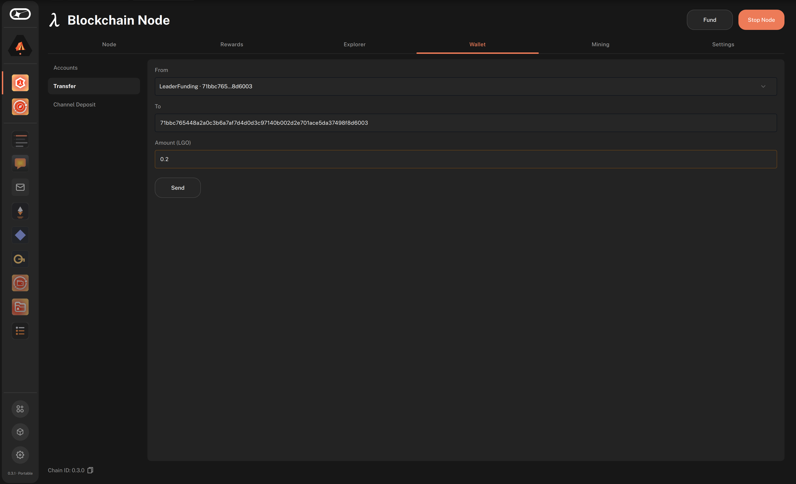
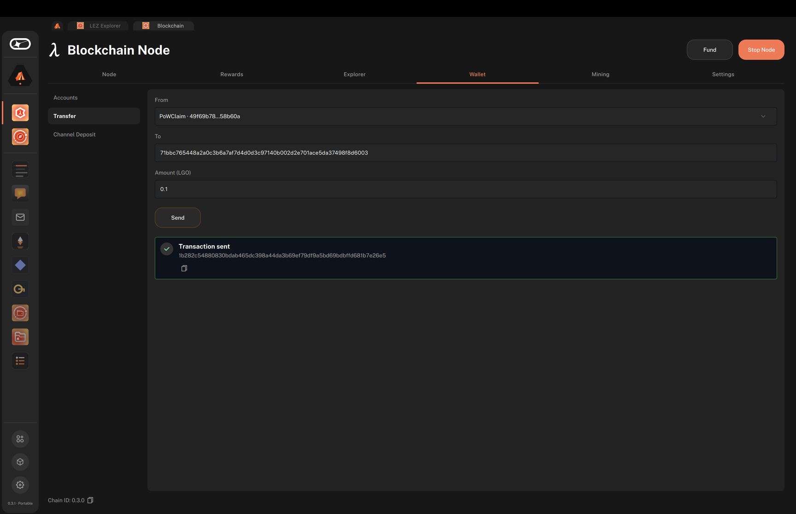
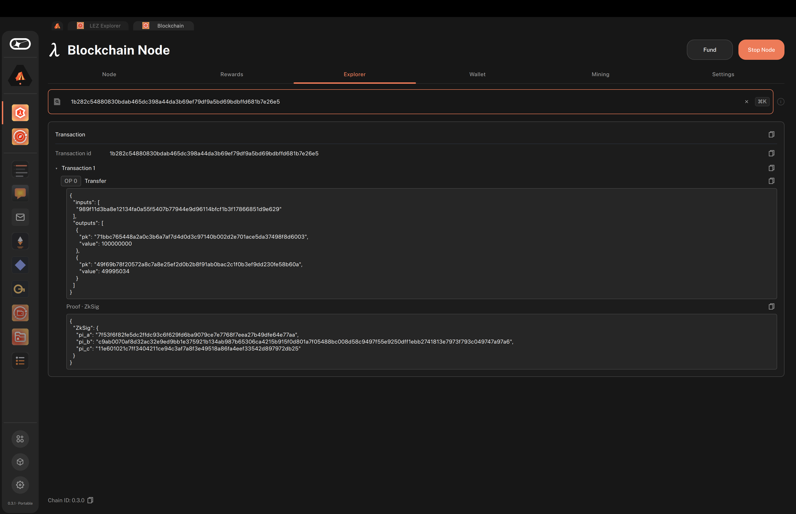

# Move assets using the Logos Blockchain UI app

#### Get started with token transfers between wallet accounts directly from the dashboard UI.

:::tip[Version]
This document is accurate for **Testnet v0.3.0**.
:::

This procedure covers how to send funds from one of your wallet accounts to a recipient on the [Logos Blockchain](../../get-started/glossary.md#logos-blockchain) using the **Transfer** form of the Logos Blockchain UI app. It is intended for users who need to move tokens between accounts without using the CLI or crafting transactions manually.

:::info[Prerequisites]

- The [Blockchain UI app](./build-and-run-logos-blockchain-node-app-ui.md) running, with a node set up.
- At least one wallet account with a positive balance, for example one funded by [mining](./build-and-run-logos-blockchain-node-app-ui.md#step-4-fund-your-node).
- The recipient's 64-hex-character public key.
:::

## What to expect

- You can pick any of your wallet accounts as the sender and see its balance in TestToken before you send.
- You can submit a transfer and copy the resulting transaction hash from the result notice below the **Send** button.
- You can confirm the transfer by finding its hash in the **Explorer** tab or on the testnet block explorer website, and by refreshing your account balances.

## Start the node and open the transfer form

Every tab in the app is open whether or not the node is running, but the **Send** button stays disabled until the node is running. Start the node first, then open the form.

1. If the node is not running, click **Start Node** in the header. Wait until the headline on the **Node** tab reads **Online**.

1. Click the **Wallet** tab, then click **Transfer** in the left menu.

   - While the node cannot answer, a notice at the top of the form says why, for example `Start the node from the Node tab.` or `The node is still catching up.`

1. Select the sender account in the **From** dropdown.

   - Each account shows its name, address, and balance.
   - The balance of the selected account appears as **Available:** next to the **Amount (TestToken)** label.

1. Enter the recipient's public key in the **To** field.

1. Enter the amount to send, in TestToken, in the **Amount (TestToken)** field.

   - If the amount is more than the account holds, the form shows `More than this account holds.` and **Send** stays disabled.

   

1. Click **Send**.

   :::warning
   Transfers are irreversible; double-check the 64-hex recipient key and the amount before clicking **Send**.
   :::

## Read the transfer result

1. Check the notice below the **Send** button:

   - On success, it reads **Transaction sent** and shows the transaction hash returned by the [module](../../get-started/glossary.md#module). Click the copy button to copy it to the clipboard.
   - On failure, it reads **Transfer failed** and shows `Error: <message>` with the reason.

   

1. Confirm that the transaction is on chain, either in the app or on the web:

   - In the app, open the **Explorer** tab, paste the hash in **Search a block id or transaction hash**, and press **Enter**. The result shows the **Transaction** and the block slot it was included in. If it reads `Nothing found for “<hash>”.`, the transaction is not in a block yet. Wait for a few blocks and search again.

     

   - In your browser, go to `https://testnet.blockchain.logos.co/web/explorer/transactions/<TX_HASH>`, replacing `<TX_HASH>` with the hash. The [testnet block explorer](https://testnet.blockchain.logos.co/web/explorer/) shows the block that includes the transaction, and its operation as **LedgerTransfer**. If it reads **Transaction not found**, wait for a few blocks and reload the page.

1. Open **Wallet** > **Accounts** and click **Refresh** to confirm that the sender's balance has decreased.

## Troubleshooting dashboard transfers

### The Send button stays disabled

**Send** needs a running node, a sender account, a recipient key, and an amount that the account can cover. Start the node from the header if the notice at the top of the form asks you to, then check each field.

### The result shows `Error: Module not initialized.`

The app's connection to the blockchain module did not initialise at startup. Restart the app and try again.

### The result shows another `Error: …`

The module rejected the transaction. Common causes are an insufficient balance to cover the amount and fee, or an invalid recipient key. Verify that the recipient key is exactly 64 hex characters, then retry.
