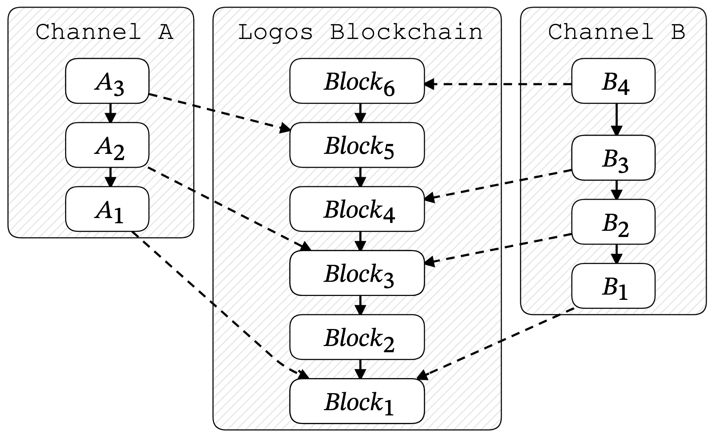

# Creating a Logos Zone with the Zone SDK
## Introduction
Applications built on Logos are not implemented on the Logos Blockchain directly. Instead, they live in Layer 2 execution environments known as *Sovereign Zones*, henceforth *Zones* for short (*Native Zones* are planned for future versions of Logos). A Zone could host a versatile rollup with thousands of applications, such as the [Logos Execution Zone](../apps/wallet/journeys/quickstart-for-the-logos-execution-zone-wallet.md). It could also be a simple, standalone Zone keeping track of the state of just one application, or anything in between.

The **Zone SDK** is a ready-to-use toolbox of code that handles basic interactions with a Logos Zone. Develops can use the SDK to simplify the process of building their own Zones and Zone apps.

### Who Interacts with a Zone?

Every Zone is maintained by a **sequencer**, an execution node publishes updates to the Logos Blockchain. A Zone can also have multiple sequencers taking turns or competing to submit updates.

**Indexers** are nodes that follow a Zone's updates on the Logos Blockchain. They re-execute these updates locally to obtain an updated copy of the Zone state, as set by the sequencer. The Zone SDK provides functionality for implementing both sequencers and indexers.

Depending on the type of environment the Zone maintains, there could be other actors interacting with the Zone as well. For example, ZK rollup Zones may use provers and validators to ensure the correctness of state transitions. These more complex roles are not directly supported by the Zone SDK, but can be built by integrating basic features from the SDK's sequencer and indexer types.

### Channels
To safeguard the correct ordering of updates from Sovereign Zones, data posted to the blockchain is assigned to a *Logos channel* dedicated to that Zone. Logos channels (sometimes called Mantle channels) are implemented as permissioned hash chains of messages. Each message, or *inscription*, is signed by the Zone’s sequencer, who stores the message on-chain via an operation sent to the Logos Blockchain. For Sovereign Zones, an inscription typically consists of a Zone state update, although channel messages can be used for other purposes, too. 

An example of how messages from two Logos channels can be written to the Logos Blockchain is shown below.




### Tutorial

This tutorial will walk you through the functionality provided by the Zone SDK, structured as a step-by-step guide to building your own Zone by progressively adding more SDK features to nodes interacting with a Zone.

Each step in the tutorial is accompanied by example code using the Zone SDK to build a [password manager](https://github.com/H2CO3/steelsafe) Zone. This Zone is sequenced by a single sequencer, with multiple indexers following its updates. However, the major concepts will be applicable to all Sovereign Zones on Logos.

To make things easier, we’ve provided a bare-bones implementation skeleton that contains all dependencies and password manager code not related to Zone functionality. As you work through the tutorial, you can add the example code in each step to the correct location of the skeleton file. By the end of the tutorial, you will have a working password manager Zone demo that is ready to be compiled.

## Getting Started
### Clone Logos Blockchain Repo
Before beginning this tutorial, you should clone the [Logos Blockchain Node](https://github.com/logos-blockchain/logos-blockchain) repository, which contains the Zone SDK in the [`zone-sdk`](https://github.com/logos-blockchain/logos-blockchain/tree/master/zone-sdk) folder.

To clone the repository with git, run the following in your desired path:

```bash
git clone https://github.com/logos-blockchain/logos-blockchain.git
```

#### Example Application Skeleton
To follow along with the tutorial example, switch to the `sql-zone-tutorial` branch:

```bash
cd logos-blockchain
git checkout sql-zone-tutorial
cd testnet/sqlite-zone-demo
```

The complete demo is available in the `sql-zone` branch.

### Access to Logos Blockchain Node
It's also important for your Sequencer and Indexers to have access to a Logos Blockchain Node. See the [documentation](../quickstart-guide-for-the-logos-blockchain-node.md) for instructions on how to start your own node and connect to the Testnet.

## Sequencer
### Define Your Zone Environment
The first step to creating a Logos Zone is defining the Zone state - what application(s) it will host, how the state is updated, and in what form updates are posted on-chain.

#### Example
In this tutorial, we'll be adapting an existing Rust [password manager](https://github.com/H2CO3/steelsafe) application to the Logos Zone context. The goal is for the user to be able to update their passwords on one device, with other devices syncing their state to match the main device. This design is useful for users who want to avoid relying on managed hosting for their password manager, and cannot self-host it on their own server. 

> Read **Decentralise the Log, Not the Server** (ADD LINK) for the motivation behind this design.

This application maintains its state by using a sqlite database, with updates taking the form of SQL transactions applied to the database. To work as a Logos Zone, we will adopt the design as follows:

* The user will interact with the password manager on the main device (in the `sequencer` folder) whenever they want to add or update passwords in the manager.
* The main device will operate as a **sequencer**, posting SQL transactions as inscriptions to its channel.
* Secondary devices will operate as **indexers**, following the channel and obtaining SQL transactions from the chain.
* Secondary devices will run a read-only version of the password manager (in the `indexer` folder), applying SQL transactions from the channel to update the state.

The implementation skeleton already has most of this password manager code written. This tutorial will focus on using the Zone SDK to write the sequencer and indexer functionality, contained in the `sequencer/src/sequencer.rs` and `indexer/src/indexer.rs` files.

* Signing key
* Publish data
* Inscription status
* Checkpoints (save/restore from)

## Indexer
* Follow channel

## Conclusion
* Check out the demo
* Some more ideas (e.g. ZK, bridging etc)
* Build your own with launchpad