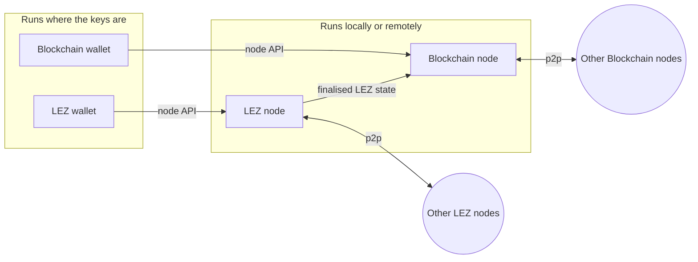

# Integrate Logos into your application

#### Choose how your application reaches the Logos stack, and where the nodes it depends on run.

:::tip[Version]
This document is accurate for **Testnet v0.3.0**. Sections marked **Planned** describe work that is not part of a release yet.
:::

This page is for teams with an existing or planned product, such as a wallet, an exchange, or a decentralised application, who want to add [Logos Blockchain](../get-started/glossary.md#logos-blockchain), the [Logos Execution Zone](../get-started/glossary.md#logos-execution-zone) (LEZ), [Logos Storage](../get-started/glossary.md#logos-storage), or [Logos Delivery](../get-started/glossary.md#logos-delivery) to it. It sets out the two ways to integrate, what each one gives you, and what is available now compared with what is still being built.

Each capability on this page carries one of two statuses:

| Status | Meaning |
|:---|:---|
| **Available** | Part of a release, with documentation you can follow today. |
| **Planned** | Not released yet. Some of it already works on development branches, and its interfaces can change. Integrator feedback is welcome: [tell us what you need](#tell-us-what-you-need). |

## The basics

- **Logos capabilities are modules.** Blockchain, LEZ, Storage, and Delivery each ship as [Logos modules](../get-started/glossary.md#module) that the Logos Core runtime loads, isolates, and connects. See [What is Logos?](../get-started/introduction-to-logos.md) for the architecture.
- **There are two ways to integrate.** Build your application from Logos modules and run it in [Logos Basecamp](../get-started/glossary.md#basecamp) or `logosctl` (recommended), or host Logos Core inside your own application and bundle the modules you need.
- **Both paths use the same runtime and the same modules.** They differ in how your application is built and distributed, not in what it can reach.
- **Modules call each other through their contracts, never directly.** The same call works whether the target module runs in the same process, in another process, or on another machine, so whether a node runs locally or remotely is a deployment choice.

## Two choices that shape an integration

### What your application is built from

**Building your application from Logos modules is the recommended way to integrate, and the one that gets the most out of Logos.** Your application runs in the Logos runtime that Basecamp and `logosctl` already provide, so it needs no development kit: it calls the modules it depends on through the runtime, and other modules can call it in turn. It also inherits what the runtime adds on top of the protocols: module isolation, distribution without a central service, and a place in an ecosystem where other developers build on your modules. See [What you get](#what-you-get).

An application not built from modules, such as an existing mobile wallet or a server backend, hosts Logos Core itself instead. It links the Logos Core host library, bundles the runtime and the modules it uses, and calls those modules from its own code. It keeps its own code and distribution, and gives up some of what the runtime offers. See [What you give up compared with a Basecamp app](#what-you-give-up-compared-with-a-basecamp-app).

### Where the node runs

Every Logos component runs as a node. Blockchain and LEZ nodes follow their chain, hold its state, and relay transactions; Storage and Delivery nodes take part in their peer-to-peer networks to store, retrieve, and carry data. A node can run in one of two places:

- **On the user's device.** This is how Logos is designed to be used: its nodes are deliberately lightweight so that they run on consumer hardware. No third party sees what the user queries or submits, and the node talks to the peer-to-peer networks directly. The node can run:
  - **inside the application**, which costs artefact size and the CPU, network, battery, and storage a running node uses while it runs, or
  - **on another device the user owns**, such as a home computer running Basecamp or `logosctl`, which the user's application reaches remotely. The user keeps the privacy of running their own node without running it on, for example, their phone.
- **In your infrastructure.** You run the nodes and the user's application holds the keys. This suits exchanges, custodians, and wallets that cannot run a node on the user's device, at a cost to privacy.

Which of these suits your users bears on privacy as well as on cost. See [What a remote node costs you](#what-a-remote-node-costs-you).

| Your situation | How to integrate | Where the node runs |
|:---|:---|:---|
| New desktop or mobile application ([mobile is Planned](#mobile)) | [Build a Basecamp app](#build-a-basecamp-app-or-logosctl-service) | On the user's device, in the application or on another device they own |
| Server backend, exchange, or custodian | [Build a `logosctl` service](#build-a-basecamp-app-or-logosctl-service), or [host Logos Core](#host-logos-core-in-your-application) | Your infrastructure |
| Existing desktop application | [Host Logos Core](#host-logos-core-in-your-application) | On the user's device, in the application or on another device they own, or in your infrastructure |
| Existing mobile application | [Host Logos Core](#host-logos-core-in-your-application) ([Planned](#mobile)) | On the user's device, in the application or on another device they own, or in your infrastructure |

## The modules you integrate

:::note[Planned]
This section describes the target architecture. Today the Logos Blockchain node and wallet are combined in a single `blockchain_module`, and the LEZ module (`lez_core`) provides the LEZ wallet and reaches a LEZ sequencer directly. Separating each chain into a wallet module and a node module is planned.
:::

Each Logos chain is served by two modules: a **wallet** module and a **node** module.

- **Wallet modules** handle keys, derivation, signing, and proving. Both chains need proofs generated on the client: LEZ executes and proves transactions on [private accounts](../get-started/glossary.md#private-account) locally, and Logos Blockchain value transfers carry a zero-knowledge proof in place of a signature. Wallet modules therefore run where the keys are, which is normally in the user's application.
- **Node modules** follow their network over peer-to-peer connections, serve chain state, and relay the transactions the wallets produce.
- **A LEZ node depends on a Logos Blockchain node** to obtain the finalised LEZ state.
- **A wallet reaches its node only through the node API.** This is what lets the node run in the application, on another device the user owns, or in your infrastructure without any change to the wallet.

Storage and Delivery follow the same pattern without a wallet: an application calls the [Storage module](../get-started/glossary.md#storage-module) or the [Delivery module](../get-started/glossary.md#delivery-module) directly. Logos Delivery protects its network against spam with [Rate Limiting Nullifiers](../messaging/concepts/understand-logos-delivery-protocols.md#rln-relay) (RLN), and publishers hold an RLN membership [registered on LEZ](../lez/rln/register-rln-membership-from-basecamp.md).

## Build a Basecamp app or `logosctl` service

**Recommended.** Your application is a set of Logos modules: one or more [core modules](../get-started/glossary.md#core-module) for its logic and, for a graphical application, a [UI module](../get-started/glossary.md#ui-module). Users run it in [Logos Basecamp](../basecamp/install-logos-basecamp.md) on the desktop, and operators run the core modules headlessly with `logosctl` on a server, as a [Logos node](../get-started/glossary.md#logos-node).

### What you get

- **The whole stack by composition.** Blockchain, LEZ, Storage, and Delivery are modules your modules depend on. An application composed from them inherits their metadata protection and private state support, whether or not its developer built anonymity measures directly.
- **Isolation.** Each module runs in its own operating system process, so a fault in one module does not reach the others. Container-like isolation and finer permission management are in development.
- **A fault and audit boundary.** Each module is developed, audited, and upgraded independently.
- **Distribution without a central service** (in development). Once Basecamp is installed, modules are discovered in its [catalogue](../get-started/glossary.md#catalogue) and distributed over the Logos stack itself, with developer signatures and integrity checks.
- **An ecosystem around your modules.** Other developers' modules can depend on yours and call it, the same way yours call the Logos modules. A native Basecamp integration makes your product part of the stack rather than a client of it.

### Platforms

| Platform | Status |
|:---|:---|
| Linux and macOS desktop, in Basecamp | Available |
| Linux server, with `logosctl` | Available |
| Windows | Planned |
| Android and iOS, in Basecamp | Planned for Testnet v0.4.0 |

### Start building

- [Build and run a Logos core module](../core/build-modules/build-and-run-a-logos-core-module.md)
- [Wrap a C library as a Logos module](../core/build-modules/wrap-a-c-library-as-a-logos-core-module.md)
- [Build a Logos C++ UI module](../core/build-modules/build-a-logos-cpp-ui-module.md)
- [Install and load a module in Logos Basecamp](../basecamp/install-and-load-a-module-in-logos-basecamp.md)
- [Run a Logos node](../run-a-node/get-started/run-logos-node-blockchain-storage-delivery.md) with `logosctl`

A module is a compiled shared library that exposes its methods through a C-compatible interface (FFI), so in principle any language that can build such a library can be used to write one. A Logos SDK for the language makes this much easier: it provides the module plumbing and generates typed clients for the modules yours depends on. For the languages with an SDK, see [Languages](#languages).

## Host Logos Core in your application

:::note[Planned]
Hosting Logos Core in a third-party application works on development branches. It is not released yet.
:::

Your application keeps its own code, user interface, and distribution, and hosts the Logos Core runtime inside it:

1. Your application ships the runtime and the module [packages](../get-started/glossary.md#package) it needs inside its own bundle.
1. At start-up, your application starts the runtime through the Logos Core host library for its language.
1. Logos Core loads the modules, resolves their dependencies, and manages their lifecycle, exactly as it does in Basecamp.
1. Your application calls modules through typed clients generated from each module's contract (a `.lidl` file), and subscribes to their events.

Your own code does not need to be a module. You can still write modules, and doing so lets the same logic run in Basecamp later.

This is not a library wrapper per Logos component. Your application gets the module runtime itself, so every Logos module, including third-party modules, is reachable the same way, and the runtime chooses where each module runs.

### Where modules run

The runtime can run each module in a process of its own, run every module in a single runtime process, or run inside your application's process with no child processes at all. The last option is what platforms that forbid spawning processes, such as iOS, require. The placement does not change your application's code. Only the process-per-module placement isolates modules from each other and from your application.

### What you give up compared with a Basecamp app

- **Basecamp distribution.** You ship and update your application through your own channels, such as app stores, so decentralised discovery, distribution, and signature checks do not apply to it.
- **The ecosystem effect.** Code that is not a module cannot be reused by other developers' modules or run by Basecamp users.
- **Some isolation.** When modules run inside your application's process, a fault in a module can reach your application.
- **Packaging work.** You build and ship the runtime and modules for each platform you support.

If you host Logos Core yourself, consider publishing your core logic as modules as well, so that Basecamp users and other developers can reach it too.

### Languages

The table shows where a Logos SDK exists or is planned. Any language that can produce a shared library with a C-compatible interface can still be used to write a module without one. **Not planned yet** means no work is scheduled. If you need that language, [tell us](#tell-us-what-you-need).

| Language | Write a module | Host Logos Core in your application |
|:---|:---|:---|
| C++ | Available | Planned |
| Rust | Available | Planned |
| Kotlin | Not planned yet | Planned |
| Swift | Not planned yet | Planned |
| Go | Not planned yet | Not planned yet |
| JavaScript and React Native | Planned | Not planned yet |
| Dart and Flutter | Not planned yet | Not planned yet |
| Python | Not planned yet | Not planned yet: `logos-logoscore-py` runs `logosctl` as a separate process |
## Mobile

:::note[Planned]
Logos Basecamp for Android and iOS is planned for Testnet v0.4.0. Kotlin and Swift libraries that let a mobile application host Logos Core, with its modules bundled inside the application package, are also planned. Integrator feedback is welcome on which comes first.
:::

Whether a phone runs the Logos nodes itself depends on how it is used. A phone on Wi-Fi and on charge at home is a very different setting from one on a mobile network and on battery, and running a chain node on a phone has not been benchmarked yet.

What the design already ensures is that the two halves can be split. Wallet modules run on the phone, where the keys are, and the nodes they use can run on another device the user owns, such as a home computer, or in your infrastructure. See [Calling modules locally and remotely](#calling-modules-locally-and-remotely).

## Calling modules locally and remotely

A module is never linked against another module's library, the way a program is linked against the shared libraries it depends on. It calls the other module's contract through the runtime, which authorises the call and carries it to wherever the target runs.

### Locally

**Available.** Each module runs in its own process and calls other modules over a local socket. The runtime only lets a module call the modules it declares as dependencies.

**Planned.** A runtime without Qt, and the single-process and in-application placements described under [Where modules run](#where-modules-run).

### Remotely, for integrators: the node in your infrastructure

:::note[Planned]
Module transports over TCP and TLS are in the `logosctl` 0.3.0 release candidates and are marked as work in progress.
:::

You run the node modules in a `logosctl` daemon in your infrastructure and expose them over TCP with TLS. Your application authenticates with a token that the daemon issues, which can be named, set to expire, and revoked.

Today, your application's own code connects to the remote module. A module inside your application cannot yet declare a dependency on a remote module, so a wallet module in the application cannot use a node module in your infrastructure without your code in between.

The target is the transparency that peering already gives (see below), with grants per method rather than per module. That way you could expose the read and relay methods of a node to your users' applications without exposing its administrative methods. If your integration depends on this, [tell us](#tell-us-what-you-need).

### Remotely, for individuals: peering

:::note[Planned]
Peering works on development branches. It is not released yet.
:::

A user runs a node on another device they own, in Basecamp or `logosctl`, and pairs their application with it, either by comparing a six-digit code on both screens or with a single-use invite. Paired runtimes connect over mutual TLS. The runtime on that device **exports** the node module, and the application's runtime **imports** it.

The imported module appears under a local name. Modules in the application, and the application's generated clients, call it exactly as they would call a local module, and its events arrive the same way. The import reconnects after the remote runtime restarts.

The exporting runtime decides what each paired runtime is granted, and the importing runtime decides which of its own modules may call the import. A grant that covers a whole module includes its administrative methods, such as stopping the node, so pair only with applications you trust.

### Why remote module access

- **One interface, local or remote.** The same contract and the same generated client serve a module wherever it runs. Moving a node from the application to a server is a deployment change, not a code change.
- **Typed contracts and generated clients.** Every module publishes a `.lidl` contract, and clients are generated from it for each supported language. There is no request format to hand-write or keep in sync, and a module can describe its own contract at run time.
- **Events built in.** Subscriptions work across the network, so an application receives new blocks or incoming messages as they happen, without polling and without a separate notification service.
- **No API server to build.** A module's contract is its remote interface. Exposing a module is a deployment setting, not a separate service to write, version, and operate.
- **Any module, not only nodes.** Storage, Delivery, and your own modules are exposed and reached the same way as the chain nodes.
- **Composition across machines.** With peering, a module in one runtime can depend on a module in another, so a distributed application is built from the same parts as a local one.
- **Access control per module and per caller.** Access is denied by default and granted per module and per calling module. Tokens are named, can expire, can be revoked, and can be restricted to local connections only.
- **Mutual authentication.** Peering pairs runtimes with a code or a single-use invite, issues certificates to each, and connects them over mutual TLS 1.3 with pinned keys. Module transports for integrators use TLS with issued tokens.
- **Resilience.** An imported module reports its connection state and reconnects after the remote runtime restarts.
- **A compact encoding.** Calls can use CBOR in place of JSON where bandwidth matters.
- **Explicit compatibility.** Runtimes and modules that share the same protocol major version work together.

## What a remote node costs you

Running the node somewhere other than in the application changes what the node operator can see. When the same party runs both the application and the node, such as a custodian running both in its own infrastructure or a user pairing with a node on their own home computer, the trust assumptions are the same as running the node locally. When they are different parties, the node operator sees your network identity, the credentials you connect with, and what you query and submit.

What that exposes depends on the component:

- **LEZ.** Private transactions remain mostly private. The node receives commitments and nullifiers, but private account state is encrypted to the recipient's [viewing key](../get-started/glossary.md#viewing-keys) and stays with the account owner. Any [public account](../get-started/glossary.md#public-account) involved in a transaction is visible, as it is to every node.
- **Logos Blockchain.** Transaction contents are public on the ledger. Privacy comes from the [Blend Network](../get-started/glossary.md#blend-network), which hides where a transaction originates. Submitting through someone else's node bypasses Blend for that transaction, so the operator can link its contents to you. To benefit from Blend, submit through your own node.
- **Storage and Delivery.** Privacy comes from taking part in the [mix](../get-started/glossary.md#mix), gossip, and [peer discovery](../get-started/glossary.md#peer-discovery) networks directly. Routing reads and writes through someone else's node weakens it.

## Tell us what you need

Integrator feedback shapes which Planned items come first. When you talk to us, it helps to know:

- Which platforms you ship on: desktop, server, Android, iOS, or the web.
- Which language and framework your application uses.
- Where you want the nodes to run: in the application, on another device your users own, or in your infrastructure.
- Which components you need: LEZ, Logos Blockchain, Storage, or Delivery.
- Whether you would ship your logic as Logos modules, and what would stop you.
- Which methods your users' applications would need on a node you run for them.

Talk to your Logos point of contact, or join the conversation on the [Logos Discord](https://discord.com/invite/logosnetwork) or the [Logos forum](https://forum.logos.co).
