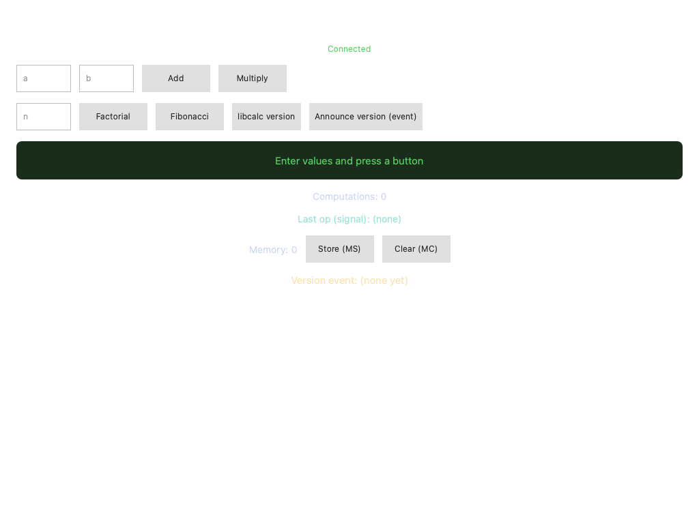
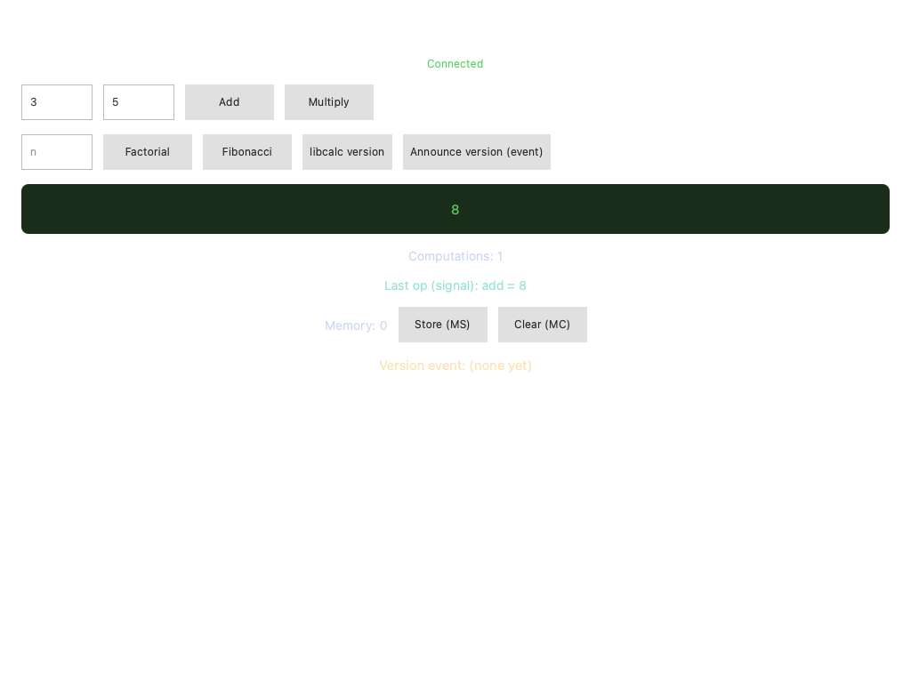

# Build a Logos C++ UI module

#### Get started building a ui\_qml module with a C++ backend that runs in a separate process.

:::tip[Version]
This document is accurate for **Testnet v0.3**.
:::

This guide covers building a [UI module](../../get-started/glossary.md#ui-module) that pairs a QML view with a C++ backend. The backend runs in a separate `ui-host` process while the view loads inside the host app ([`logos-standalone-app`](../../get-started/glossary.md#logos-standalone-app) or Logos Basecamp), so a backend crash cannot bring down the host. The backend calls the `calc_module` from [Wrap a C library as a Logos module](wrap-a-c-library-as-a-logos-core-module.md) through a typed, generated API.

You write two things: a `.rep` file, the contract between the view and the backend, and a C++ backend class that implements it. The build generates the Qt plugin and interface classes around them. This guide is intended for developers who want typed, process-isolated calls from their UI to other modules.

:::info[Prerequisites]

- A supported OS:
   - Linux x86_64 or aarch64
   - macOS arm64 (Apple Silicon)
- The `logos-calc-module` project from [Wrap a C library as a Logos module](wrap-a-c-library-as-a-logos-core-module.md), with its shared library built in `logos-calc-module/lib/`. You create this guide's project next to it.
- Basic familiarity with [QML](https://doc.qt.io/qt-6/qmlapplications.html).
- **Nix** with flakes enabled.
   - Install from [nixos.org](https://nixos.org/download.html), then enable flakes:

   ```bash
   mkdir -p ~/.config/nix
   echo 'experimental-features = nix-command flakes' >> ~/.config/nix/nix.conf
   ```
:::

## What to expect

- You can build a `calc_ui_cpp` module whose C++ backend runs in its own process, and run it in `logos-standalone-app` with `nix run`.
- You can connect a QML view to the backend's slots, properties and signals, and to an event that `calc_module` emits.
- You can reload the view as you edit it, and check it with automated UI tests.

## Step 1: Scaffold the project

1. Create the project directory next to `logos-calc-module`, and enter it:

   ```bash
   mkdir logos-calc-ui-cpp && cd logos-calc-ui-cpp
   ```

1. Initialise the project from the C++ backend UI template:

   ```bash
   nix flake init -t github:logos-co/logos-module-builder/0.3.2#ui-qml-backend
   ```

   - The template follows the universal authoring model: `metadata.json` sets `"interface": "universal"`, and the only sources are an example `.rep` file and one backend class. The plugin and interface classes are generated.

1. Remove the template's example `.rep` file and backend, which the following steps replace:

   ```bash
   rm -f src/ui_example.rep src/ui_example_backend.h src/ui_example_backend.cpp
   ```

1. Initialise a Git repository and stage the files:

   ```bash
   git init && git add -A
   ```

## Step 2: Configure the module metadata

1. Replace `metadata.json` with the following:

   ```json
   {
     "name": "calc_ui_cpp",
     "version": "1.0.0",
     "type": "ui_qml",
     "interface": "universal",
     "category": "tools",
     "description": "Calculator C++ UI — QML view with process-isolated backend for calc_module",
     "main": "calc_ui_cpp_plugin",
     "view": "qml/Main.qml",
     "icon": "icons/calc.png",
     "dependencies": ["calc_module"],
     "codegen": { "rep": "src/calc_ui_cpp.rep" },

     "nix": {
       "packages": {
         "build": [],
         "runtime": []
       },
       "external_libraries": [],
       "cmake": {
         "find_packages": [],
         "extra_sources": [],
         "extra_include_dirs": [],
         "extra_link_libraries": []
       }
     }
   }
   ```

   | Field | What it does |
   | --- | --- |
   | `type` | `"ui_qml"` marks a module with a QML view. |
   | `interface` | `"universal"` selects the universal authoring model: you write the `.rep` file and a backend class, and the build generates the plugin around them. Without it, the build expects a hand-written plugin. |
   | `codegen.rep` | Your `.rep` file. `backend_class` and `backend_header` can be set too; they default to `CalcUiCppBackend` and `calc_ui_cpp_backend.h`. |
   | `main` | The name of the generated backend plugin library, without its extension. |
   | `view` | The QML entry point. |
   | `dependencies` | The core modules that the backend calls. Each one is also a flake input of the same name, set up in [Step 8](#step-8-configure-the-nix-flake). |

1. Create the icon that the Logos Basecamp sidebar shows for the module. LGX packaging accepts only a 256×256 PNG, and this command writes a placeholder of that size:

   ```bash
   mkdir -p icons
   # Copy any PNG here — or generate a 256×256 placeholder:
   echo "iVBORw0KGgoAAAANSUhEUgAAAQAAAAEAAQMAAABmvDolAAAABlBMVEUuzHEuzHEVOa2oAAAAH0lEQVR42u3BAQ0AAADCoPdPbQ43oAAAAAAAAAAAvg0hAAABYOSdlwAAAABJRU5ErkJggg==" | base64 -d > icons/calc.png
   ```

## Step 3: Define the remote interface

The `.rep` file is the contract between the QML view and the C++ backend, and the one Qt-typed file you write. At build time, Qt's `repc` compiler generates `CalcUiCppSimpleSource`, the base class that your backend implements, and `CalcUiCppReplica`, the typed replica that the view uses.

1. Create `src/calc_ui_cpp.rep`:

   ```rep
   class CalcUiCpp
   {
       // ── SLOTs — call-and-return; each reply reaches QML via logos.watch() ──
       SLOT(int add(int a, int b))
       SLOT(int multiply(int a, int b))
       SLOT(int factorial(int n))
       SLOT(int fibonacci(int n))
       SLOT(QString libVersion())

       // Void slot — fire-and-forget. Asks calc_module to (re-)announce
       // its version as a `versionReady` event; there's no return value
       // to await, the answer comes back through the PROP below.
       SLOT(void announceVersion())

       // ── PROPs — auto-synced backend → every QML replica, no polling ──
       // QString, event-fed: the typed `versionReady` subscription the
       // backend arms in onContextReady() writes it. Starts empty.
       PROP(QString versionEvent="" READONLY)

       // int, slot-driven: the backend bumps it after each calculation,
       // so the view shows a live tally without ever polling.
       PROP(int computeCount=0 READONLY)

       // int, READWRITE: a memory register the QML view both *reads* and
       // *writes* (Store / Clear buttons), and the backend may set too.
       // A write round-trips QML → replica → source → back to every replica.
       PROP(int memory=0 READWRITE)

       // ── SIGNAL — backend → view push, distinct from a return value ──
       // Emitted after each calculation. QML catches it with a
       // Connections block (not logos.watch(), not a PROP read).
       SIGNAL(computed(QString op, int result))
   }
   ```

   Each kind of member reaches the view in its own way:

   | Member | Backend | QML view |
   | --- | --- | --- |
   | `SLOT` with a return value, such as `add` | Overrides `int add(int a, int b)` | `logos.watch(backend.add(1, 2), ...)` delivers the reply |
   | `SLOT` returning `void`, such as `announceVersion` | Overrides `void announceVersion()` | Calls `backend.announceVersion()`, with no reply to wait for |
   | `READONLY` `PROP`, such as `computeCount` | Writes it with the generated `setComputeCount()` | Reads `backend.computeCount`, which updates without polling |
   | `READWRITE` `PROP`, such as `memory` | Can write it with `setMemory()` | Reads `backend.memory` and can assign it, for example `backend.memory = 8` |
   | `SIGNAL`, such as `computed` | Emits it with `emit computed(op, result)` | Handles it in a `Connections` block, in `onComputed` |

## Step 4: Configure the CMake build

1. Replace `CMakeLists.txt` with the following:

   ```cmake
   cmake_minimum_required(VERSION 3.14)
   project(CalcUiCppPlugin LANGUAGES CXX)

   if(DEFINED ENV{LOGOS_MODULE_BUILDER_ROOT})
       include($ENV{LOGOS_MODULE_BUILDER_ROOT}/cmake/LogosModule.cmake)
   else()
       message(FATAL_ERROR "LogosModule.cmake not found. Set LOGOS_MODULE_BUILDER_ROOT.")
   endif()

   # Derive the module name from metadata.json — single source of truth.
   file(READ "${CMAKE_CURRENT_SOURCE_DIR}/metadata.json" METADATA_JSON)
   string(JSON MODULE_NAME GET ${METADATA_JSON} name)

   logos_module(
       NAME ${MODULE_NAME}
       REP_FILE src/calc_ui_cpp.rep
       SOURCES
           src/calc_ui_cpp_backend.h
           src/calc_ui_cpp_backend.cpp
       INCLUDE_DIRS
           src
   )
   ```

   - List only your two source files. `REP_FILE` tells `logos_module()` to run `repc`, generate the plugin and interface classes around your backend, and build a separate `calc_ui_cpp_replica_factory` library that the host uses to create typed replicas.

## Step 5: Write the C++ backend

The backend is the only C++ that you write. It derives `CalcUiCppSimpleSource`, generated from the `.rep` file, and `LogosUiPluginContext`, which provides `modules()`: typed calls and event subscriptions for each module in `dependencies`.

1. Create `src/calc_ui_cpp_backend.h`:

   ```cpp
   #pragma once

   #include "rep_calc_ui_cpp_source.h"
   #include "logos_ui_plugin_context.h"

   // The whole hand-written backend. Derives:
   //   - CalcUiCppSimpleSource — generated from calc_ui_cpp.rep; override its
   //     slots (the QML replica gets each return value via Qt Remote Objects).
   //   - LogosUiPluginContext — supplies modules() (Qt-typed callers + typed event
   //     subscriptions for "dependencies") and onContextReady(). A UI plugin is a
   //     view, not a module, so that is all the context carries.
   // The *Plugin / *Interface classes (Q_PLUGIN_METADATA, initLogos wiring,
   // QtRO registration) are generated around it.
   class CalcUiCppBackend : public CalcUiCppSimpleSource,
                            public LogosUiPluginContext
   {
   public:
       // Slots from calc_ui_cpp.rep — each delegates to calc_module.
       int add(int a, int b) override;
       int multiply(int a, int b) override;
       int factorial(int n) override;
       int fibonacci(int n) override;
       QString libVersion() override;

       // Tells calc_module to emit its `versionReady` event.
       void announceVersion() override;

       // Fires once when ui-host hands the plugin its LogosAPI — the
       // typed dependency surface is live, so we arm the event
       // subscription here (before the view's first call).
       void onContextReady() override;

   private:
       // Feeds the non-slot surfaces of the .rep after each calculation:
       // bumps the computeCount PROP (setComputeCount, generated) and
       // emits the `computed` SIGNAL. The READWRITE `memory` PROP is
       // driven from QML, so the backend doesn't have to touch it.
       void record(const QString& op, int result);
   };
   ```

   - There is no `Q_OBJECT`, `Q_PLUGIN_METADATA`, `initLogos`, `name()` or `version()` to write. The build generates them.

1. Create `src/calc_ui_cpp_backend.cpp`:

   ```cpp
   #include "calc_ui_cpp_backend.h"

   // Generated umbrella: LogosModules (behind modules()) from
   // metadata.json#dependencies — typed wrappers + typed event accessors.
   #include "logos_sdk.h"

   int CalcUiCppBackend::add(int a, int b)
   {
       int result = modules().calc_module.add(a, b);
       record("add", result);
       return result;
   }

   int CalcUiCppBackend::multiply(int a, int b)
   {
       int result = modules().calc_module.multiply(a, b);
       record("multiply", result);
       return result;
   }

   int CalcUiCppBackend::factorial(int n)
   {
       int result = modules().calc_module.factorial(n);
       record("factorial", result);
       return result;
   }

   int CalcUiCppBackend::fibonacci(int n)
   {
       int result = modules().calc_module.fibonacci(n);
       record("fibonacci", result);
       return result;
   }

   QString CalcUiCppBackend::libVersion()
   {
       // A UI plugin is Qt-typed: modules().calc_module's wrapper returns QString
       // (api-style qt), matching the .rep slot — no conversion needed.
       return modules().calc_module.libVersion();
   }

   void CalcUiCppBackend::record(const QString& op, int result)
   {
       // PROP: bump the slot-driven counter. setComputeCount() is the
       // generated setter; Qt Remote Objects syncs the new value to every
       // replica, so the view's "Computations" label updates with no polling.
       setComputeCount(computeCount() + 1);

       // SIGNAL: a backend → view push, distinct from the return value the
       // QML side gets via logos.watch(). `computed` is declared on the
       // generated SimpleSource, so we just emit it; the typed replica
       // re-emits it and the view's Connections block catches it.
       emit computed(op, result);
   }

   void CalcUiCppBackend::announceVersion()
   {
       // Fire-and-forget call into calc_module: it looks up the library
       // version and emits it as a `versionReady` event. We don't read a
       // return value here — the event comes back through the subscription
       // armed in onContextReady() below.
       modules().calc_module.libVersionNotify();
   }

   void CalcUiCppBackend::onContextReady()
   {
       // Typed module-event subscription. `versionReady` is calc_module's
       // event (Part 1's `logos_events:` block); the generated wrapper
       // exposes it as on<Event> + a Qt-typed callback (QString, because a
       // UI plugin is api-style qt). Push each payload into the versionEvent
       // PROP — Qt Remote Objects then auto-syncs it to the QML replica.
       modules().calc_module.onVersionReady([this](const QString& version) {
           setVersionEvent(version);
       });
   }
   ```

   - `modules().calc_module.add(a, b)` calls `calc_module` through the generated, typed API. A UI plugin gets Qt types (`int`, `QString`) that match its `.rep` slots, even where `calc_module` declares `std::string`; the generated wrapper converts them.
   - `record()` updates the `computeCount` property and emits the `computed` signal after each calculation.
   - `onContextReady()` subscribes to the `versionReady` event of `calc_module` and writes each payload to the `versionEvent` property. Subscribe there, not in the constructor: `modules()` is ready only once the framework calls `onContextReady()`.

## Step 6: Write the QML view

1. Create `src/qml/Main.qml`:

   ```qml
   import QtQuick
   import QtQuick.Controls
   import QtQuick.Layouts

   Item {
       id: root

       property string result: ""
       property string errorText: ""

       // Last payload from the backend's `computed` SIGNAL (see Connections below).
       property string lastSignal: "(none)"

       // Typed replica of the backend running in ui-host (generated from calc_ui_cpp.rep).
       readonly property var backend: logos.module("calc_ui_cpp")

       // The ui-host backend connects asynchronously, so the replica isn't
       // immediately usable. Track readiness reactively: isViewModuleReady()
       // is a Q_INVOKABLE (not a property), so we re-check it on the
       // onViewModuleReadyChanged signal and once at startup — never via a
       // plain property binding, which would not re-evaluate.
       property bool ready: false

       Connections {
           target: logos
           function onViewModuleReadyChanged(moduleName, isReady) {
               if (moduleName === "calc_ui_cpp")
                   root.ready = isReady && root.backend !== null
           }
       }
       Component.onCompleted: {
           root.ready = root.backend !== null && logos.isViewModuleReady("calc_ui_cpp")
       }

       // SIGNAL from the .rep: the backend emits `computed(op, result)` after
       // each calculation. The typed replica re-emits it, so we catch it with
       // a Connections block — no logos.watch(), no property read. This is the
       // backend → view push path, distinct from the slot return value above.
       Connections {
           target: root.backend
           function onComputed(op, result) {
               root.lastSignal = op + " = " + result
           }
       }

       // logos.watch() delivers the result of a replica slot call via callbacks.
       // No QtRemoteObjects import needed — the bridge handles it.
       function callCalc(method, args) {
           if (!root.ready) {
               root.errorText = "Backend not ready"
               return
           }
           root.errorText = ""
           root.result = "..."
           logos.watch(backend[method].apply(backend, args),
               function(value) { root.result = String(value) },
               function(error) { root.errorText = String(error) }
           )
       }

       ColumnLayout {
           anchors.fill: parent
           anchors.margins: 24
           spacing: 16

           Text {
               text: "Logos Calculator (C++ backend)"
               font.pixelSize: 20
               color: "#ffffff"
               Layout.alignment: Qt.AlignHCenter
           }

           // Reactive backend-connection indicator.
           Text {
               text: root.ready ? "Connected" : "Connecting to backend..."
               color: root.ready ? "#56d364" : "#f0883e"
               font.pixelSize: 12
               Layout.alignment: Qt.AlignHCenter
           }

           RowLayout {
               spacing: 12
               Layout.fillWidth: true

               TextField {
                   id: inputA
                   placeholderText: "a"
                   Layout.preferredWidth: 80
                   validator: IntValidator {}
               }

               TextField {
                   id: inputB
                   placeholderText: "b"
                   Layout.preferredWidth: 80
                   validator: IntValidator {}
               }

               Button {
                   text: "Add"
                   enabled: root.ready
                   onClicked: root.callCalc("add", [parseInt(inputA.text) || 0, parseInt(inputB.text) || 0])
               }

               Button {
                   text: "Multiply"
                   enabled: root.ready
                   onClicked: root.callCalc("multiply", [parseInt(inputA.text) || 0, parseInt(inputB.text) || 0])
               }
           }

           RowLayout {
               spacing: 12
               Layout.fillWidth: true

               TextField {
                   id: inputN
                   placeholderText: "n"
                   Layout.preferredWidth: 80
                   validator: IntValidator { bottom: 0 }
               }

               Button {
                   text: "Factorial"
                   enabled: root.ready
                   onClicked: root.callCalc("factorial", [parseInt(inputN.text) || 0])
               }

               Button {
                   text: "Fibonacci"
                   enabled: root.ready
                   onClicked: root.callCalc("fibonacci", [parseInt(inputN.text) || 0])
               }

               Button {
                   text: "libcalc version"
                   enabled: root.ready
                   onClicked: root.callCalc("libVersion", [])
               }

               Button {
                   // Fires the event path: asks calc_module to emit
                   // versionReady. No logos.watch() — the result comes
                   // back through the versionEvent PROP, not a return value.
                   text: "Announce version (event)"
                   enabled: root.ready
                   onClicked: root.backend.announceVersion()
               }
           }

           Rectangle {
               Layout.fillWidth: true
               height: 56
               color: root.errorText.length > 0 ? "#3d1a1a" : "#1a2d1a"
               radius: 8

               Text {
                   anchors.centerIn: parent
                   text: root.errorText.length > 0 ? root.errorText
                           : (root.result.length > 0 ? root.result : "Enter values and press a button")
                   color: root.errorText.length > 0 ? "#f85149" : "#56d364"
                   font.pixelSize: 15
               }
           }

           // Slot-driven PROP: bumped by the backend's record() after each
           // calculation. A plain property read — auto-syncs, no polling.
           Text {
               text: "Computations: " + ((root.ready && root.backend) ? root.backend.computeCount : 0)
               color: "#cdd6f4"
               font.pixelSize: 14
               Layout.alignment: Qt.AlignHCenter
           }

           // SIGNAL payload, captured by the Connections block above.
           Text {
               text: "Last op (signal): " + root.lastSignal
               color: "#94e2d5"
               font.pixelSize: 14
               Layout.alignment: Qt.AlignHCenter
           }

           // READWRITE PROP: the memory register. The label *reads*
           // backend.memory; the buttons *write* it. A write round-trips
           // QML → replica → backend source → back to every replica, so the
           // label updates once the new value syncs home.
           RowLayout {
               spacing: 12
               Layout.alignment: Qt.AlignHCenter

               Text {
                   text: "Memory: " + ((root.ready && root.backend) ? root.backend.memory : 0)
                   color: "#cdd6f4"
                   font.pixelSize: 14
               }

               Button {
                   text: "Store (MS)"
                   enabled: root.ready
                   onClicked: root.backend.memory = parseInt(root.result) || 0
               }

               Button {
                   text: "Clear (MC)"
                   enabled: root.ready
                   onClicked: root.backend.memory = 0
               }
           }

           // Event-fed label: the versionEvent PROP auto-syncs from the
           // backend's typed versionReady subscription. No polling — it
           // updates the moment calc_module emits.
           Text {
               readonly property string ev: (root.ready && root.backend) ? root.backend.versionEvent : ""
               text: "Version event: " + (ev.length > 0 ? ev : "(none yet)")
               color: "#f9e2af"
               font.pixelSize: 15
               Layout.alignment: Qt.AlignHCenter
           }

           Item { Layout.fillHeight: true }
       }
   }
   ```

   - `logos.module("calc_ui_cpp")` returns the typed replica of the backend. The host injects the `logos` object, so no `QtRemoteObjects` import is needed.
   - The backend connects asynchronously from its own process. `logos.isViewModuleReady()` is a method, not a property, so the view checks it once at startup and again in `onViewModuleReadyChanged`, and enables the buttons only when the backend is ready.
   - Slot replies arrive through `logos.watch()`, properties are read and written directly, and a `Connections` block on the backend handles the `computed` signal.

## Step 7: Use the Logos Design System in your QML (optional)

The host app has [`logos-design-system`](https://github.com/logos-co/logos-design-system) on its QML import path. Use its themed components instead of raw controls and hard-coded colours, so the module keeps the Logos look as the design system evolves.

1. In `src/qml/Main.qml`, import the design system and replace raw controls with its components, for example:

   ```qml
   import Logos.Theme
   import Logos.Controls
   import Logos.Icons        // optional shared icon assets

   LogosButton {
       text: qsTr("Add")
       onClicked: root.callCalc("add", [parseInt(inputA.text) || 0,
                                        parseInt(inputB.text) || 0])
   }

   LogosTextField {
       id: inputA
       placeholderText: qsTr("a")
   }

   Rectangle {
       color: Theme.palette.backgroundSecondary
       radius: Theme.spacing.radiusSmall
       LogosText { text: qsTr("Result"); color: Theme.palette.text }
   }
   ```

1. Build the design system's storybook, then run it to browse the available components:

   ```bash
   nix build github:logos-co/logos-design-system#bin-bundle-dir --out-link ../logos-storybook
   ../logos-storybook/bin/LogosStorybook
   ```

   - **Controls** are designed and ready for production, for example `LogosButton`, `LogosBadge`, `LogosCheckbox`, `LogosComboBox`, `LogosIconButton`, `LogosPaginator`, `LogosSearchBar`, `LogosTabBar`, `LogosTable`, `LogosText`, `LogosTextField` and `LogosToolTip`.
   - **Controls (not designed)** have stable APIs but unstyled visuals, for example `LogosDialog`, `LogosDrawer`, `LogosScrollView`, `LogosSpinner`, `LogosTextArea` and `LogosSwitch`. You can ship with them; they get the designed look later without changes to your QML.

   Use theme tokens instead of colour literals and font sizes:

   | Token | Values |
   | --- | --- |
   | `Theme.palette.*` | `background`, `backgroundSecondary`, `surface`, `text`, `textSecondary`, `border`, `primary`, `success`, `warning`, `error`, `info`, `hover`, `pressed`, … |
   | `Theme.spacing.*` | `tiny`, `small`, `medium`, `large`, `xlarge`, `xxlarge`, `radiusSmall`, `radiusMedium`, `radiusLarge` |
   | `Theme.typography.*` | `pageTitleText` (36), `titleText` (30), `panelTitleText` (24), `subtitleText` (16), `primaryText` (14), `secondaryText` (12), `weightRegular`, `weightMedium`, `weightBold`, `publicSans` |
   | `LogosIcons.*` (from `Logos.Icons`) | `arrowLeft`, `arrowRight`, `refresh`, `install`, `trash`, `more`, `search`, … |

## Step 8: Configure the Nix flake

1. Replace `flake.nix` with the following:

   ```nix
   {
     description = "Calculator C++ UI plugin for Logos - QML view with process-isolated backend for calc_module";

     inputs = {
       logos-module-builder.url = "github:logos-co/logos-module-builder/0.3.2";

       # Points at your local calc_module checkout. This is a placeholder —
       # you lock it to your actual path in the next step with
       # `nix flake update --override-input` (see "Lock and build" below).
       calc_module.url = "path:/path/to/your/calc_module";
     };

     outputs = inputs@{ logos-module-builder, calc_module, ... }:
       logos-module-builder.lib.mkLogosQmlModule {
         src = ./.;
         configFile = ./metadata.json;
         flakeInputs = inputs;
       };
   }
   ```

   - The `calc_module` input has the same name as the dependency in `metadata.json`.
   - Leave the placeholder `path:/path/to/your/calc_module` as it is. Nix doesn't accept a relative path such as `../logos-calc-module` in `flake.nix`, so [Step 9](#step-9-build-and-run-the-module) records the real path in `flake.lock` instead.
   - To fetch `calc_module` from a repository instead, use a `github:` URL, for example `calc_module.url = "github:<your-org>/<your-calc-module>";`.
   - `mkLogosQmlModule` compiles the backend, bundles the view, builds the LGX [packages](../../get-started/glossary.md#package) and sets up `nix run`.

## Step 9: Build and run the module

1. Confirm that the shared library of `calc_module` exists:

   ```bash
   # Linux
   ls ../logos-calc-module/lib/libcalc.so

   # macOS
   ls ../logos-calc-module/lib/libcalc.dylib
   ```

   - If it is missing, build it as in [Wrap a C library as a Logos module](wrap-a-c-library-as-a-logos-core-module.md#step-2-write-the-c-library):

     ```bash
     cd ../logos-calc-module/lib
     gcc -shared -fPIC -o libcalc.so libcalc.c     # Linux
     # gcc -shared -fPIC -o libcalc.dylib libcalc.c  # macOS
     cd ../../logos-calc-ui-cpp
     ```

1. Stage the files and lock `calc_module` to your local project:

   ```bash
   git add -A
   nix flake update --override-input calc_module path:../logos-calc-module
   git add flake.lock
   ```

   - `--override-input` resolves `../logos-calc-module` to an absolute path and records it in `flake.lock`, so later commands need no override.
   - The lock keeps a copy of `calc_module` as it is now. After you change `calc_module`, run the `nix flake update` command again to build against the change.

1. Build and run the app:

   ```bash
   nix run
   ```

   - The first run builds the backend, the replica factory and `logos-standalone-app`, which can take several minutes.

   **Expected result:** `logos-standalone-app` opens the calculator view, which shows **Connected** once the backend is ready:

   

1. Enter `3` and `5` in the first two fields, then click **Add**.

   **Expected result:** the result shows `8`, followed by `Computations: 1` and `Last op (signal): add = 8`:

   

   - `8` is the slot's reply, `Computations: 1` is the `computeCount` property and `Last op (signal): add = 8` is the `computed` signal.

1. Click **Store (MS)**, then **Announce version (event)**.

   **Expected result:** the view shows `Memory: 8` and `Version event: 1.0.0`.

   - `Memory` is the `READWRITE` property: the view wrote it, and the value synced back from the backend.
   - `Version event` arrives through the event path: the button made `calc_module` emit `versionReady`, and the backend's subscription wrote the payload to the `versionEvent` property.

## Step 10: Reload the view as you edit it (optional)

`nix run` rebuilds the plugin whenever any tracked file changes, including the QML. The development launcher reloads the view from your source tree instead, without a rebuild.

1. Build the development launcher once, then start it from the project root:

   ```bash
   nix build .#ui-dev
   ./result/bin/run-logos-standalone-ui
   ```

   It reports where it reloads QML from:

   ```text
   run-logos-standalone-ui: hot-reloading QML from /path/to/logos-calc-ui-cpp/src/qml
     (export DEV_QML_PATH to override, or LOGOS_QML_HOT_RELOAD=0 to disable)
   ```

1. Edit and save a `.qml` or `.js` file under `src/qml/`.

   **Expected result:** the view re-renders with your change, and the launcher logs `QML reloaded` with the file's path.

   - The backend keeps running in its own process, so its state and connections survive a reload. QML state, such as the text in a field, resets.
   - A QML syntax error is logged with its line number and blanks the view until the next save that compiles.
   - Changes to C++, the `.rep` file, `metadata.json` or CMake still need a rebuild: run `nix build .#ui-dev` again and restart the launcher.

## Step 11: Add UI integration tests (optional)

Add automated UI tests with the [logos-qt-mcp](https://github.com/logos-co/logos-qt-mcp) test framework. The tests connect to the QML inspector in `logos-standalone-app` and can find elements, click buttons and check text.

1. Create `tests/ui-tests.mjs`:

   ```javascript
   import { resolve } from "node:path";

   // CI sets LOGOS_QT_MCP automatically; for interactive use: nix build .#test-framework -o result-mcp
   const root =
     process.env.LOGOS_QT_MCP ||
     new URL("../result-mcp", import.meta.url).pathname;
   const { test, run } = await import(
     resolve(root, "test-framework/framework.mjs")
   );

   test("calc_ui_cpp: loads and shows title", async (app) => {
     await app.waitFor(
       async () => {
         await app.expectTexts(["Logos Calculator (C++ backend)"]);
       },
       { timeout: 15000, interval: 500, description: "UI to load" },
     );
   });

   test("calc_ui_cpp: operation buttons visible", async (app) => {
     await app.expectTexts(["Add", "Multiply", "Factorial", "Fibonacci"]);
   });

   run();
   ```

1. Stage the test file and run the tests headlessly:

   ```bash
   git add tests/
   nix build .#integration-test -L
   ```

   - `integration-test` launches `logos-standalone-app` with `QT_QPA_PLATFORM=offscreen`, so no display is needed, and runs every `.mjs` file in `tests/`.

1. To run the tests against a running app instead, build the test framework and start the app:

   ```bash
   nix build .#test-framework -o result-mcp
   nix run .
   ```

   Then, in a second terminal in the project directory, run the tests with [Node.js](https://nodejs.org/):

   ```bash
   node tests/ui-tests.mjs
   ```

   - The app serves its QML inspector on port 3768.

## Troubleshooting the C++ UI module build

### Linker errors during `nix build`

Confirm that `../logos-calc-module/lib/libcalc.so` (Linux) or `../logos-calc-module/lib/libcalc.dylib` (macOS) exists, and that `flake.lock` was updated with `nix flake update --override-input calc_module path:../logos-calc-module`. A missing library or a lock that still holds the placeholder path is the most common cause.

### The development launcher doesn't find your QML

The launcher looks for the `view` entry from `metadata.json` under `src/<viewDir>/`, then under `<viewDir>/`. If your project is laid out differently, set `DEV_QML_PATH` to the directory that contains the entry file itself, here `Main.qml`, not a parent directory.

### Known constraints

Reloading works only with `logos-standalone-app`. Logos Basecamp loads UI plugins from its own data directory, so it shows your changes only after you rebuild and reinstall the LGX package.
