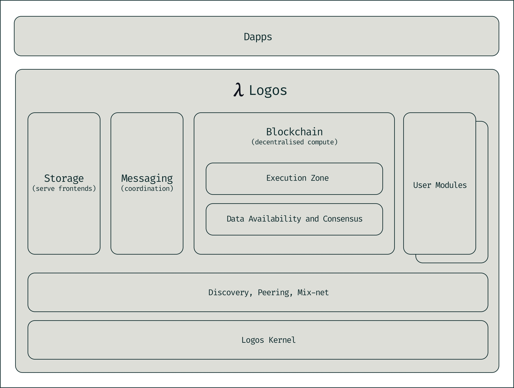

# Introduction to Logos

#### Learn how the Logos technology stack is organised as a modular operating system for decentralised applications.

Logos is a modular, microkernel-based stack for decentralised infrastructure, built for privacy, composability, and resilience. Its structure can be compared to the Linux operating system, which consists of a kernel, a networking stack, a set of system services, and the applications that run on top of them. Different distributions share the same kernel but assemble different services and applications on top of it.

Logos follows the same structure. At its foundation sits the **Logos runtime**, a microkernel-style core that provides the primitives a decentralised application requires. Above the runtime sits a **networking layer**, which provides peer discovery, connection management, and privacy-preserving communication through a mixnet. Above that sit the **modules** - pluggable components that provide a specific capability, such as storage, messaging, or blockchain consensus. At the top of the stack sit the **dApps** that compose these modules into applications.

Logos ships with a default configuration consisting of the runtime plus storage, messaging, and blockchain modules. This configuration is not fixed: developers can assemble other distributions from a different selection of modules.

## The basics

* Logos is organised into four layers: a runtime at the base, a privacy-preserving networking layer above it, a set of pluggable modules that provide specific capabilities, and decentralised applications on top that compose those modules.
* [Logos Basecamp](https://docs.logos.co/basecamp) is the default launcher for the stack. It runs the Logos runtime locally, loads a configured module profile, and provides a unified interface. The **Logos Node** runs the same runtime without a user interface, for validators, operators, or backend services.
* Privacy is implemented at the infrastructure layer rather than the application layer. An application built on Logos inherits metadata protection and support for private state regardless of whether its developer has implemented anonymity measures directly.

## Design principles

Logos was designed around modularity, structural privacy, and sovereignty.

Modularity determines how the system tolerates failure and change. Each layer and module can be developed, audited, and upgraded independently of the others. A defect in the storage module does not affect the messaging layer, and an upgrade to consensus does not require changes to the networking layer.

Structural privacy means that privacy guarantees are properties of the infrastructure rather than features that individual applications must implement. The mixnet obscures communication patterns at the networking layer, [Cryptarchia and the Blend Network](https://press.logos.co/article/why-proposer-anonymity) hide validator identities and stake amounts at the consensus layer, and the Logos Execution Zone supports private state at the execution layer.

Sovereignty refers to the operator's control over the infrastructure they run. A Logos node does not route messages through a third-party server, does not store files in a third-party data centre, and does not require permission from an intermediary to process a transaction. Because the stack is modular, an operator selects only the capabilities their use case requires.

## Architecture

Logos is organised into distinct layers, each with a defined responsibility: the runtime, the networking layer, modules, and dApps.

### The runtime

The **Logos runtime** follows a microkernel design: it performs a minimal set of functions and delegates all other responsibilities to modules that run on top of it. This differs from a monolithic kernel such as Linux, where the networking stack and many other services run inside the kernel itself. The runtime's responsibilities are limited to loading and unloading modules, managing each module's lifecycle, and providing a mechanism for modules to locate and call one another.

The runtime is implemented in a C++ library called [liblogos](https://github.com/logos-co/logos-liblogos). Three supporting modules operate alongside it. The **Process Manager Module** runs each loaded module in its own operating system process. If a module fails, the Process Manager Module records the failure and restarts the module using an exponential backoff, so that a fault in one module does not affect the rest of the system. The **Developer Module** provides visibility into loaded modules, their registered objects, and their interactions, together with tracing, hot reload, and live debugging through a JSON-RPC interface. The **Package Manager Module** retrieves modules, currently from GitHub and in future from peer-to-peer storage, verifies them against cryptographic hashes, resolves dependencies, and applies incremental updates rather than re-downloading a module in full each time it changes.

This separation allows individual modules to be developed, tested, and updated independently of the runtime and of one another.

### The networking layer

The networking layer sits above the runtime and is represented in the stack as discovery, peering, and mixnet. It determines how Logos nodes locate one another, establish connections, and exchange messages. Unlike a conventional networking stack, this layer is designed to prevent observers from determining who is communicating with whom, as a property of the network rather than of any individual application.

This layer comprises several components. **Service Discovery** allows a node to locate other nodes that offer a required capability without consulting a central directory. It adapts the DISC-NG protocol for use with libp2p's Kademlia-DHT: each node publishes a signed record describing its address and capabilities, and other nodes query for records that match the capabilities they require without participating in the full distributed hash table.

**The libp2p mixnet** is the privacy-preserving transport layer, based on the design principles used in anonymity networks such as Tor and Nym. Messages are routed through a sequence of intermediary relay nodes that shuffle and delay traffic before forwarding it, preventing an observer from correlating senders with receivers using timing or volume analysis. The protocol supports both one-way messages and request-response interactions, and includes cover traffic to maintain a sufficient set of plausible senders.

**RLN and Zerokit** add spam protection to the anonymous network. A Rate Limiting Nullifier allows each network participant to send messages up to a defined rate while remaining anonymous. If a participant exceeds that rate, the protocol reveals their identity, allowing them to be slashed or removed. This cryptography is implemented in [Zerokit](https://github.com/vacp2p/zerokit) and is used both for denial-of-service protection on the mixnet and for rate limiting within Logos Delivery.

**De-MLS** extends private messaging from one-to-one conversations to group conversations. It is a decentralised implementation of Messaging Layer Security in which a group is managed by multiple stewards rather than a single administrator.

The networking layer is itself packaged as a module and loaded by the runtime in the same way as storage or messaging. Once loaded, it provides the private transport used by every other module to communicate across the network, independent of whether that traffic consists of file storage requests, chat messages, or transactions.

### Modules

Modules are self-contained components that sit above the networking layer, each providing a defined capability. Logos includes three foundational modules, and the architecture supports the addition of further modules.

The [**Blockchain**](https://docs.logos.co/blockchain) module provides decentralised compute and consensus. It is built on **Cryptarchia**, a private proof-of-stake consensus mechanism in which block proposers cannot be linked to their proposals, with additional privacy by the **Blend Network**. The **Logos Execution Zone (LEZ)**, a Layer 2 execution environment, supports program deployment with both public and private account states.

The [**Messaging**](https://docs.logos.co/messaging) module provides private, censorship-resistant communication between parties and consists of two components. [Logos Delivery](https://github.com/logos-messaging/logos-delivery) provides the transport layer, implementing publish-subscribe messaging for reliable delivery. [Logos Chat](https://github.com/logos-messaging/nim-chat-poc) uses Delivery as its transport and provides encrypted one-to-one conversations, implemented with double-ratchet encryption, with support for group conversations under development using de-MLS.

The [**Storage**](https://docs.logos.co/storage) module provides decentralised file storage and retrieval using content-addressed data. It exposes an API for storing a file and receiving a content identifier (CID) in return, and for retrieving a file given its CID.

**User modules** extend the architecture beyond the foundational set. Any developer can build a module that integrates with the same infrastructure. The runtime loads user modules, manages their lifecycle, and enables them to communicate with other modules, whether those modules are provided by Logos or by third parties.

### Dapps

Dapps are the decentralised applications that compose the modules described above. A chat application could use the messaging and storage modules; a decentralised finance application could use the blockchain module and the LEZ; a file-sharing application could use the storage module.

The [Logos Basecamp](https://docs.logos.co/basecamp), is the default launcher for the stack. It starts the runtime, loads the configured module profile, and provides a unified interface. By default, it includes a set of applications for each foundational module: a wallet for managing tokens, a chat interface for encrypted messaging, a file-sharing tool, and an explorer for inspecting blockchain and LEZ activity. The [Logos Node](https://docs.logos.co/run-a-node) provides an alternative entry point, starting the same runtime without a user interface. Because a distribution is defined by its selected modules rather than by its launcher, developers can assemble distributions for purposes other than the default configuration.
