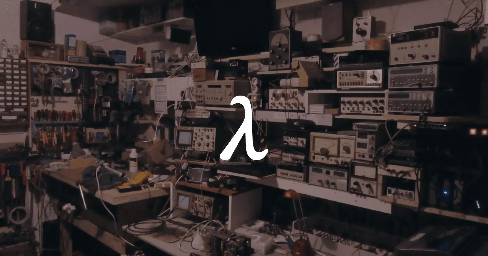

# Logos documentation


{% column width="50%" %}
<figure><figcaption></figcaption></figure>


{% column width="50%" %}
## Understand Logos

Learn what Logos is, how the stack works, and the ideas behind it.

<a href="https://app.gitbook.com/o/Tz2C1vFUwlNJfOdNUpoG/s/8QijtodASL4Q5q0oXGQH/" class="button primary">Get started →</a>



### Choose your path

<table data-card-size="large" data-view="cards"><thead><tr><th></th><th></th><th></th><th data-hidden data-card-target data-type="content-ref"></th></tr></thead><tbody><tr><td></td><td><h4>Run an app</h4></td><td>Run modules inside Basecamp, as standalone apps, or headlessly</td><td><a href="https://app.gitbook.com/o/Tz2C1vFUwlNJfOdNUpoG/s/AxLT8aL99XJmIpRcMGEQ/">Run an app</a></td></tr><tr><td></td><td><h4>Run a node</h4></td><td>Run one service or all three: blockchain, delivery, and storage</td><td><a href="https://app.gitbook.com/o/Tz2C1vFUwlNJfOdNUpoG/s/82PwPRFtJ7jjTE5D77E1/">Run a node</a></td></tr><tr><td></td><td><h4>Build an app</h4></td><td>Build and ship apps on Logos</td><td><a href="https://app.gitbook.com/o/Tz2C1vFUwlNJfOdNUpoG/s/X5pOauFxMnjWpMlUFyXf/">Build an app</a></td></tr><tr><td></td><td><h4>Contribute</h4></td><td>Improve the protocol, the docs, or the tooling</td><td><a href="https://app.gitbook.com/o/Tz2C1vFUwlNJfOdNUpoG/s/w0a9QH6eq01LxQX5O2I9/">Contribute</a></td></tr></tbody></table>

### Explore Logos

<table data-card-size="large" data-view="cards"><thead><tr><th></th><th></th><th data-hidden data-card-target data-type="content-ref"></th></tr></thead><tbody><tr><td><strong>λ</strong> <strong>Basecamp</strong></td><td>The desktop shell for Logos</td><td><a href="https://app.gitbook.com/o/Tz2C1vFUwlNJfOdNUpoG/s/bOqkFXndRajGojcgnNMu/">Basecamp</a></td></tr><tr><td><strong>λ Blockchain</strong></td><td>A sovereign, censorship-resistant base layer for building apps</td><td><a href="https://app.gitbook.com/o/Tz2C1vFUwlNJfOdNUpoG/s/lqX9z72JJnv1AbbpSrfe/">Blockchain</a></td></tr><tr><td><strong>λ LEZ</strong></td><td>The flagship execution environment built on the Logos Blockchain</td><td><a href="https://app.gitbook.com/o/Tz2C1vFUwlNJfOdNUpoG/s/ziu0BHsaEvwCPD4FoSGL/">LEZ</a></td></tr><tr><td><strong>λ Core</strong></td><td>The headless CLI runtime</td><td><a href="https://app.gitbook.com/o/Tz2C1vFUwlNJfOdNUpoG/s/cV7TWoqvCQVaTeWSxetl/">Core</a></td></tr><tr><td><strong>λ Messaging</strong></td><td>Private, censorship-resistant communication</td><td><a href="https://app.gitbook.com/o/Tz2C1vFUwlNJfOdNUpoG/s/Mxj5eJc1yLRjwdhr0Cvu/">Messaging</a></td></tr><tr><td><strong>λ Storage</strong></td><td>Decentralised, content-addressed file storage and retrieval</td><td><a href="https://app.gitbook.com/o/Tz2C1vFUwlNJfOdNUpoG/s/sBqvXHVAwSVyIulkhv5S/">Storage</a></td></tr><tr><td><strong>λ Mixnet</strong></td><td>Traffic mixing that hides communication patterns from network observers</td><td><a href="https://app.gitbook.com/o/Tz2C1vFUwlNJfOdNUpoG/s/NZnzB8S3dpBiTIMoog5j/">Mixnet</a></td></tr><tr><td><strong>λ Peer discovery</strong></td><td>Peer discovery and connection management without central registries</td><td><a href="https://app.gitbook.com/o/Tz2C1vFUwlNJfOdNUpoG/s/uzi1pjCZIOszwKWHV6Da/">Peer discovery </a></td></tr></tbody></table>

&#x20;
