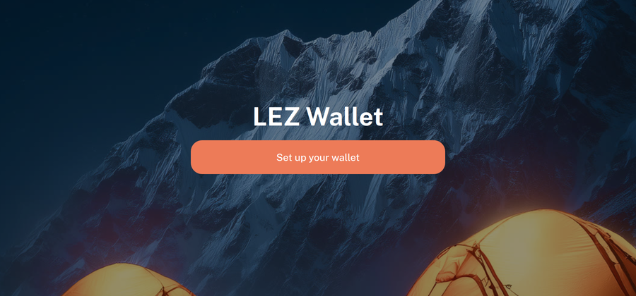
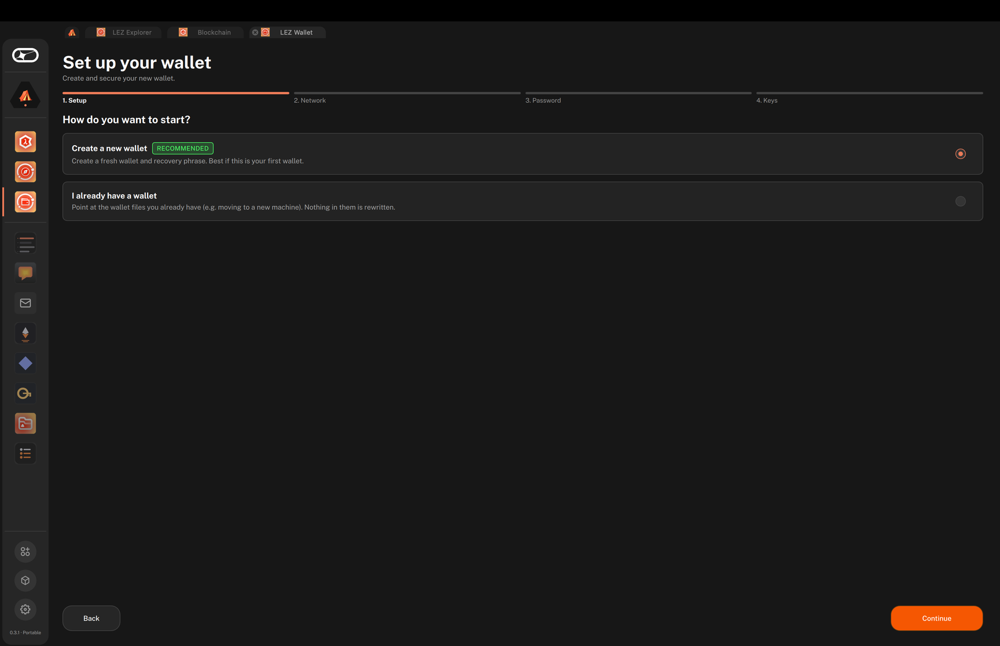
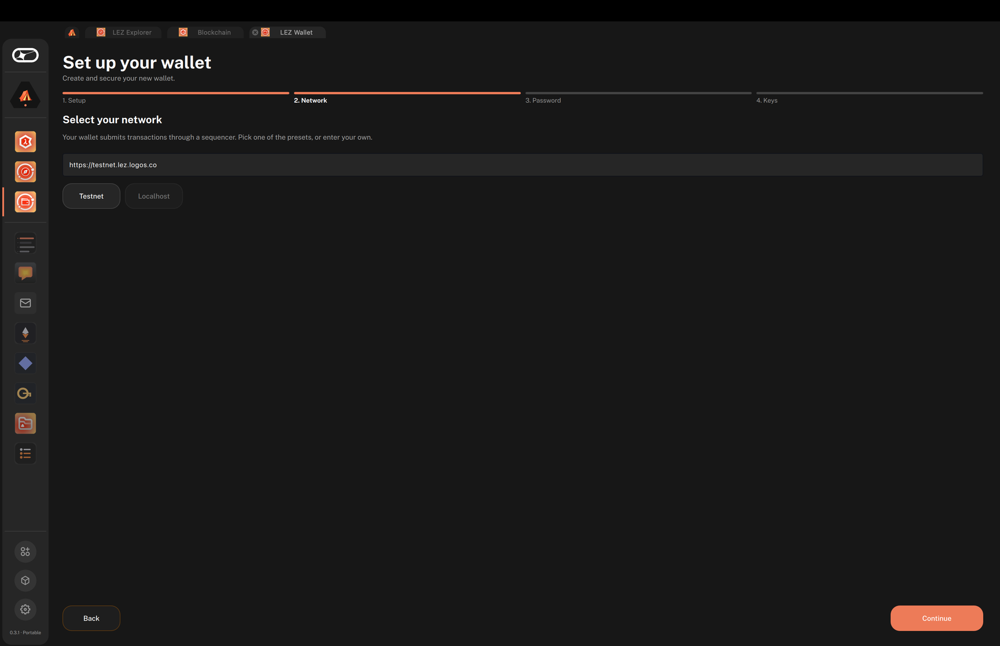
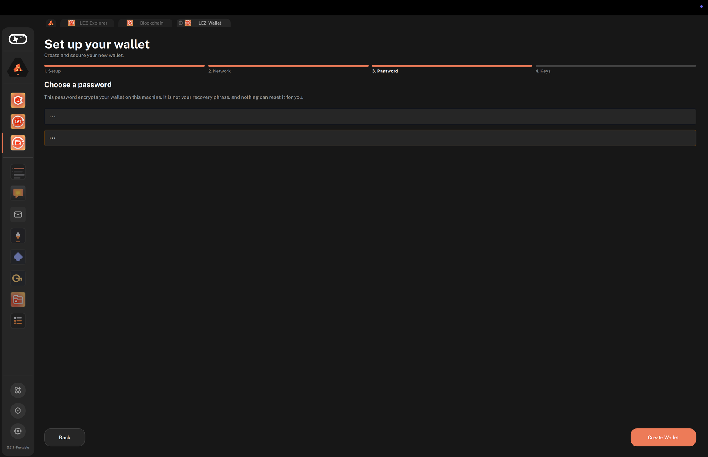
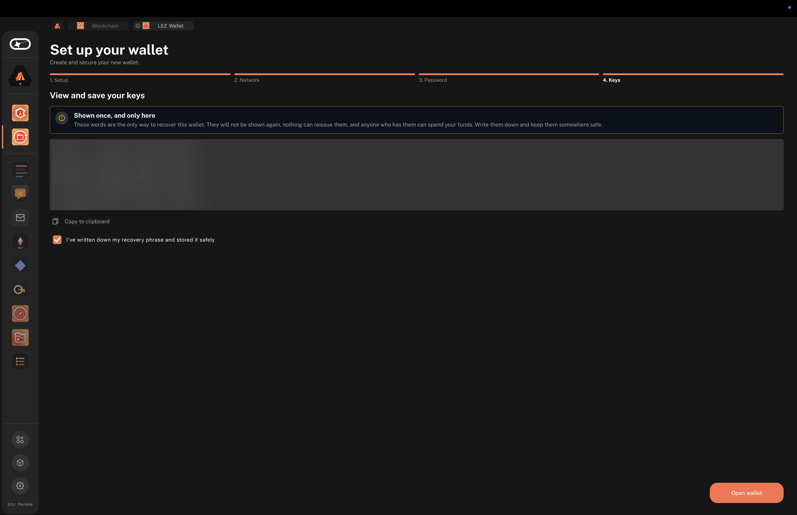
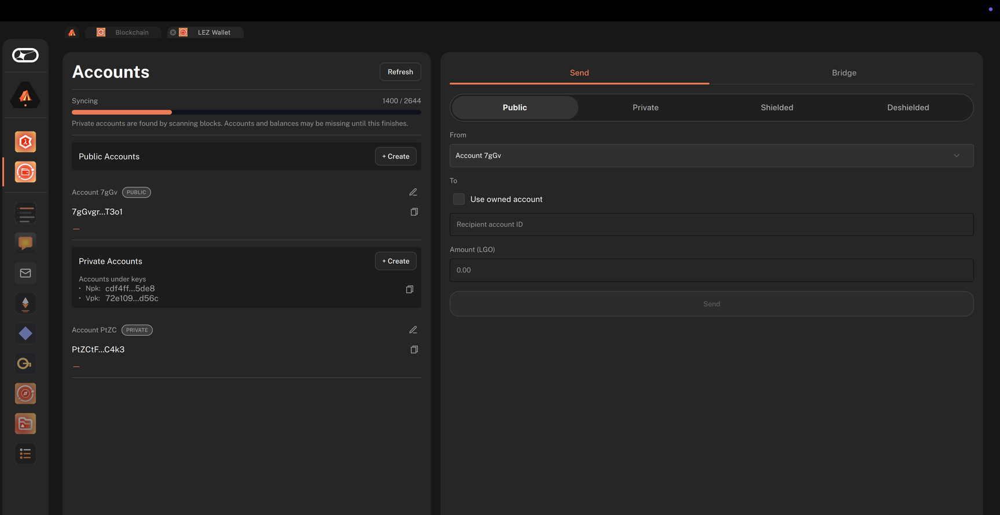
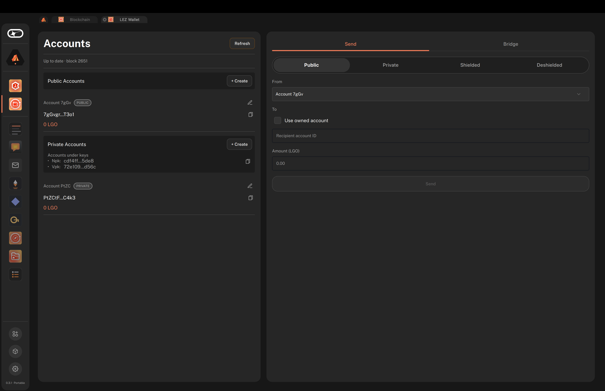
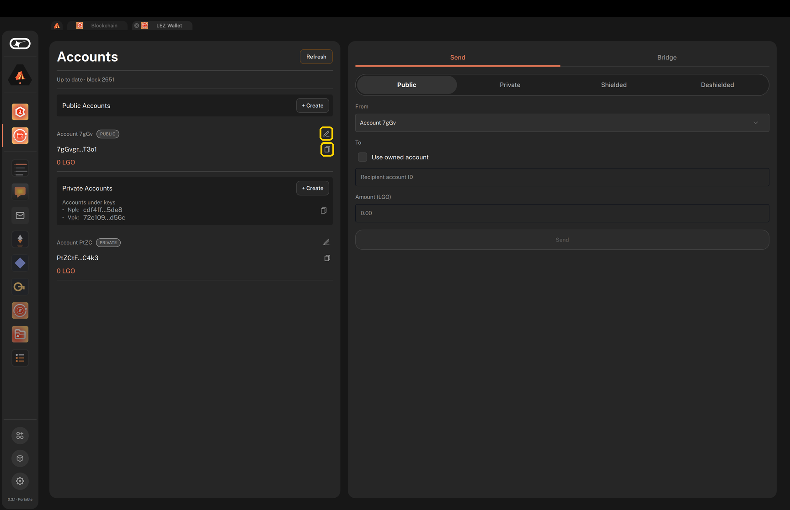
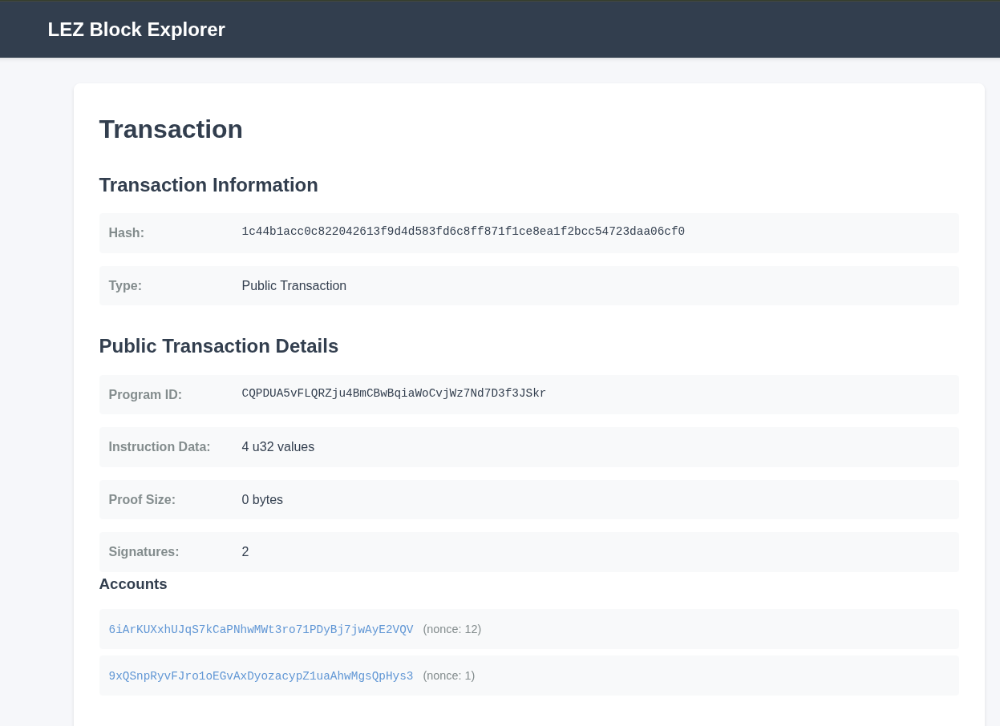

# Run the LEZ wallet UI and initiate native token transfers

#### Use the wallet UI to set up accounts and try every type of native token transfer on the LEZ testnet.

:::tip[Version]
This document is accurate for **Testnet v0.3.0**.
:::

The wallet UI is a simple entrypoint for getting started on the [LEZ](../../get-started/glossary.md#lez). This procedure walks you through running the wallet UI, syncing it with the public LEZ testnet, creating [accounts](../../get-started/glossary.md#account), executing all combinations of public, private, shielded, and deshielded native token transfers, and withdrawing tokens to the L1 through the bridge. The LEZ testnet runs the centralised LEZ sequencer, which processes the transactions the wallet UI submits, while the wallet UI itself manages your accounts locally and can execute transfers with any combination of private and public accounts.

This page describes the **LEZ Wallet** app version 1.2.0 (`lez_wallet_ui`), which requires the `lez_core` module version 0.5.0 or later.

:::note
Recovering a wallet from its recovery phrase is not yet supported.
:::

:::info[Prerequisites]

- To run the wallet in Logos Basecamp:
    - [Logos Basecamp installed and running](../../basecamp/install-logos-basecamp.md) on macOS (Apple silicon) or Linux (x86-64 or ARM64). The catalogue publishes the wallet for these platforms only.
- To build the wallet from source: **Nix** with flakes enabled, on macOS (Apple silicon) or Linux (x86-64 or ARM64).
    - Install from [nixos.org](https://nixos.org/download.html), then enable flakes:

    ```bash
    mkdir -p ~/.config/nix
    echo 'experimental-features = nix-command flakes' >> ~/.config/nix/nix.conf
    ```
:::

## What to expect

- You can run the wallet UI in Logos Basecamp or locally, and sync it with the live LEZ testnet.
- You can create and name public and private accounts, and fund them to test transfers.
- You can complete public, private, shielded, and deshielded token transfers, verify finalisation on the L1, and withdraw tokens to the L1.

## Run the wallet UI

Install the official release from the Basecamp catalogue, or build the same release from source.

### Install from Logos Basecamp

1. At the bottom of the sidebar, click **Applications**.
1. Select `Wallet` in **Categories**, or search for `LEZ Wallet`, then click the **LEZ Wallet** card.
1. In the **Add Application** dialogue, click **Install**. **Install** also installs the `lez_core` [module](../../get-started/glossary.md#module) listed under **Required Packages**.
1. Wait until the button changes to **Launch**, then click it. A **LEZ Wallet** icon appears in the sidebar, so you can reopen the wallet from there later.

To install packages one by one instead, see [Install and load a module in Logos Basecamp](../../basecamp/install-and-load-a-module-in-logos-basecamp.md).

### Build from source

Build the standalone app from commit `4e49d9ce` of [`logos-execution-zone-wallet-ui`](https://github.com/logos-blockchain/logos-execution-zone-wallet-ui), the source of the `lez_wallet_ui` 1.2.0 catalogue release. The repository has no release tags or branches, so you check out the commit itself.

:::note
`master` runs ahead of the testnet, so a build from it can need `lez_core` changes and config updates that this page does not cover.
:::

1.  Clone the repository, check out the release commit, and start the wallet UI:

    ```bash
    git clone https://github.com/logos-blockchain/logos-execution-zone-wallet-ui.git
    cd logos-execution-zone-wallet-ui
    git checkout 4e49d9ce
    nix run
    ```

    `nix run` starts a standalone app that loads the `lez_core` module pinned in the repository's `flake.lock`.

    :::info
    On a cold Nix cache, the first run compiles the wallet UI from source (Qt/C++ and Rust dependencies). This can take 20–60 minutes. Subsequent runs are instant from cache.
    :::

## Set up and sync the wallet UI

This task creates your wallet and syncs it with the LEZ testnet.

1.  On the **LEZ Wallet** welcome screen, click **Set up your wallet**.

    

1.  Follow the four steps of the **Set up your wallet** wizard:

    1.  **Setup**: select **Create a new wallet** and click **Continue**. To reuse wallet files you already have, select **I already have a wallet** instead, choose your **Storage file** and **Config file**, and click **Open Wallet**.

        

    1.  **Network**: keep the **Testnet** preset (`https://testnet.lez.logos.co`) and click **Continue**.

        

    1.  **Password**: enter a password in both fields and click **Create Wallet**. The password encrypts the wallet on this machine; it is not your recovery phrase.

        

    1.  **Keys**: write down the 24-word recovery phrase, which is shown only once, tick **I've written down my recovery phrase and stored it safely**, and click **Open wallet**.

        

1.  Wait for the wallet UI to sync with the testnet. The wallet finds your [private account](../../get-started/glossary.md#private-account) values by scanning blocks, so accounts and balances may be missing until the sync finishes.

    While it syncs, the **Accounts** panel shows **Syncing** with the number of blocks processed and a progress bar. This can take a few minutes. When the sync finishes, the panel briefly shows **Up to date · block** followed by the current block height.

    

    

    To sync again and reload balances later, click **Refresh** in the **Accounts** panel.

## Create a new public account

A new wallet starts with one public account and one private account, both empty. Accounts you create are controlled only by you, and you need a funded account before you can send a transfer.

1.  In the **Accounts** panel, click **+ Create** next to **Public Accounts**. If your account list is empty, click **+ Public account** instead.

    The new [public account](../../get-started/glossary.md#public-account) appears in the account list with its account ID and balance in LGO. The edit (pencil) and copy buttons sit on the right of each account.

    

1.  Optional: to name the account, click the edit (pencil) button next to it, enter a name in the **Add name** dialogue, and click **Save**. Each name must be unique in the wallet, and the edit button shows only on accounts that don't have a name yet.

1.  Fund the account. Next to the account, click the copy button to copy its account ID, then have another testnet user send LGO to it, or [bridge tokens from the L1](../../blockchain/node-app/bridge-assets-from-logos-blockchain-to-zone-using-app.md).

## Send a public transfer

This task moves tokens from a funded public account to another public account.

1. In the transfer panel, select **Send**, then select the **Public** tab.
1. In the **From** field, choose a public account with a positive balance.
1. In the **To** field, either paste the recipient's account ID, or tick **Use owned account** and choose one of your own public accounts.
1. In **Amount (LGO)**, enter the amount to send.
1.  Click **Send**.

    A result line displays below the **Send** button and reads `Success. Tx:` followed by the transaction hash. Use its copy button to copy the hash for the next task.

## Verify L1 finalisation

1.  In your browser, navigate to `https://explorer.testnet.lez.logos.co/transaction/<TX_HASH>`, replacing `<TX_HASH>` with the transaction hash from the previous task.

    The explorer shows only LEZ blocks that are finalised on the L1, so the transaction details display about an hour after the transfer. Until then, the page cannot find the transaction. You can also paste the hash in the search box on the [LEZ block explorer](https://explorer.testnet.lez.logos.co/) home page.

    

## Try private, shielded, and deshielded transfers

Repeat the create-account and transfer tasks for the other account types and transfer flows. Each of these transfers generates a proof, and the transfer panel shows **Generating proof, please wait…** until it finishes.

1. Create one or more private accounts: click **+ Create** next to **Private Accounts**, or **+ Private account** if your account list is empty.
1. On the **Private** tab, send a private transfer from a private sender to a private recipient.
1. On the **Shielded** tab, send a shielded transfer from a public sender to a private recipient.
1. On the **Deshielded** tab, send a deshielded transfer from a private sender to a public recipient.

Each transfer shows `Success. Tx:` followed by its transaction hash below the button. To check its status, look it up on the explorer as in [Verify L1 finalisation](#verify-l1-finalisation), and expect the same delay of about an hour.

To send to one of your own accounts, tick **Use owned account** and choose the recipient. To send to a private account in another wallet, paste the recipient's public keys as JSON with `nullifier_public_key` and `viewing_public_key`. To share your own private keys, click the copy button next to **Accounts under keys** in the **Private Accounts** section.

## Withdraw tokens to the L1

The **Bridge** section withdraws native tokens from one of your public accounts to a public key on the L1 (Bedrock). Only public accounts can send bridge withdrawals.

1. In the transfer panel, select **Bridge**.
1. In the **From** field, choose a public account with a positive balance.
1. In **Bedrock (L1) public key**, paste the recipient's Bedrock public key as hex.
1. In **Amount (LGO)**, enter the amount to withdraw.
1.  Click **Withdraw**.

    A result line displays below the **Withdraw** button. On success, it reads `Success. Tx:` followed by the transaction hash.

## Troubleshooting wallet UI setup

### Why doesn't the setup screen show?

The setup screen is skipped if the settings saved by the wallet UI already list paths for the storage and config files, typically from an earlier run of the wallet UI, and the wallet at those paths opens. If the saved files no longer exist, the wallet UI forgets them and shows the setup screen.

The settings are stored under the organisation `Logos` and application `ExecutionZoneWalletUI`, whether the wallet runs in Basecamp or on its own. To see the setup screen again, quit the wallet UI and remove the settings:

- **Linux**: remove `~/.config/Logos/ExecutionZoneWalletUI.conf`.
- **macOS**: run the following commands:

    ```bash
    defaults delete com.logos.ExecutionZoneWalletUI 2>/dev/null
    rm -f ~/Library/Preferences/com.logos.ExecutionZoneWalletUI.plist
    killall cfprefsd
    ```

### Why does creating a wallet fail with `A wallet already exists at`?

The wallet UI won't create a new wallet over existing wallet files. The error message names the existing storage file. To keep using that wallet, select **I already have a wallet** in the **Setup** step and choose that storage file and the `config.json` file in the same folder. To create a new wallet instead, move or remove those files first.
