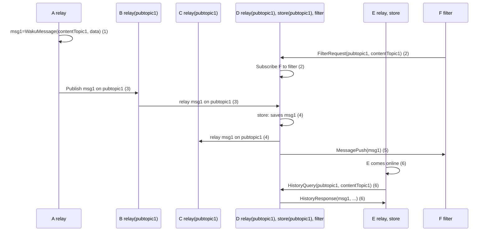

# About network domains
 
#### Understand the discovery, gossip, and request/response domains that structure how peers interact.

Logos Delivery is a unified and cohesive entity that offers a rich ecosystem with three distinct network interaction domains. These domains serve specialised purposes and contribute to the robust functionality of Logos Delivery, forming its foundation.

## The basics
 
- The [discovery domain](#discovery-domain) helps nodes locate other peers in the network.
- The [gossip domain](#gossip-domain) distributes messages across the network through Relay.
- The [request/response domain](#requestresponse-domain) serves resource-limited nodes with Store, Filter, and Light Push.

## Discovery domain
 
Peer discovery in Logos Delivery facilitates locating other nodes within the network. As a modular protocol, Logos Delivery incorporates various discovery mechanisms, such as [Discv5](./about-discv5.md) and [Peer Exchange](./about-peer-exchange.md). These mechanisms allow developers to choose the most suitable option(s) for their specific use cases and user environments, including mobile phones, desktop browsers, servers, and more.
 
## Gossip domain
 
GossipSub derives its name from the practice within Pub/Sub networks where peers gossip about the messages they have encountered, thus establishing a message delivery network.
 
Logos Delivery employs gossiping through [Relay](https://docs.waku.org/learn/concepts/protocols#relay) to distribute messages across the network. Additionally, Logos Delivery introduces [RLN Relay](https://docs.waku.org/learn/concepts/protocols#rln-relay), an experimental mechanism that combines privacy preservation and economic spam protection.
 
## Request/response domain
 
Logos Delivery provides a set of protocols to optimise its performance in resource-limited environments like low bandwidth or mostly offline scenarios for multiple purposes.
 
- [Store](https://docs.waku.org/learn/concepts/protocols#store) enables the retrieval of historical messages.
- [Filter](https://docs.waku.org/learn/concepts/protocols#filter) efficiently retrieves a subset of messages to conserve bandwidth.
- [Light Push](https://docs.waku.org/learn/concepts/protocols#light-push) facilitates message publication for nodes with limited bandwidth and short connection windows.
 
## Overview of protocol interaction
 
Here is a diagram illustrating the interaction between different protocols.

The Pub/Sub topic `pubtopic1` serves as a means of routing messages (the network employs a default Pub/Sub topic) and indicates that it is subscribed to messages on that topic for a relay. Node D serves as a `Store` and is responsible for storing messages.
 
1. Node A creates a WakuMessage `msg1` with [Content Topic](https://docs.waku.org/learn/concepts/content-topics) `contentTopic1`.
1. Node F requests to get messages filtered by Pub/Sub topic `pubtopic1` and Content Topic `contentTopic1`. Node D subscribes F to this filter and will forward messages that match that filter in the future.
1. Node A publishes `msg1` on `pubtopic1`. The message is sent from Node A to Node B and then forwarded to Node D.
1. Node D, upon receiving `msg1`, stores the message for future retrieval by other nodes and forwards it to Node C.
1. Node D also pushes `msg1` to Node F, informing it about the arrival of a new message.
1. At a later time, Node E comes online and requests messages matching `pubtopic1` and `contentTopic1` from Node D. Node D responds with `msg1` and potentially other messages that match the query.
