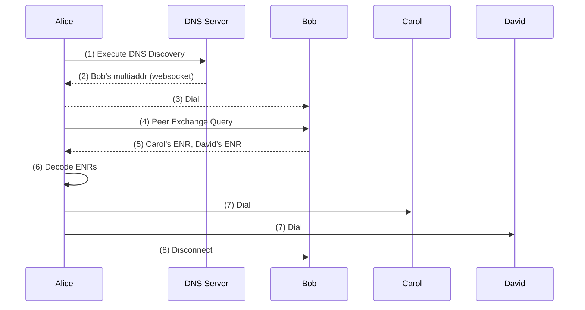

# About peer exchange

#### Understand how light nodes request peers from other nodes without relying on Discv5.

The primary objective of this protocol is to facilitate peer connectivity for resource-limited devices without relying on `Discv5`. The peer exchange protocol enables light nodes to request peers from other nodes within the network.



`Peer Exchange` enables requesting random peers from other network nodes without revealing information about their connectivity or neighbourhood.



## How peer exchange works

1. DNS Discovery protocol is executed.
1. Alice retrieves Bob's websocket multiaddr from DNS Server.
1. Alice dials Bob using libp2p protocols.
1. Alice executes a Peer Exchange query to Bob.
1. Bob returns Carol's and David's ENR to Alice.
1. Alice decodes ENRs and extracts Carol's and David's websocket multiaddrs.
1. Alice dials Carol and David.
1. Alice can now drop the connection with Bob (bootstrap node); Alice has 2 connections to the Logos Messaging Network.

## Pros and cons

Pros:

- Low resource requirements.
- Decentralised with random sampling of nodes from a global view using `Discv5`.

Cons:

- Decreased anonymity.
- Imposes additional load on responder nodes.
