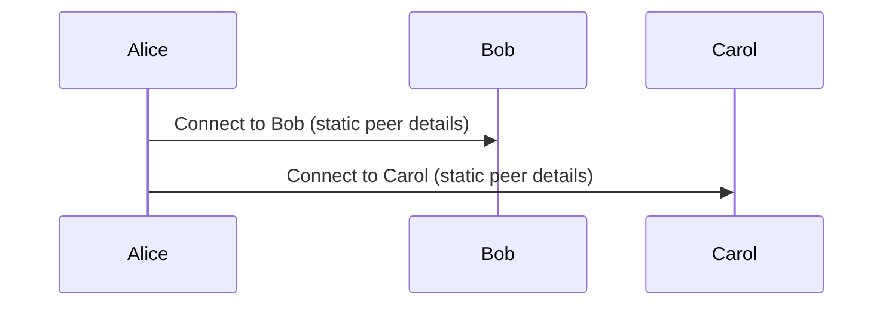

# About static peers

#### Understand how hard-coded bootstrap peers work and the trade-offs they carry.

Logos Messaging applications have the flexibility to embed bootstrap node addresses directly into their codebase. Developers can either use static peers operated by [Status](https://status.im/) or [run a node](../delivery/run-logos-delivery-node.md).

## How static peers work

Alice establishes connections with Bob and Carol using their node details, which are predefined (hard-coded) into Alice's node.

## Pros and cons

Pros:

- Low latency.
- Low resource requirements.

Cons:

- Vulnerable to censorship: Node IPs can be blocked or restricted.
- Limited scalability: The number of nodes is fixed and cannot easily be expanded.
- Maintenance challenges: Updating the node list requires modifying the code, which can be cumbersome and involves releasing and deploying.
