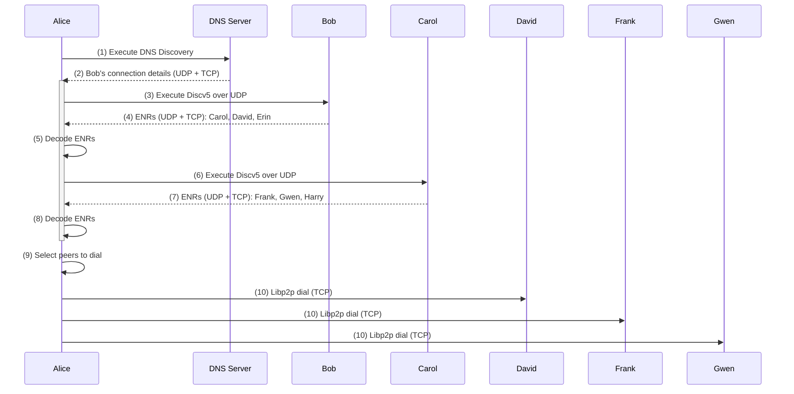

# About Discv5

#### Understand how Discv5 uses a distributed hash table to find peers across the network.

`Discv5` is a decentralised and efficient [peer discovery](https://docs.logos.co/get-started/glossary#peer-discovery) mechanism for the [Logos Delivery](https://docs.logos.co/get-started/glossary#logos-delivery) Network. It uses a [Distributed Hash Table (DHT)](https://en.wikipedia.org/wiki/Distributed_hash_table) for storing `ENR` records, providing resistance to censorship. `Discv5` offers a global view of participating nodes, enabling random sampling for load distribution. It uses bootstrap nodes as an entry point to the network, providing randomised sets of nodes for mesh expansion. Have a look at the [Discv5](https://lip.logos.co/messaging/core/draft/33/discv5.html) specification to learn more.

## How Discv5 works

1. [DNS Discovery](https://docs.logos.co/get-started/glossary#dns-discovery) protocol is executed.
1. Alice retrieves Bob's [ENR](https://docs.logos.co/get-started/glossary#enr) (Ethereum Node Record) from DNS Server.
1. Alice executes the Discv5 protocol with Bob using UDP connection details from ENR.
1. Bob returns Carol's, David's and Erin's ENRs to Alice.
1. Alice decodes ENRs and extracts the details of Carol, David, and Erin's TCP and UDP connections.
1. Alice executes the Discv5 protocol with Carol using UDP connection details from ENR.
1. Carol returns Frank's, Gwen's and Harry's ENRs to Alice.
1. Alice decodes ENRs and extracts Frank's, Gwen's and Harry's TCP and UDP connection details.
1. Alice selects to dial David, Frank and Gwen.
1. Alice dials David, Frank and Gwen over libp2p using TCP connection details from ENRs.

## Pros and cons

Pros:

- Decentralised with random sampling from a global view.
- Continuously researched and improved.

Cons:

- Requires lots of connections and involves frequent churn.
- Relies on User Datagram Protocol (UDP), which is not supported in web browsers.
