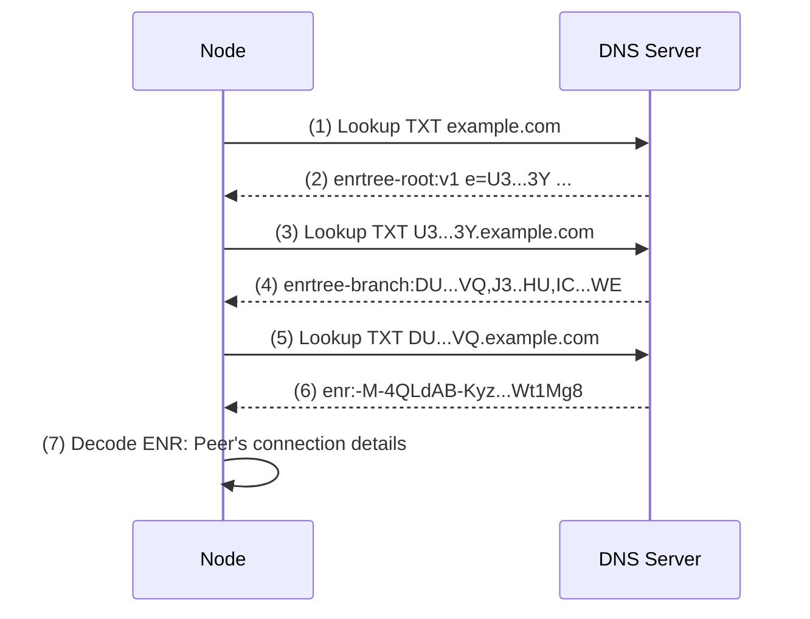

# About DNS discovery

#### Understand how a node retrieves peer connection details from an ENR tree published in DNS.

Built upon the foundation of [EIP-1459: Node Discovery via DNS](https://eips.ethereum.org/EIPS/eip-1459), [DNS Discovery](https://docs.logos.co/get-started/glossary#dns-discovery) allows the retrieval of an `ENR` tree from the `TXT` field of a domain name. This approach enables the storage of essential node connection details, including IP, port, and multiaddr. This [bootstrapping](https://docs.logos.co/get-started/glossary#bootstrapping) method allows anyone to register and publish a domain name for the network, promoting increased decentralisation.

## How DNS discovery works

1. DNS lookup query to retrieve TXT data stored on `example.com` domain.
1. `enrtree-root` is returned, and the value of `e` is the `enr-root`, the root hash of the node subtree.
1. DNS lookup query to retrieve TXT data stored on `<enr-root>.example.com` domain.
1. `enrtree-branch` is returned; this tree contains hashes of node subtrees.
1. DNS lookup query to retrieve TXT data stored on `DU...VQ.example.com` domain, the first leaf of `enrtree-branch`.
1. `enr` record is returned.
1. Returned value is decoded, and peer connection details such as IP address and port are learned.

## Pros and cons

Pros:

- Low latency, low resource requirements.
- Easy bootstrap list updates by modifying the domain name, eliminating the need for code changes.
- Ability to reference a larger list of nodes by including other domain names in the code or [ENR](https://docs.logos.co/get-started/glossary#enr) tree.

Cons:

- Vulnerable to censorship: Domain names can be blocked or restricted.
- Limited scalability: The listed nodes are at risk of being overwhelmed by receiving all queries. Also, operators must provide their `ENR` to the domain owner for listing.
