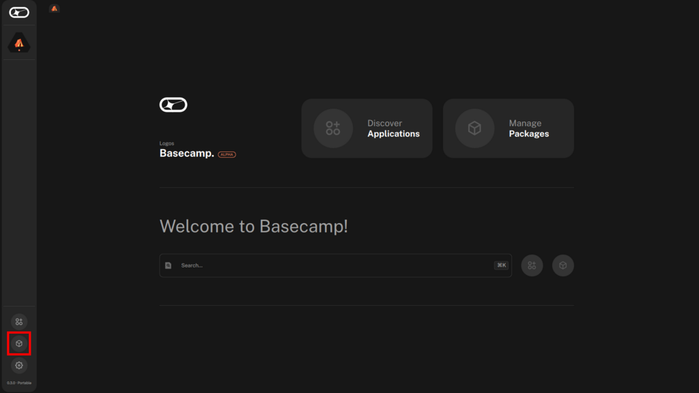
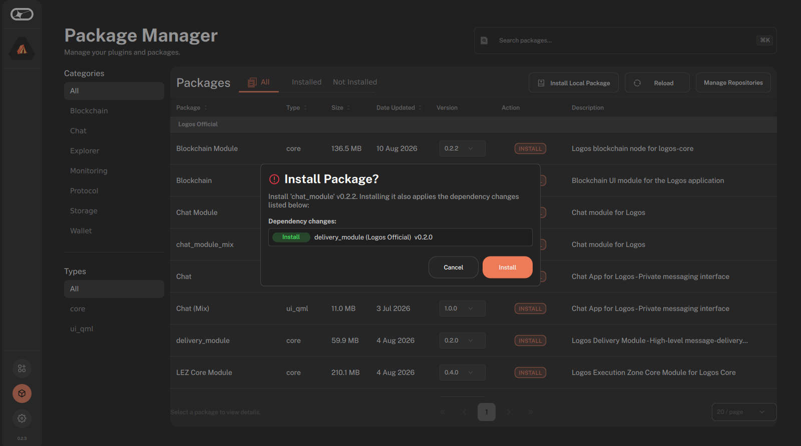
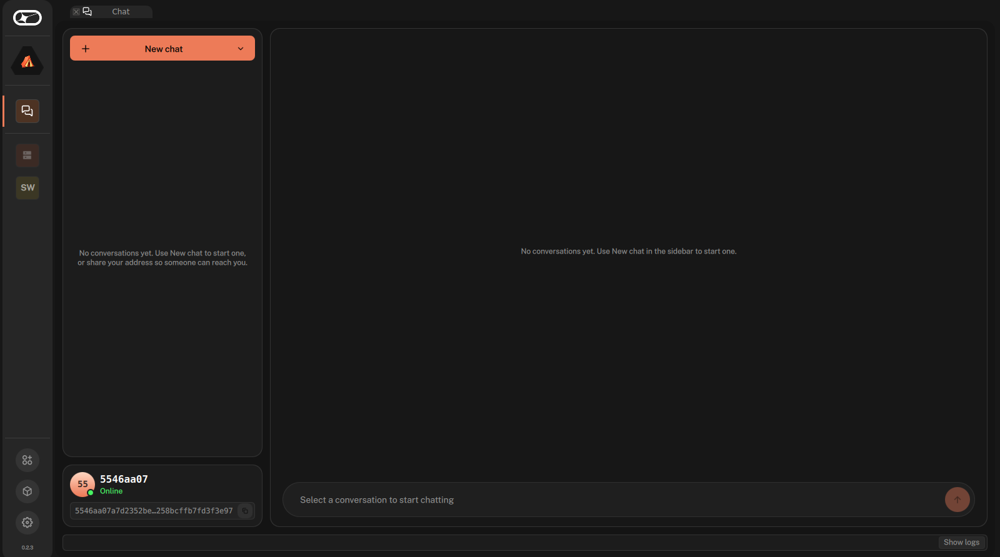

# Send 1:1 messages with the Logos Chat app

#### Try out end-to-end encrypted private messaging over the Logos network.

:::tip[Version]
This document is accurate for **Testnet v0.2.1**.
:::

This procedure shows how to use the [Logos Chat](../../get-started/glossary.md#logos-chat) app to exchange encrypted 1:1 messages between two running instances. The app is a QML and C++ UI built on top of the [`logos-chat-module`](https://github.com/logos-co/logos-chat-module), which wraps the [Logos Chat SDK](https://github.com/logos-messaging/logos-chat). It demonstrates the basic private-messaging capabilities of the Logos Chat [Module](../../get-started/glossary.md#module): ephemeral identity, address-based contact discovery, and encrypted messaging with no central server. Use this procedure to verify the setup works or to explore the messaging flow for development purposes.

Identity, conversations, and message history exist only while the app is running. Restarting an instance gives it a new identity and clears all conversations.

:::info[Prerequisites]

- A supported OS:
    - Linux
    - macOS
- Network access
- For the local build only: **Nix** with flakes enabled.
    - Install from [nixos.org](https://nixos.org/download.html), then enable flakes:

    ```bash
    mkdir -p ~/.config/nix
    echo 'experimental-features = nix-command flakes' >> ~/.config/nix/nix.conf
    ```
:::

## What to expect

- You can run the Logos Chat app without building from source by installing it through Logos [Basecamp](../../get-started/glossary.md#basecamp).
- You can exchange encrypted messages between two instances in real time once one of them has opened a conversation with the other's address.
- You can verify delivery by confirming each message appears on the receiving instance within a few seconds.

## Step 1: Run the Logos Chat app

You need two running instances to complete this procedure. Each instance can use either of the options below independently.

:::info
When using Nix, all build dependencies—including Qt6, `logos-chat-module`, and `liblogoschat`—are fetched automatically.
:::

### Option A—Run in Logos Basecamp

1. Download and [install](../../basecamp/install-logos-basecamp.md) the latest release of Logos Basecamp from `github.com/logos-co/logos-basecamp/releases`.
1.  In the left bar, select **Package Manager**.

    
1.  Find **Chat** (type `ui_qml`) in the package list and click **INSTALL**. The **Install Package?**
    dialogue lists the `chat_module` core package it depends on; confirm with **Install**.

    
1. Wait until the **Action** column reads **INSTALLED** for both packages.
1. Restart Basecamp, then select the chat icon in the left bar to launch the Logos Chat app.

### Option B—Build and run locally with Nix

1.  Clone the repository and check out the target release:

    ```bash
    git clone https://github.com/logos-co/logos-chatsdk-ui
    cd logos-chatsdk-ui
    git checkout v0.2.2
    ```

    - `v0.2.2` is the release the Basecamp catalogue ships as **Chat**, so both options run the same
      app and match the walkthrough below. Older tags such as `v0.1.0` predate the address-based
      contact flow in [Step 2](#step-2-start-a-conversation).
1.  Run the standalone app:

    ```bash
    # Nix fetches all dependencies automatically
    nix run
    ```

## Step 2: Start a conversation

The app auto-initialises on launch. The bottom-left panel shows your identity, an **Online**
indicator, and your **address** in hexadecimal with a copy button next to it. You need one
instance's address to open a conversation from the other—referred to here as **A** and **B**.



**On instance B:**

1. In the bottom-left panel, click the copy button next to your address.
1. Send the address to instance A through any [out-of-band](../../get-started/glossary.md#out-of-band) [channel](../../get-started/glossary.md#channel).

**On instance A:**

1. Click **New chat**, then choose **Direct message** ("One person, by address").
2. Paste B's address into the **New DM** dialogue under **Paste the other user's address**.
3. Click **Create**. A new conversation appears in A's conversation list.

There is no intro message to type and nothing to accept on B's side: the conversation appears in
B's list as soon as A's first message arrives, which you send in the next step.

## Step 3: Send and receive messages

1. On instance A, select the conversation you created in [Step 2](#step-2-start-a-conversation).
2.  Type a message in the message input field, then press `Enter` or click the send button.

    Your messages appear right-aligned in the chat panel; the counterparty's messages appear left-aligned, each with a timestamp.
3.  Observe instance B.

    **Expected result:** the conversation appears in B's list with an unread badge, and the exact message text appears as an incoming (left-aligned) bubble in B's chat panel within a few seconds. Select it and reply; the reply appears as an incoming bubble in A.

## Troubleshooting Logos Chat

### Messages never arrive and the left panel shows "Waiting for connection…"

Both instances need to reach a shared bootstrap peer to connect to the peer-to-peer network and discover each other. Ensure that both instances have a stable internet connection for [peer discovery](../../get-started/glossary.md#peer-discovery).

### A previously open conversation has disappeared

Conversations are ephemeral and are not persisted between sessions. Open a new conversation with **New chat > Direct message** using the other instance's current address.
