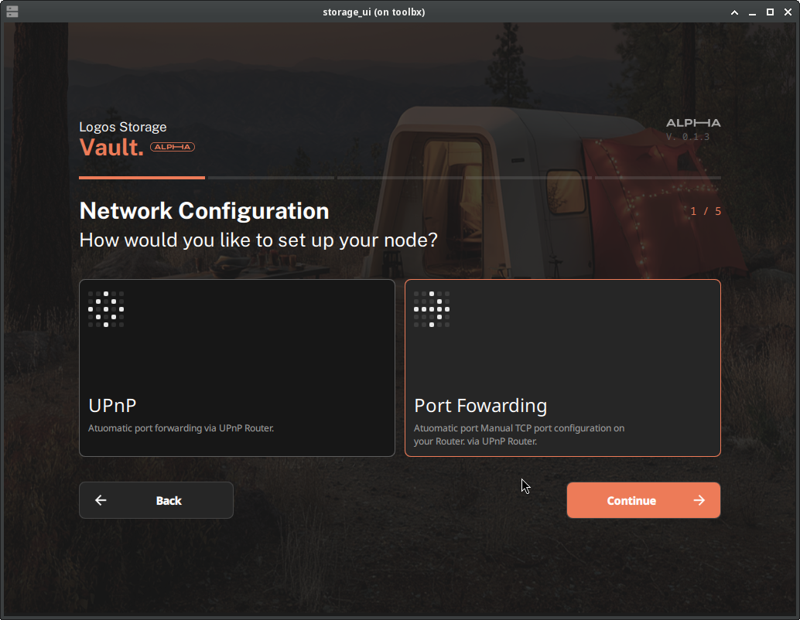
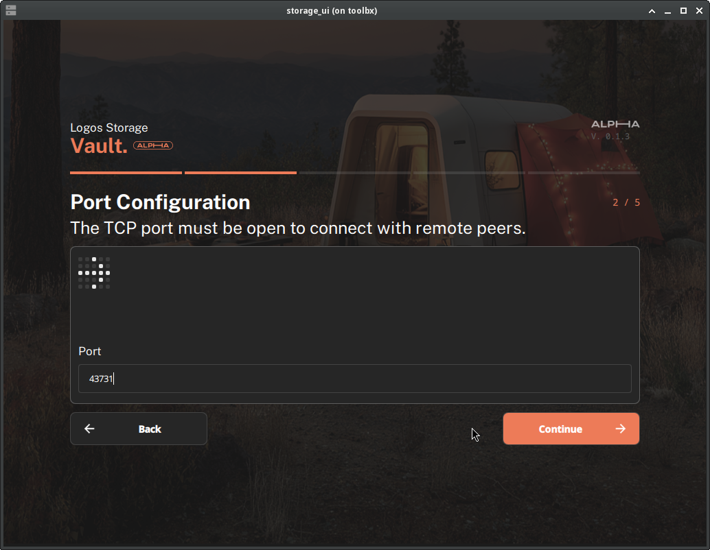
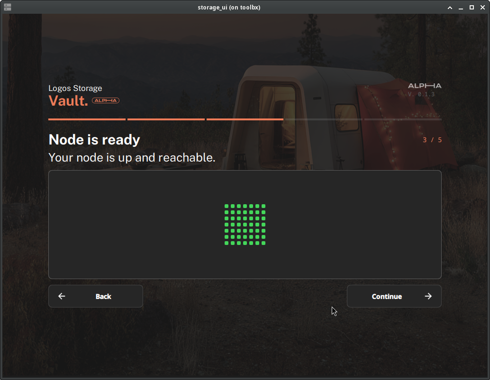
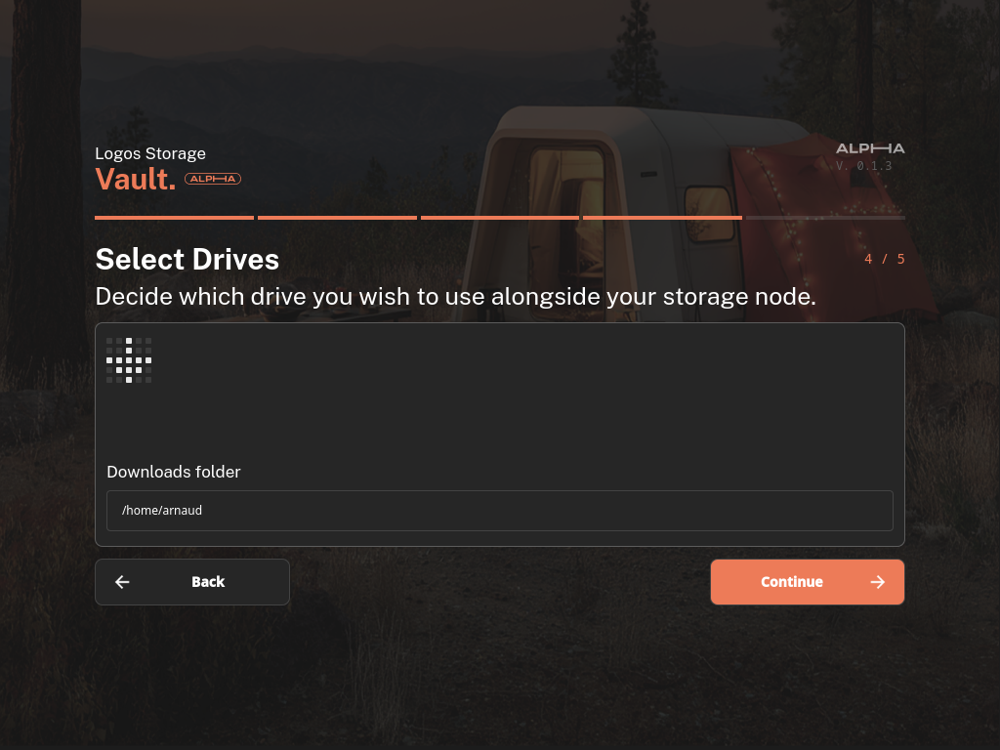
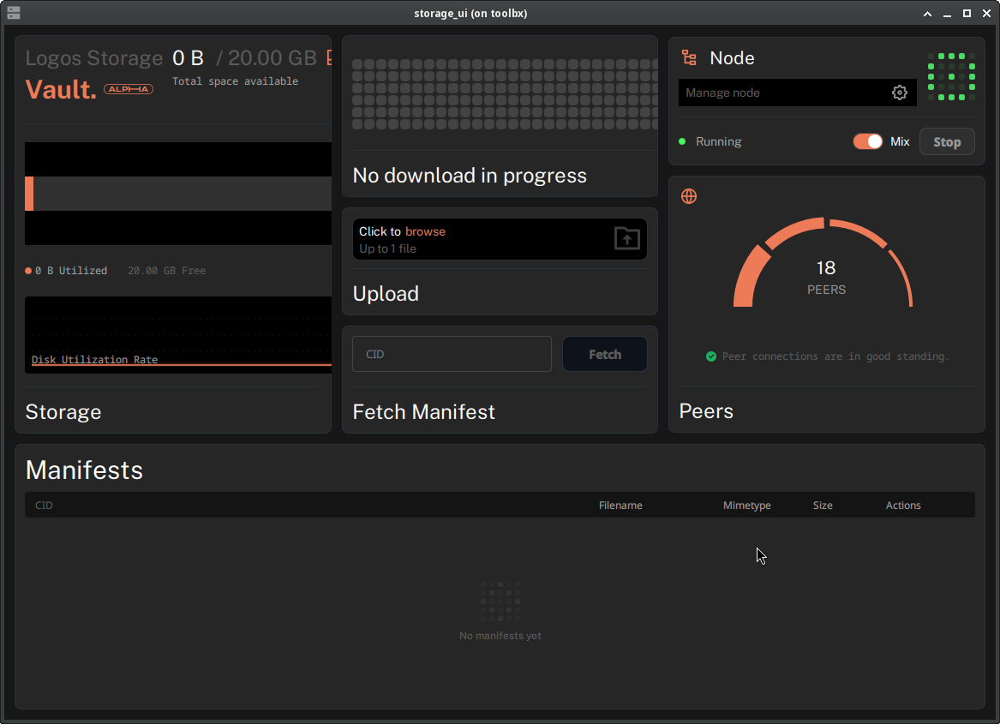
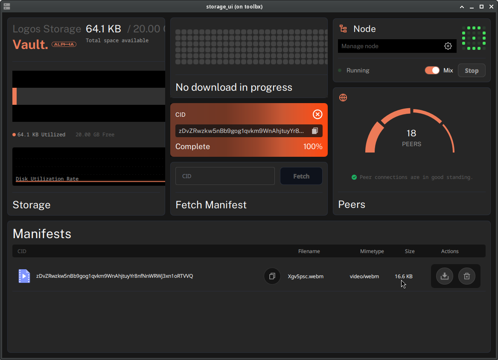
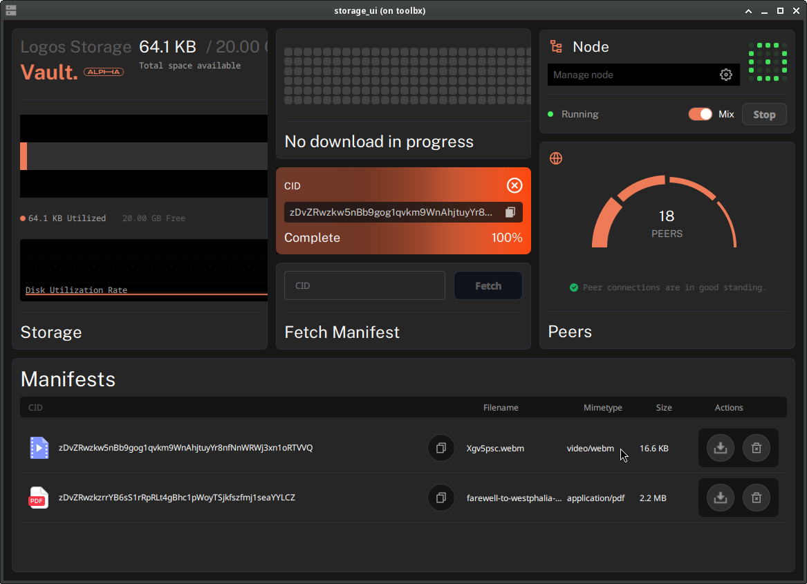

# Set up and use the Logos Storage UI

#### Get started sharing and downloading files on the Logos Storage network

The [Logos Storage](https://docs.logos.co/get-started/glossary#logos-storage) UI is a file-sharing application built on top of the [Logos Storage Module](https://github.com/logos-co/logos-storage-module). This guide covers running the application (through Logos Basecamp or by building it with Nix), configuring your node through the onboarding wizard, and using the UI to share, download, and delete files. It is intended for node operators running the application on Linux or macOS.

Before you start, have a router where you can configure port forwarding or that supports UPnP/NAT-PMP ready (see [Connectivity](../concepts/connectivity.md)).

## What to expect

- You can build and run a standalone Logos Storage UI application using a single `nix build` command.
- You can configure your node through the onboarding wizard, in guided or advanced mode, and reach a running node.
- You can share files with other nodes and download files shared by others using a Content Identifier ([CID](https://docs.logos.co/get-started/glossary#cid)).
- You can make content lookups private with the **Mix** switch, and stop and restart the node without losing your files.

## Step 1: Run the application

You can install the application through Logos Basecamp (Option A), or build it from source with Nix (Option B).

### Option A — Run in Logos Basecamp

1. Download and [install](https://github.com/logos-co/logos-docs/blob/main/docs/basecamp/get-started/install-logos-basecamp.md) the latest release of Logos Basecamp from `github.com/logos-co/logos-basecamp/releases`.
1. In the left bar, select **Package Manager**.
1. Select `Storage` in `Categories` then click **Install**.
1. Wait until a green **Installed** label appears next to both modules.
1. In the left bar, select **storage** to launch the Logos Storage UI.

### Option B — Build and run locally with Nix

The application is built using Nix flakes. The output includes the storage UI plugin and supporting binaries. You need:

- **Nix** with flakes enabled. Install from [nixos.org](https://nixos.org/download.html), then enable flakes:

  ```bash
  mkdir -p ~/.config/nix
  echo 'experimental-features = nix-command flakes' >> ~/.config/nix/nix.conf
  ```

  Verify: `nix flake --help >/dev/null 2>&1 && echo "Flakes enabled"`

- **Git**

1. Clone the [`logos-storage-ui`](https://github.com/logos-co/logos-storage-ui) repository and enter the project directory:

   ```bash
   git clone --recurse-submodules https://github.com/logos-co/logos-storage-ui.git
   cd logos-storage-ui
   ```

1. Run the build command:

   ```bash
   nix build
   ```

1. Confirm the build succeeded by checking the `result/` directory for the following outputs on macOS (`.dylib` files are replaced with `.so` files on Linux):

   ```
   result/
   └── lib/
       ├── storage_ui_plugin.dylib           # Qt plugin (loaded by the app)
       └── storage_ui_replica_factory.dylib
   ```

1. Launch the application:

   ```bash
   nix run
   ```

   - To override a dependency with a local version, use `--override-input`. For example:

     ```bash
     nix run --override-input storage_module/logos-storage git+file:///somewhere/logos-storage-nim?submodules=1
     ```

:::info
The first build compiles the storage engine and can take a long time; subsequent builds use the Nix cache. To work on the code, `nix develop` opens a shell with all dependencies available.
:::

#### Build fails with HTTP 500 on BoringSSL fetch

**Symptom:** The build fails with the following error:

```
error: Failed to fetch git repository https://boringssl.googlesource.com/boringssl : error: RPC failed; HTTP 500 curl 22 The requested URL returned error: 500
fatal: unable to write request to remote: Broken pipe
```

**Cause:** Git's HTTP request size limits are too low for large repositories.

**Fix:** Increase the limits and retry:

```bash
git config --global http.postBuffer 524288000
git config --global http.maxRequestBuffer 100M
```

## Step 2: Configure your node through onboarding

On first launch, the app opens the onboarding wizard and asks how you want to set up your node: **Guided** or **Advanced**.

Your node must be reachable from the internet to share files (an unreachable node can still download). Choose the setup option that matches your network environment:

| Scenario | Setup option | Details |
|:---------|:-------------|:--------|
| Behind NAT with UPnP or NAT-PMP | `Guided` followed by `UPnP` | Logos Storage configures the network automatically. |
| Behind NAT, manual port forwarding available | `Guided` followed by `Port Forwarding` | Requires forwarding one TCP port (chosen during onboarding) and UDP `8090`. See [Forwarding ports manually](../concepts/connectivity.md#forwarding-ports-manually). |
| Custom or complex network | `Advanced` | Displays a prepopulated configuration JSON you can edit manually. See the [API reference](https://logos-co.github.io/logos-storage-module/latest/api_reference.html). |

This guide follows the `Guided` setup with `Port Forwarding`.

1. Select **Guided** and click **Continue**.

1. On the **Network Configuration** step, select **Port Forwarding** and click **Continue**.

   

1. On the **Port Configuration** step, note the TCP port (or type your own), then forward it on your router along with UDP `8090` (see [Forwarding ports manually](../concepts/connectivity.md#forwarding-ports-manually)). Click **Continue**.

   

1. Wait for the connectivity checker to confirm your node is reachable: "Node is ready — Your node is up and reachable." Click **Continue**.

   

   - If the node is unreachable, see [Troubleshooting](troubleshooting.md).
   - The guided setup requires a reachable node. To run without connectivity, go **Back** and use the `Advanced` setup: the node will only be able to download files from other nodes.

1. On the **Select Drives** step, choose the folder where downloaded files will be saved, then click **Continue**.

   

1. Wait for the dashboard to open and the node status to reach **Running**.

   

   - A red status dot means the node is running but not reachable from the internet; green means it is reachable and ready to share files.

### Configuration

The active configuration is saved to `${HOME}/.logos_storage/config.json`. Change this file and restart the [Storage Module](https://docs.logos.co/get-started/glossary#storage-module) to apply the changes.

After onboarding, the settings are saved to a file whose location depends on the OS. If you are running the UI inside the Basecamp application:

| OS    | Path                                                |
|:------|:-----------------------------------------------------|
| Linux | `~/.config/Logos/LogosBasecamp.conf`                  |
| macOS | `~/Library/Preferences/com.logos.LogosBasecamp.plist` |

If you are running the standalone app built with Nix:

| OS    | Path                                                  |
|:------|:------------------------------------------------------|
| Linux | `~/.config/Logos/LogosStandalone.conf`                 |
| macOS | `~/Library/Preferences/com.logos.LogosStandalone.plist` |

## Step 3: Share a file

1. In the **Upload** panel, click **browse**. A file selector opens.

1. Select the file you want to share and click **Open**. The file is uploaded to your node and sharing begins automatically.

1. When the upload completes, the file appears in the **Manifests** list at the bottom of the UI, with its CID, filename, mimetype, and size.

   

1. Click the copy icon next to the CID. Share this string with others so they can download the file.

## Step 4: Download a file

The manifest is the representation of a file on the network: it carries the metadata (filename, size, mimetype). To download a file, you first fetch its manifest by CID, then download the content itself.

1. Paste the file's CID into the **Fetch Manifest** panel and click **Fetch**. The manifest downloads from the network and an entry appears in the **Manifests** list.

1. In the manifest entry's **Actions** column, click the download icon.

1. Watch the download widget at the top: it shows progress in real time and reports **Complete** when the file has been written to the downloads folder you chose during onboarding.

   

:::info
No CID at hand? Try downloading a public file: fetch `zDvZRwzkzrrYB6sS1rRpRLt4gBhc1pWoyTSjkfszfmj1seaYYLCZ`, the [Farewell to Westphalia book](https://logos.co/farewell-to-westphalia). It is available on the network the default configuration connects to.
:::

## Step 5: Make your lookups private with Mix

The **Mix** switch in the **Node** panel controls private queries. When enabled, the node forwards its content lookups over the Logos mix network, which makes them much harder to trace back to you. See [Mix](../concepts/mix.md) for how it works.


- The switch is on by default when your configuration includes the Mix options.
- Private queries can be slower and may fail more often than direct ones. When looking up content that is not sensitive, you can toggle the switch off — observers will then be able to link you to your queries.

## Step 6: Manage the node lifecycle

1. To stop the node, click **Stop** in the **Node** panel. The status indicator turns grey, the node reports **Stopped**, and peer connections drop.

1. Click **Start** to bring the node back to **Running**.

   - Your files survive the restart: the node persists its data in the configured `data-dir`, so previously uploaded files reappear in the **Manifests** list.

1. To stop sharing a file, click the trash icon in the manifest entry's **Actions** column. The file leaves the list and the **Storage** panel returns to **0 B Utilized**: the blocks are actually removed from disk.

## Troubleshooting Logos Storage

Connectivity problems (no peers, unreachable node, downloads timing out) are covered in the [Troubleshooting](troubleshooting.md) and [Connectivity](../concepts/connectivity.md) pages.
